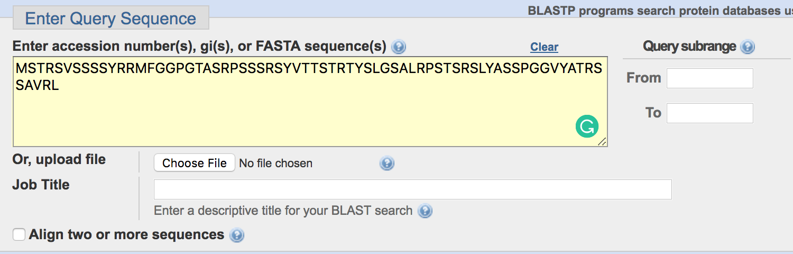
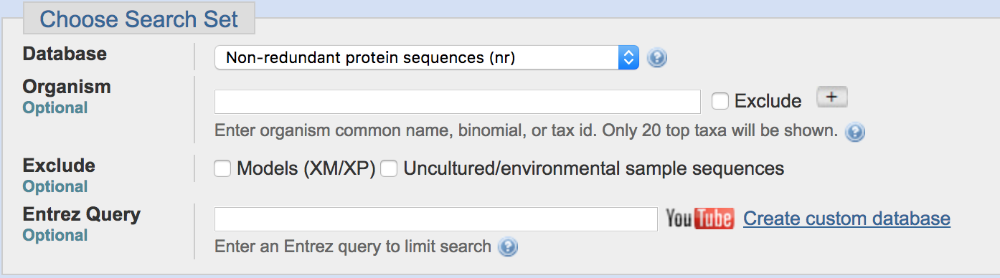
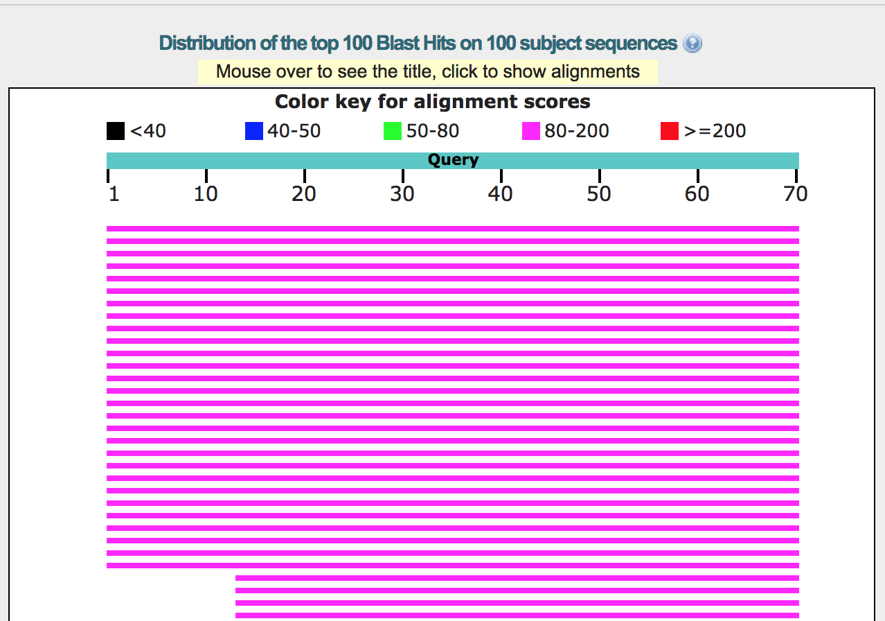

# 2.1 序列比对 - Blast in web


## Pipeline
---


## Data Structure
---
```text
"gi47115317.fa"         # query protein sequence (i.e. Homo sapiens CAG28618.1)

~/proj_blast/
|-- gi47115317.fa       #query protein sequence (i.e. Homo sapiens CAG28618.1)
|-- gi47115317.output   #The blast output results.
```

### **Inputs**

| **File format** | **Information contained in file** | **File description** | **Notes** |
| --- | --- | --- | --- |
| fasta | sequence | The file contain the gene name and sequence |  gene name start with '>'|

### **Outputs**

| **File format** | **Information contained in file** | **File description** | **Notes** |
| --- | --- | --- |--- |
| blastp |Output information | The query align to database | |


## Running Scripts
---
###  **Input sequence**

###  **Select database**

###  **Select algorithm**

###  **Output results**

###  **Output table**

###  **Alignment details**


## Tips/Utilities
---
#### A better view of fasta file

```bash
less -S gi47115317.fa  # chop long lines rather than wrap them
```
## Homework and more

#### 1 Blast sequence with mouse genome.
Blast protein sequence only with mouse genome protein database, and only keep the max target sequences is 10, expect threshold is 0.5.


