# Docker

## 1) Windows 用户使用 Docker

## 1a) windows 10 非 pro 64 安装和使用方法 (基于Virtual Box) {#win-vb-use-docker}

1. 安装 Virtual Box 

   至 [官网](https://www.virtualbox.org/wiki/Downloads) 或 [清华云](https://cloud.tsinghua.edu.cn/f/89c75b51b5bd423aa92b/) 下载安装程序，运行，按照提示完成安装。

1. 下载我们提供的 Ubuntu 虚拟机： [bioinfo_tsinghua.virtualbox.ova](https://cloud.tsinghua.edu.cn/f/c91ec26fc5774303a5df/) （用户名和密码均为 `test`）。  

1. 导入虚拟机
   
   <br>
   `管理` -> `导入虚拟电脑`
   

   <br>
   选中上一步下载完成的 `bioinfo_tsinghua.virtualbox.ova`
   
   
   <br>
   **注意：** 路径名不能有空格、中文等，可以直接放在某一磁盘下，比如这里我们放在了 D 盘。
   

   <br>
   导入时一般使用默认选项即可。如果 C 盘空间不足，可以修改以下最后一个选项——`虚拟硬盘`，需要手动输入路径，与上文一样，不能有空格、中文等。
   

   <br>
   
1. 导入完成后，启动 `bioinfo_tinghua`, 等待2至5分钟，虚拟机即可使用。

   

系统启动完成后，打开 ubuntu command terminal，到 [Getting Started 5b)](../getting-started.md#load-image) 完成后续操作。


## 1b) windows 10 pro 64 安装和使用方法  {#win-pro-use-docker}
从 [官网](https://store.docker.com/editions/community/docker-ce-desktop-windows) 或者 [清华云盘](https://cloud.tsinghua.edu.cn/f/a28251b47d0e471a8d8f/) 安装 。


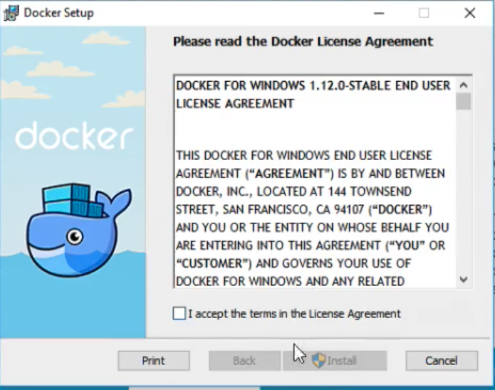
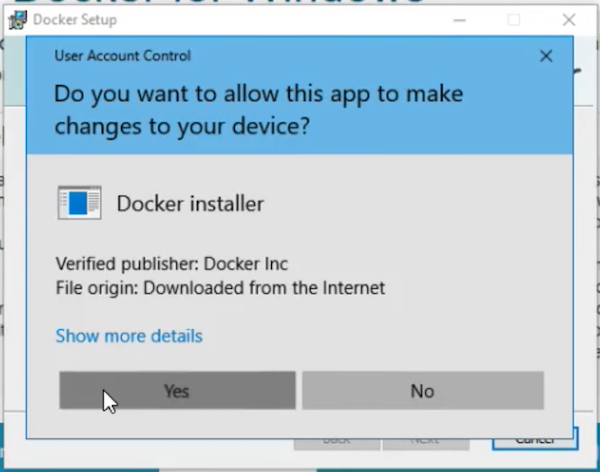

确认 打开 Hyper-V 。

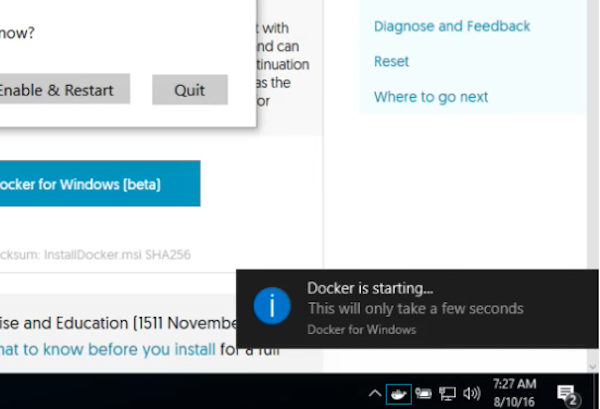
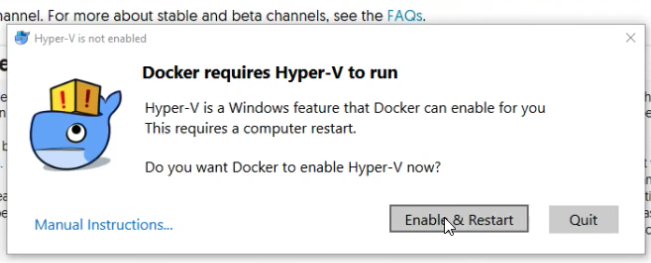

在开始菜单搜索 PowerShall, 并启动。

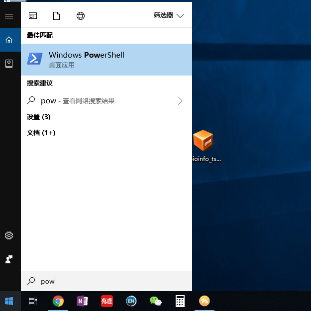

检查安装完成。之后将下载在桌面的 [bioinfo_tsinghua.docker.tar.gz](https://cloud.tsinghua.edu.cn/f/b8dcdfa425ba4880b4f3/) image 文件导入到 Docker 中。  

```sh
docker info
docker load -i Desktop\bioinfo_tsinghua.docker.tar.gz
```

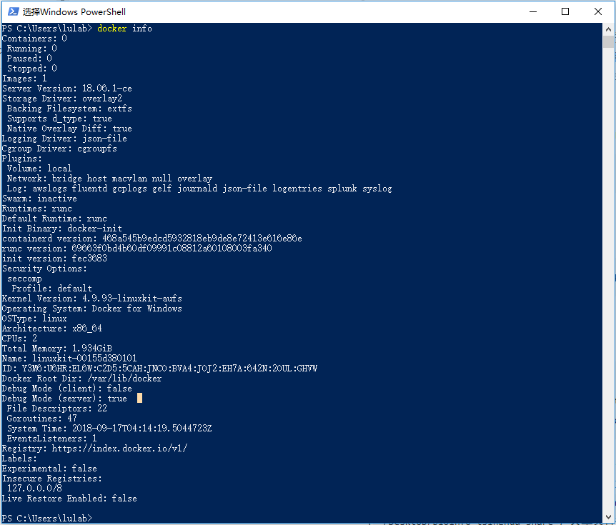
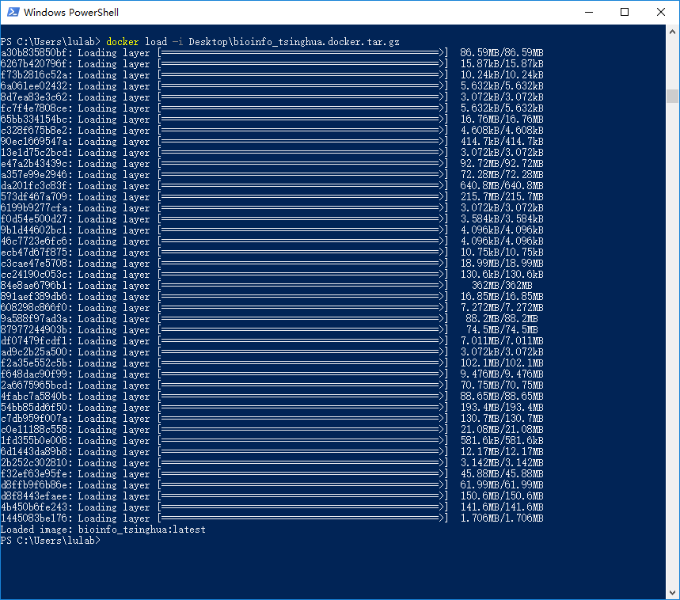

创建容器。

```sh
docker run --name=bioinfo_tsinghua -dt --restart unless-stopped -v ~/Desktop/bioinfo_tsinghua_share:/home/test/share bioinfo_tsinghua

docker exec -u root bioinfo_tsinghua chown test:test /home/test/share


```    
    

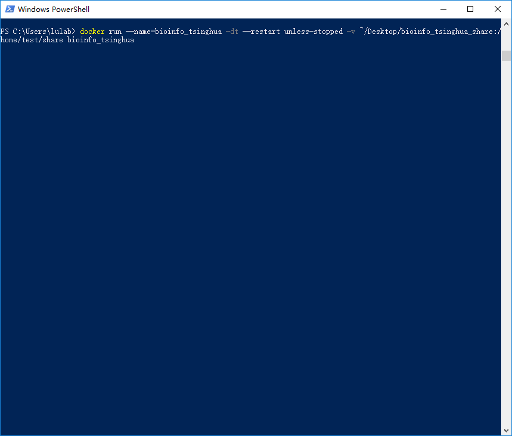
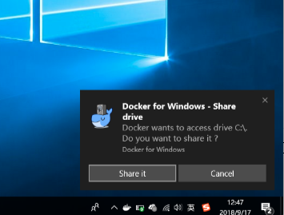

进入容器。

```sh
docker exec -it bioinfo_tsinghua bash
```

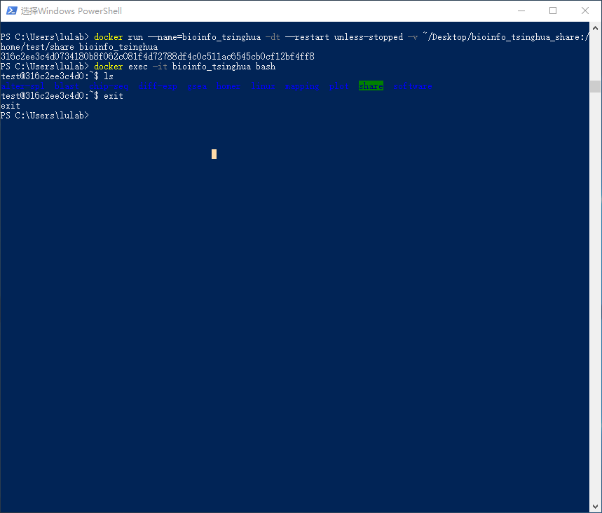

调整PowerShall配色,之后可以重新打开 PowerShall。

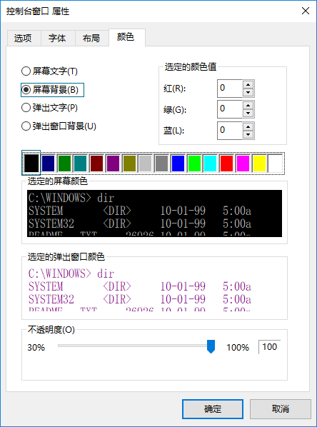
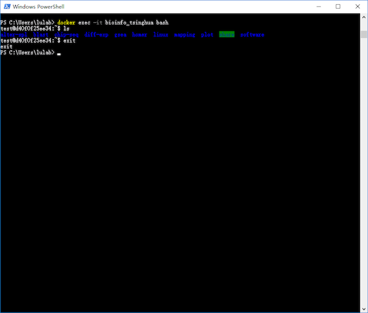


完成以上操作后，请回到 [Getting Started 5e)](../getting-started.md#recover-container) 继续阅读。


## 2) MAC 用户使用 Docker

MAC 用户在安装完 Docker 后，如果遇到使用问题，可以参考官网的 [这篇文章](https://docs.docker.com/docker-for-mac/)，启动并设置Docker Desktop。


## 3)  容器共享主机文件夹


上图所示的命令是新建 名为 bioinfo_tsinghua 的容器，并将该容器中的 `～/share` 路径挂载到mac主机桌面上的 `bioinfo_tsinghua_share` 文件夹中。


**推荐使用挂载主机目录的方法创建的容器去练习本教程接下来的章节，在所有章节running scripts前切换docker工作目录到Desktop，最后你会发现所有inputs&outputs的文件都会同步到mac桌面的 `bioinfo_tsinghua_share` 文件夹中，便于管理和查看结果。同时，从本地添加到 `bioinfo_tsinghua_share` 文件夹下面的文件或子文件夹，也可以在docker中`ls`查看。**

**so，同步的前提是，工作目录与挂载主机目录一致。也就是说，在所有章节running scripts前切换docker工作目录到Desktop，也就是输入`cd Desktop`命令，否则将无法同步，如下图所示。**


有些命令没有在此列出，感兴趣（且不怕把 Docker 弄坏）的读者可自行相关教程（本章最后面有一些推荐）。


## 4) docker 常用命令

```bash
docker ps #查看当前正在运行的容器
docker ps -a #查看所有容器
docker images #查看所有镜像
```

## 5) 清理环境

如果你完成了本教程的全部内容（本章后面还有一章），可以使用如下命令清理你的电脑：

```bash
docker rm -f bioinfo_tsinghua  # 强行删除容器
docker rmi bioinfo_tsinghua    # 删除镜像
rm ~/Desktop/bioinfo_tsinghua.docker.tar.gz # 删除下载的文件
```

## 6) 参考阅读

> 这里推荐阅读两篇Docker安装教程，分别是[《macOS 安装 Docker》](https://yeasy.gitbooks.io/docker_practice/install/mac.html)和[《Windows 10 PC 安装 Docker CE》](https://yeasy.gitbooks.io/docker_practice/install/windows.html)，来自于[《Docker——从入门到实践》](https://legacy.gitbook.com/book/yeasy/docker_practice/details)书，这本书对Docker进行了深入浅出的讲解，对于初学者理解和学习docker技术有所帮助。另外，网上也有很多docker教程，有深入学习兴趣的同学可以自行检索学习。


