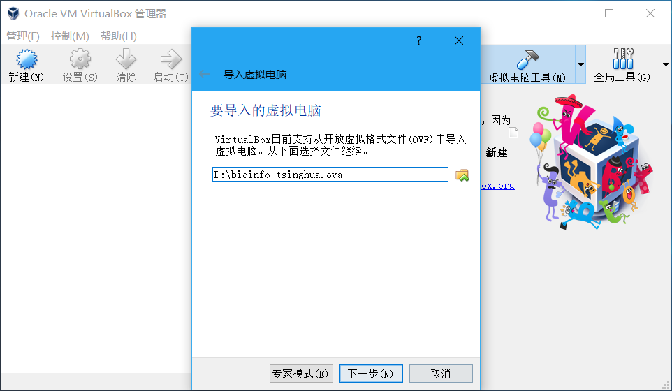
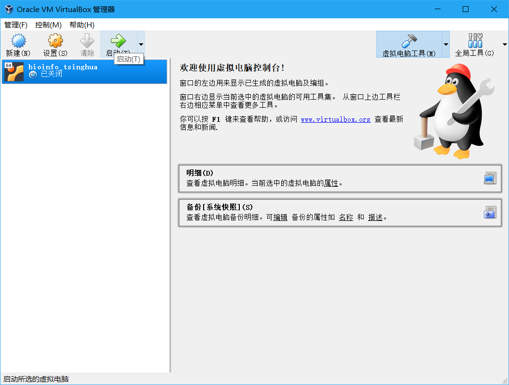

# Docker

## Pipeline 


## Running Scripts

### a) Windows 用户使用 Docker（基于Virtual Box）{#win-use-docker}

virtual box 官网 [](https://www.virtualbox.org/wiki/Downloads)  或 [这里](https://cloud.tsinghua.edu.cn/d/d03116f6f8e843f38236/) 

+ 点击管理，导入虚拟电脑。


+ 导入下载完成 bioinfo_tsinghua.ova




+ 点击确认


+ 导入完成后，启动 bioinfo_tinghua, 等待2至5分钟，ubuntu 系统启动。



系统启动完成后，打开 ubuntu command terminal，请参考[Getting Started 5b) 载入镜像](getting-started.md) 载入镜像。

)进行操作。


### b) MAC 用户使用 Docker

MAC 用户在安装完 Docker 后，如果遇到使用问题，可以参考官网的 [这篇文章](https://docs.docker.com/docker-for-mac/)，启动并设置Docker Desktop。

### c) docker 常用命令

```bash
docker ps #查看当前正在运行的容器
docker ps -a #查看所有容器
docker images #查看所有镜像
```

### d) 容器共享主机文件夹


上图所示的命令是新建name=bioinfo容器，并将bioinfo容器中的 `～/share` 路径挂载到mac主机桌面上的 `bioinfo_tsinghua_share` 文件夹中。


**推荐使用挂载主机目录的方法创建的容器去练习本教程接下来的章节，在所有章节running scripts前切换docker工作目录到Desktop，最后你会发现所有inputs&outputs的文件都会同步到mac桌面的bioinfo文件夹中，便于管理和查看结果。同时，从本地添加到bioinfo文件夹下面的文件或子文件夹，也可以在docker中`ls`查看。**

**so，同步的前提是，工作目录与挂载主机目录一致。也就是说，在所有章节running scripts前切换docker工作目录到Desktop，也就是输入`cd Desktop`命令，否则将无法同步，如下图所示。**


有些命令没有在此列出，感兴趣（且不怕把 Docker 弄坏）的读者可自行相关教程（本章最后面有一些推荐）。


### e) 清理环境

如果你完成了本教程的全部内容（本章后面还有一章），可以使用如下命令清理你的电脑：

```bash
docker rm -f bioinfo_tsinghua  # 强行删除容器
docker rmi bioinfo_tsinghua    # 删除镜像
rm ~/Desktop/bioinfo_tsinghua.tar.gz # 删除下载的文件
```


## Tips/Utilitie


### 参考阅读

> 这里推荐阅读两篇Docker安装教程，分别是[《macOS 安装 Docker》](https://yeasy.gitbooks.io/docker_practice/install/mac.html)和[《Windows 10 PC 安装 Docker CE》](https://yeasy.gitbooks.io/docker_practice/install/windows.html)，来自于[《Docker——从入门到实践》](https://legacy.gitbook.com/book/yeasy/docker_practice/details)书，这本书对Docker进行了深入浅出的讲解，对于初学者理解和学习docker技术有所帮助。另外，网上也有很多docker教程，有深入学习兴趣的同学可以自行检索学习。

## Homework and more

根据教程指导，安装Docker，load本教程提供的ubuntu：latest镜像，完成Running Scripts部分的基础操作练习，然后尝试更多的镜像和容器管理操作，例如容器创建、查看、启动、终止、删除等。

