# Appendix III. Plots & Scripts

## 0. Load the data and install packages {#plot-setup}
------

1. Set work directory

   ```r
   setwd("~/gitbook")
   ```

1. Load the data

   ```r
   data <-read.table("box_plots_mtcars.txt",header=T,sep="\t")
   df <- data[, c("mpg", "cyl", "wt")]
   
   df2 <-read.table("histogram_plots.txt",header=T,sep="\t")
   
   df3 <- read.table("volcano_plots.txt", header=TRUE)
   
   df4 <- read.table("manhattan_plots_gwasResults.txt",header=T,sep="\t")
   
   df5 <-read.table("heatmaps.txt",header=T,sep="\t")
   dm <- data.matrix(df5[1:nrow(df5),2:ncol(df5)])
   row.names(dm) <- df5[,1]
   
   df6 <- read.table("ballon_plots_GO.txt", header=T, sep="\t")
   ```

1. Install and library packages

   ```r
   install.packages(c('ggplot2', 'qqman', 'gplots', 'pheatmap', 'scales', 'reshape2', 'RColorBrewer'))

   library(ggplot2)
   library(qqman)
   library(gplots)
   library(pheatmap)
   library(scales)
   library(reshape2)
   library(RColorBrewer)
   library(plyr)
   library(plotrix)
   ```

1. Save the plot

   If you want to save the plot,  please use `pdf()`, `dev.off()` or `ggsave()`. 
       The second one is specific for the **ggplot2** package.
   
   For example,
   
   ```r
   pdf("1.1.Basic_boxplot.pdf", height = 3, width = 3)
   ggplot(df, aes(x=cyl, y=mpg)) + 
     geom_boxplot(fill="gray")+
     labs(title="Plot of mpg per cyl",x="Cyl", y = "Mpg")+
     theme_classic()
   dev.off()
   ```
   
   Or 

   ```r
   p <- ggplot(df, aes(x=cyl, y=mpg)) + 
     geom_boxplot(fill="gray")+
     labs(title="Plot of mpg per cyl",x="Cyl", y = "Mpg")+
     theme_classic()
   ggsave("1.1.Basic_boxplot.pdf", plot=p, height = 3, width = 3)
   ```

## 1. Box plots {#box-plot}
------

1. Basic box plot

   ```r
   df$cyl <- as.factor(df$cyl)
   head(df)
   ```
   
   ```
   ###                    mpg cyl    wt
   ### Mazda RX4         21.0   6 2.620
   ### Mazda RX4 Wag     21.0   6 2.875
   ### Datsun 710        22.8   4 2.320
   ### Hornet 4 Drive    21.4   6 3.215
   ### Hornet Sportabout 18.7   8 3.440
   ### Valiant           18.1   6 3.460
   ```
   
   ```r
   ggplot(df, aes(x=cyl, y=mpg)) + 
     geom_boxplot(fill="gray")+
     labs(title="Plot of mpg per cyl",x="Cyl", y = "Mpg")+
     theme_classic()
   ```
   
   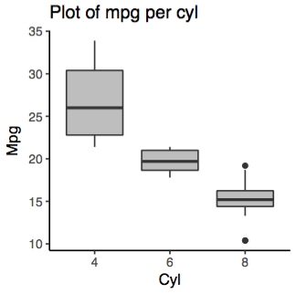

2. Change continuous color by groups

   ```r
   ggplot(df, aes(x=cyl, y=mpg, fill=cyl)) + 
     geom_boxplot()+
     labs(title="Plot of mpg per cyl",x="Cyl", y = "Mpg") +
     scale_fill_brewer(palette="Blues") + 
     theme_bw()
   ```
   
   
   
Reference: [http://www.sthda.com/english/wiki/ggplot2-box-plot-quick-start-guide-r-software-and-data-visualization](http://www.sthda.com/english/wiki/ggplot2-box-plot-quick-start-guide-r-software-and-data-visualization)

## 2. Violin plots {#violin-plot}
------

1. Basic violin plot

   ```r
   df$cyl <- as.factor(df$cyl)
   head(df)
   ```
   
   ```
   ###                    mpg cyl    wt
   ### Mazda RX4         21.0   6 2.620
   ### Mazda RX4 Wag     21.0   6 2.875
   ### Datsun 710        22.8   4 2.320
   ### Hornet 4 Drive    21.4   6 3.215
   ### Hornet Sportabout 18.7   8 3.440
   ### Valiant           18.1   6 3.460
   ```
   
   ```r
   ggplot(df, aes(x=cyl, y=mpg)) +
       geom_violin(trim=FALSE) +
       labs(title="Plot of mpg per cyl", x="Cyl", y = "Mpg")
   ```
   
   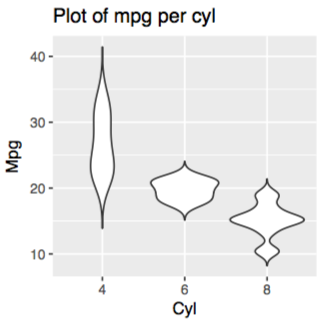

2. Add summary statistics on a violin plot

   - Add median and quartile
   
     ```r
     ggplot(df, aes(x=cyl, y=mpg)) + 
       geom_violin(trim=FALSE) +
       labs(title="Plot of mpg per cyl", x="Cyl", y = "Mpg") +
       stat_summary(fun.y=mean, geom="point", shape=23, size=2, color="red")
     ```
     
     
     
     or
     
     ```r
     ggplot(df, aes(x=cyl, y=mpg)) + 
       geom_violin(trim=FALSE) +
       labs(title="Plot of mpg per cyl", x="Cyl", y = "Mpg") +
       geom_boxplot(width=0.1)
     ```
     
     
   
   - Add mean and standard deviation
   
     ```r
     ggplot(df, aes(x=cyl, y=mpg)) + 
       geom_violin(trim=FALSE) +
       labs(title="Plot of mpg per cyl", x="Cyl", y = "Mpg") +
       stat_summary(fun.data="mean_sdl", fun.args = list(mult = 1), geom="crossbar", width=0.1 )
     ```
     
     
     
     or
     
     ```r
     ggplot(df, aes(x=cyl, y=mpg)) + 
       geom_violin(trim=FALSE) +
       labs(title="Plot of mpg per cyl", x="Cyl", y = "Mpg") +
       stat_summary(fun.data=mean_sdl, fun.args = list(mult = 1), geom="pointrange", color="red")
     ```
     
     

3. Change violin plot fill colors

   ```r
   ggplot(df, aes(x=cyl, y=mpg, fill=cyl)) + 
     geom_violin(trim=FALSE) +
     geom_boxplot(width=0.1, fill="white") +
     labs(title="Plot of mpg per cyl", x="Cyl", y = "Mpg") +
     scale_fill_brewer(palette="Blues") + 
     theme_classic()
   ```
   
   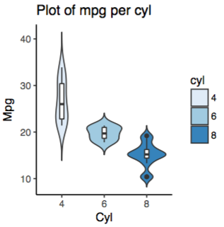

Reference: [http://www.sthda.com/english/wiki/ggplot2-violin-plot-quick-start-guide-r-software-and-data-visualization](http://www.sthda.com/english/wiki/ggplot2-violin-plot-quick-start-guide-r-software-and-data-visualization)

## 3. Histogram plots {#histogram-plot}
------

1. Basic histogram plot

   ```r
   head(df2)
   ```
   
   ```
   ###   sex weight
   ### 1   F     49
   ### 2   F     56
   ### 3   F     60
   ### 4   F     43
   ### 5   F     57
   ### 6   F     58
   ```
   
   ```r
   ggplot(df2, aes(x=weight)) + geom_histogram(binwidth=1)
   ```
   
   

2. Add mean line on a histogram plot

   ```r
   ggplot(df2, aes(x=weight)) + 
     geom_histogram(binwidth=1, color="black", fill="white") +
     geom_vline(aes(xintercept=mean(weight)),color="black", linetype="dashed", size=0.5)
   ```
   
   

3. Change histogram plot fill colors

   ```r
   ##Use the plyr package to calculate the average weight of each group :
   mu <- ddply(df2, "sex", summarise, grp.mean=mean(weight))
   head(mu)
   ```
   
   ```
   ###   sex grp.mean
   ### 1   F    54.70
   ### 2   M    65.36
   ```
   
   ```r
   ##draw the plot
   ggplot(df2, aes(x=weight, color=sex)) +
     geom_histogram(binwidth=1, fill="white", position="dodge")+
     geom_vline(data=mu, aes(xintercept=grp.mean, color=sex), linetype="dashed") +
     scale_color_brewer(palette="Paired") + 
     theme_classic()+
     theme(legend.position="top")
   ```
   
   

Reference: [http://www.sthda.com/english/wiki/ggplot2-histogram-plot-quick-start-guide-r-software-and-data-visualization](http://www.sthda.com/english/wiki/ggplot2-histogram-plot-quick-start-guide-r-software-and-data-visualization)

## 4. Density plots {#density-plot}
------

1. Basic density
   
   ```r
   head(df2)
   ```
   
   ```
   ###   sex weight
   ### 1   F     49
   ### 2   F     56
   ### 3   F     60
   ### 4   F     43
   ### 5   F     57
   ### 6   F     58
   ```
   
   ```r
   ggplot(df2, aes(x=weight)) + 
     geom_density()
   ```
   
   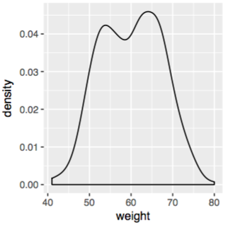
   
2. Add mean line on a density plot
   
   ```r
   ggplot(df2, aes(x=weight)) +
     geom_density() +
     geom_vline(aes(xintercept=mean(weight)), color="black", linetype="dashed", size=0.5)
   ```
   
   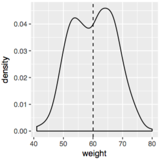
   
3. Change density plot fill colors
   
   ```r
   ##Use the plyr package plyr to calculate the average weight of each group :
   mu <- ddply(df2, "sex", summarise, grp.mean=mean(weight))
   head(mu)
   ```
   
   ```
   ###   sex grp.mean
   ### 1   F    54.70
   ### 2   M    65.36
   ```
   
   draw the plot
   
   - Change fill colors
   
     ```r
     ggplot(df2, aes(x=weight, fill=sex)) +
       geom_density(alpha=0.7)+
       geom_vline(data=mu, aes(xintercept=grp.mean, color=sex), linetype="dashed")+
       labs(title="Weight density curve",x="Weight(kg)", y = "Density") + 
       scale_color_brewer(palette="Paired") +
       scale_fill_brewer(palette="Blues") +
       theme_classic()
     ```
     
     
   
   - Change line colors
   
     ```r
     ggplot(df2, aes(x=weight, color=sex)) +
       geom_density()+
       geom_vline(data=mu, aes(xintercept=grp.mean, color=sex), linetype="dashed")+
       labs(title="Weight density curve",x="Weight(kg)", y = "Density") + 
       scale_color_brewer(palette="Paired") +
       theme_classic()
     ```
     
     
   
   - Combine histogram and density plots
   
     ```r
     ggplot(df2, aes(x=weight, color=sex, fill=sex)) + 
       geom_histogram(binwidth=1, aes(y=..density..), alpha=0.5, position="identity") +
       geom_density(alpha=.2) +
       labs(title="Weight density curve",x="Weight(kg)", y = "Density") + 
       scale_color_brewer(palette="Paired") +
       scale_fill_brewer(palette="Blues") +
       theme_classic()
     ```
     
     

Reference: [http://www.sthda.com/english/wiki/ggplot2-density-plot-quick-start-guide-r-software-and-data-visualization](http://www.sthda.com/english/wiki/ggplot2-density-plot-quick-start-guide-r-software-and-data-visualization)


## 5. Dot plots {#dot-plot}
------

1. Basic dot plots
   
   ```r
   df$cyl <- as.factor(df$cyl)
   head(df)
   ```
   
   ```
   ###                    mpg cyl    wt
   ### Mazda RX4         21.0   6 2.620
   ### Mazda RX4 Wag     21.0   6 2.875
   ### Datsun 710        22.8   4 2.320
   ### Hornet 4 Drive    21.4   6 3.215
   ### Hornet Sportabout 18.7   8 3.440
   ### Valiant           18.1   6 3.460
   ```
   
   ```r
   ggplot(df, aes(x=cyl, y=mpg)) + 
     geom_dotplot(binaxis='y', stackdir='center', binwidth=1)
   ```
   
   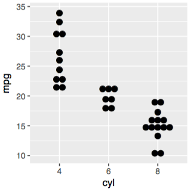
   
2. Add mean and standard deviation
   
   ```r
   ggplot(df, aes(x=cyl, y=mpg)) + 
     geom_dotplot(binaxis='y', stackdir='center', binwidth=1) + 
     stat_summary(fun.data="mean_sdl", fun.args = list(mult=1), geom="crossbar", width=0.5)
   ```
   
   
   
   or
   
   ```r
   ggplot(df, aes(x=cyl, y=mpg)) + 
     geom_dotplot(binaxis='y', stackdir='center', binwidth=1) + 
     stat_summary(fun.data="mean_sdl", fun.args = list(mult=1), geom="pointrange", color="red")
   ```
   
   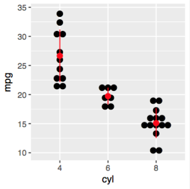
   
3. Change dot colors
   
   ```r
   ggplot(df, aes(x=cyl, y=mpg, fill=cyl, shape=cyl)) + 
     geom_dotplot(binaxis='y', stackdir='center', binwidth=1, dotsize=0.8) + 
     labs(title="Plot of mpg per cyl",x="Cyl", y = "Mpg") +
     #stat_summary(fun.data="mean_sdl", fun.args = list(mult=1), geom="crossbar", width=0.5) +
     scale_fill_brewer(palette="Blues") +
     #scale_color_brewer(palette="Blues") +
     theme_classic()
   ```
   
   
   
4. Change dot colors, shapes and align types
   
   ```r
   ggplot(df, aes(x=cyl, y=mpg, color=cyl, shape=cyl)) + 
     geom_jitter(position=position_jitter(0.1), cex=2)+
     labs(title="Plot of mpg per cyl",x="Cyl", y = "Mpg") + 
     scale_color_brewer(palette="Blues") + 
     theme_classic()
   ```
   
   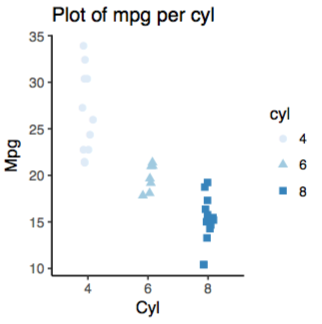

Reference: [http://www.sthda.com/english/wiki/ggplot2-dot-plot-quick-start-guide-r-software-and-data-visualization](http://www.sthda.com/english/wiki/ggplot2-dot-plot-quick-start-guide-r-software-and-data-visualization)

## 6. Scatter plots {#scatter-plot}
------

1. Basic scatter plots
   
   ```r
   df$cyl <- as.factor(df$cyl)
   head(df)
   ```
   
   ```
   ###                    mpg cyl    wt
   ### Mazda RX4         21.0   6 2.620
   ### Mazda RX4 Wag     21.0   6 2.875
   ### Datsun 710        22.8   4 2.320
   ### Hornet 4 Drive    21.4   6 3.215
   ### Hornet Sportabout 18.7   8 3.440
   ### Valiant           18.1   6 3.460
   ```
   
   ```r
   ggplot(df, aes(x=wt, y=mpg)) + 
     geom_point(size=1.5)
   ```
   
   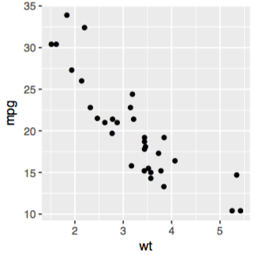
   
2. Add regression lines and change the point colors, shapes and sizes
   
   ```r
   ggplot(df, aes(x=wt, y=mpg, color=cyl, shape=cyl)) +
     geom_point(size=1.5) + 
     geom_smooth(method=lm, se=FALSE, fullrange=TRUE) +
     theme_classic()
   ```
   
   

Reference: [http://www.sthda.com/english/wiki/ggplot2-scatter-plots-quick-start-guide-r-software-and-data-visualization](http://www.sthda.com/english/wiki/ggplot2-scatter-plots-quick-start-guide-r-software-and-data-visualization)

## 7. Volcano plots {#volcano-plot}
------

```r
head(df3)
```

```
###      Gene log2FoldChange    pvalue      padj
### 1    DOK6         0.5100 1.861e-08 0.0003053
### 2    TBX5        -2.1290 5.655e-08 0.0004191
### 3 SLC32A1         0.9003 7.664e-08 0.0004191
### 4  IFITM1        -1.6870 3.735e-06 0.0068090
### 5   NUP93         0.3659 3.373e-06 0.0068090
### 6 EMILIN2         1.5340 2.976e-06 0.0068090
```

```r
df3$threshold <- as.factor(ifelse(df3$padj < 0.05 & abs(df3$log2FoldChange) >=1,ifelse(df3$log2FoldChange > 1 ,'Up','Down'),'Not'))
ggplot(data=df3, aes(x=log2FoldChange, y =-log10(padj), color=threshold,fill=threshold)) +
  scale_color_manual(values=c("blue", "grey","red"))+
  geom_point(size=1) +
  xlim(c(-3, 3)) +
  theme_bw(base_size = 12, base_family = "Times") +
  geom_vline(xintercept=c(-1,1),lty=4,col="grey",lwd=0.6)+
  geom_hline(yintercept = -log10(0.05),lty=4,col="grey",lwd=0.6)+
  theme(legend.position="right",
        panel.grid=element_blank(),
        legend.title = element_blank(),
        legend.text= element_text(face="bold", color="black",family = "Times", size=8),
        plot.title = element_text(hjust = 0.5),
        axis.text.x = element_text(face="bold", color="black", size=12),
        axis.text.y = element_text(face="bold",  color="black", size=12),
        axis.title.x = element_text(face="bold", color="black", size=12),
        axis.title.y = element_text(face="bold",color="black", size=12))+
  labs(x="log2FoldChange",y="-log10 (adjusted p-value)",title="Volcano plot of DEG", face="bold")
```

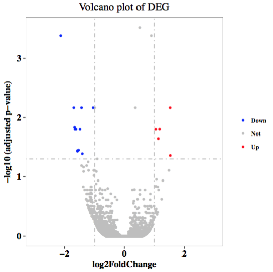

## 8. Manhattan plots {#manhattan-plot}
------

```r
head(df4)
```

```
###   SNP CHR BP         P
### 1 rs1   1  1 0.9148060
### 2 rs2   1  2 0.9370754
### 3 rs3   1  3 0.2861395
### 4 rs4   1  4 0.8304476
### 5 rs5   1  5 0.6417455
### 6 rs6   1  6 0.5190959
```

```r
manhattan(df4, main = "GWAS results", ylim = c(0, 8),
          cex = 0.5, cex.axis=0.8, col=c("dodgerblue4","deepskyblue"),
          #suggestiveline = F, genomewideline = F, #remove the suggestive and genome-wide significance lines
          chrlabs = as.character(c(1:22)))
```


## 9. Heatmaps {#heatmap-plot}
------

1. Draw the heatmap with the gplots package, heatmap.2 function
   
   ```r
   head(dm)
   ```
   
   ```
   ###       Control1      Tumor2 Control3     Tumor4 Control5     Tumor1
   ### Gene1 3.646058 -0.98990248 2.210404 -0.2063050 2.859744  1.3304284
   ### Gene2 4.271172 -1.16217765 2.734119 -2.4782173 3.752013  0.0255639
   ### Gene3 3.530448  1.11451101 1.635485 -0.4241215 3.701427  1.2263312
   ### Gene4 3.061122 -1.18791027 4.331229  0.8733314 2.349352  0.4825479
   ### Gene5 1.956817  0.25431042 1.984438  1.2713845 1.685917  1.4554739
   ### Gene6 2.000919  0.06015972 4.480901  0.9780682 3.063475 -0.4222994
   ###       Control2     Tumor3 Control4     Tumor5
   ### Gene1 2.690376  0.6135943 2.470413  0.5158246
   ### Gene2 4.471795  1.6516242 2.735508 -0.5837784
   ### Gene3 3.588787 -0.6349656 1.999844  0.1417349
   ### Gene4 1.854433 -1.2237684 1.154377 -0.9301261
   ### Gene5 2.445830  0.3316909 2.715163  0.1866400
   ### Gene6 3.585366  1.0689000 2.563422  1.3465830
   ```
   
   ```r
   ##to draw high expression value in red, we use colorRampPalette instead of redblue in heatmap.2
   ##colorRampPalette is a function in the RColorBrewer package
   cr <- colorRampPalette(c("blue","white","red"))
   heatmap.2(dm,
             scale="row", #scale the rows, scale each gene's expression value
             key=T, keysize=1.1, 
             cexCol=0.9,cexRow=0.8,
             col=cr(1000),
             ColSideColors=c(rep(c("blue","red"),5)),
             density.info="none",trace="none",
             #dendrogram='none', #if you want to remove dendrogram 
             Colv = T,Rowv = T #clusters by both row and col)
   ```
   
   
   
2. Draw the heatmap with the pheatmap package, pheatmap function
   
   ```r
   ##add column and row annotations
   annotation_col = data.frame(CellType = factor(rep(c("Control", "Tumor"), 5)), Time = 1:5)
   rownames(annotation_col) = colnames(dm)
   annotation_row = data.frame(GeneClass = factor(rep(c("Path1", "Path2", "Path3"), c(10, 4, 6))))
   rownames(annotation_row) = paste("Gene", 1:20, sep = "")
   ##set colors of each group
   ann_colors = list(Time = c("white", "springgreen4"), 
                     CellType = c(Control = "#7FBC41", Tumor = "#DE77AE"),
                     GeneClass = c(Path1 = "#807DBA", Path2 = "#9E9AC8", Path3 = "#BCBDDC"))
   ##draw the heatmap
   pheatmap(dm, 
            cutree_col = 2, cutree_row = 3, #break up the heatmap by clusters you define
            cluster_rows=TRUE, show_rownames=TRUE, cluster_cols=TRUE, #by default, pheatmap clusters by both row and col
            annotation_col = annotation_col, annotation_row = annotation_row,annotation_colors = ann_colors)
   ```
   
   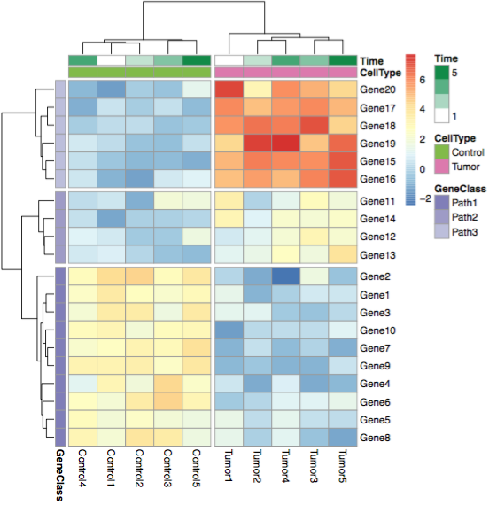
   
3. Draw the heatmap with the ggplot2 package
   
   ```r
   ##9.3.1.cluster by row and col
   ##cluster and re-order rows
   rowclust = hclust(dist(dm))
   reordered = dm[rowclust$order,]
   ##cluster and re-order columns
   colclust = hclust(dist(t(dm)))
   ##9.3.2.scale each row value in [0,1]
   dm.reordered = reordered[, colclust$order]
   dm.reordered=apply(dm.reordered,1,rescale) #rescale is a function in the scales package
   dm.reordered=t(dm.reordered) #transposed matrix
   ##9.3.3.save col and row names before changing the matrix format
   col_name=colnames(dm.reordered) 
   row_name=rownames(dm.reordered) 
   ##9.3.4.change data format for geom_title 
   colnames(dm.reordered)=1:ncol(dm.reordered)
   rownames(dm.reordered)=1:nrow(dm.reordered)
   dm.reordered=melt(dm.reordered) #melt is a function in the reshape2 package
   head(dm.reordered)
   ##9.3.5.draw the heatmap
   ggplot(dm.reordered, aes(Var2, Var1)) + 
     geom_tile(aes(fill = value), color = "white") + 
     scale_fill_gradient(low = "white", high = "steelblue") +
     theme_grey(base_size = 10) + 
     labs(x = "", y = "") + 
     scale_x_continuous(expand = c(0, 0),labels=col_name,breaks=1:length(col_name)) + 
     scale_y_continuous(expand = c(0, 0),labels=row_name,breaks=1:length(row_name))
   ```
   
   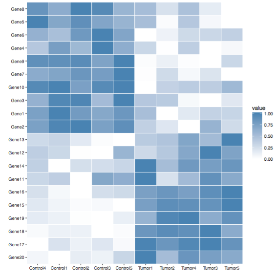

## 10. Ballon plots {#ballon-plot}
------

1. basic ballon plots
   
   ```r
   head(df6)
   ```
   
   ```
   ###                    Biological.process Fold.enrichment X.log10.Pvalue. col
   ### 1    Small molecule metabolic process             1.0              16   1
   ### 2   Single-organism catabolic process             1.5              12   1
   ### 3           Oxoacid metabolic process             2.0              23   1
   ### 4 Small molecule biosynthetic process             2.5               6   1
   ### 5   Carboxylic acid metabolic process             2.7              24   1
   ### 6      Organic acid metabolic process             2.7              25   1
   ```
   
   ```r
   ggplot(df6, aes(x=Fold.enrichment, y=Biological.process)) +
     geom_point(aes(size = X.log10.Pvalue.)) +
     scale_x_continuous(limits=c(0,7),breaks=0:7) +
     scale_size(breaks=c(1,5,10,15,20,25)) +
     theme_light() +
     theme(panel.border=element_rect(fill='transparent', color='black', size=1),
           plot.title = element_text(color="black", size=14, hjust=0.5, face="bold", lineheight=1),
           axis.title.x = element_text(color="black", size=12, face="bold"),
           axis.title.y = element_text(color="black", size=12, vjust=1.5, face="bold"),
           axis.text.x = element_text(size=12,color="black",face="bold"),
           axis.text.y = element_text(size=12,color="black",face="bold"),
           legend.text = element_text(color="black", size=10, hjust=-2),
           legend.position="bottom") +
     labs(x="Fold Enrichment",y="Biological Process",size="-log10(Pvalue)", title="GO Enrichment",face="bold")
   ```
   
   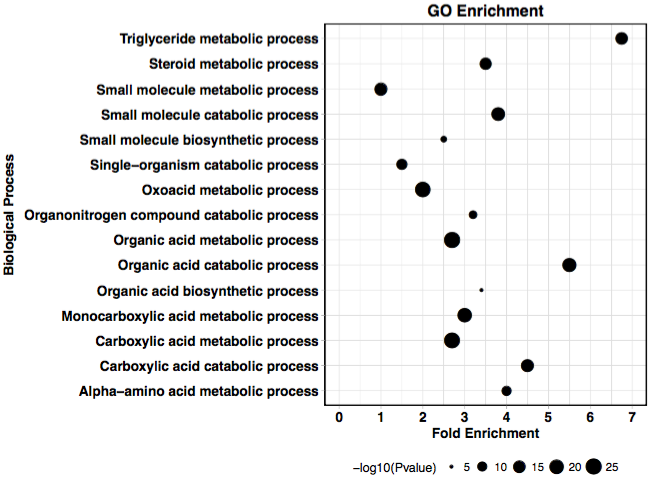
   
2. change the dot colors
   
   ```r
   ggplot(df6, aes(x=col, y=Biological.process,color=X.log10.Pvalue.)) +
     geom_point(aes(size = Fold.enrichment)) +
     scale_x_discrete(limits=c("1")) +
     scale_size(breaks=c(1,2,4,6)) +
     scale_color_gradient(low="#fcbba1", high="#a50f15") +
     theme_classic() +
     theme(panel.border=element_rect(fill='transparent', color='black', size=1),
           plot.title = element_text(color="black", size=14, hjust=0.5, face="bold", lineheight=1),
           axis.title.x = element_blank(),
           axis.title.y = element_text(color="black", size=12, face="bold"),
           axis.text.x = element_blank(),
           axis.ticks = element_blank(),
           axis.text.y = element_text(size=12,color="black",face="bold"),
           legend.text = element_text(color="black", size=10)) +
     labs(y="Biological Process",size="Fold Enrichment", color="-Log10(Pvalue)",title="GO Enrichment",face="bold")
   ```
   
   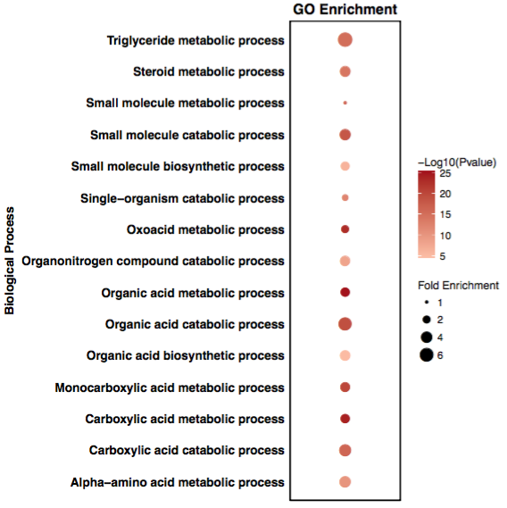

## 11. Vennpie plots {#vennpie-plot}
------

The vennpie plot is the combination of a venn diagram and a pie chart.
   
```r
##11.1.data input (number of reads mapped to each category)
total=100
rRNA=5
mtRNA=7
intergenic=48 
introns=12
exons=30
upstream=3
downstream=6
not_near_genes=40

rest=total-rRNA-mtRNA
genic=rest-intergenic
introns_and_exons=introns+exons-genic


##11.2 draw the plot
## parameter for pie chart
iniR=0.2 # initial radius
colors=list(NO='white',total='black',mtRNA='#e5f5e0',rRNA='#a1d99b',
            genic='#3182bd',intergenic='#fec44f',introns='#fc9272',
            exons='#9ecae1',upstream='#ffeda0',downstream='#fee0d2',
            not_near_genes='#d95f0e')

## from outer circle to inner circle
##0 circle: blank
pie(1, radius=iniR, init.angle=90, col=c('white'), border = NA, labels='')
##4 circle: show genic:exons and intergenic:downstream
floating.pie(0,0,
             c(exons, genic-exons+not_near_genes, downstream, mtRNA+rRNA+intergenic-not_near_genes-downstream),
             radius=5*iniR, 
             startpos=pi/2, 
             col=as.character(colors[c('exons','NO','downstream','NO')]),
             border=NA)
##3 circle: show genic:introns and intergenic:not_near_genes | upstream
floating.pie(0,0,
             c(genic-introns, introns, not_near_genes, intergenic-upstream-not_near_genes, upstream, mtRNA+rRNA),
             radius=4*iniR,
             startpos=pi/2, 
             col=as.character(colors[c('NO','introns','not_near_genes','NO','upstream','NO')]),
             border=NA)
##2 circle: divide the rest into genic and intergenic
floating.pie(0,0,
             c(genic, intergenic, mtRNA+rRNA),
             radius=3*iniR, 
             startpos=pi/2, 
             col=as.character(colors[c('genic','intergenic','NO')]),
             border=NA)
##1 circle: for rRNA+mtRNA+rest
floating.pie(0,0, 
             c(rest, rRNA,mtRNA), 
             radius=2*iniR, 
             startpos=pi/2, 
             col=as.character(colors[c('NO','rRNA','mtRNA')]), 
             border = NA)
legend(0, 6*iniR, gsub("_"," ",names(colors)[-1]), 
       col=as.character(colors[-1]), 
       pch=19, bty='n', ncol=2)

### or, in one column with reads count and %
##names=gsub("_"," ",names(colors)[-1])
##values = sapply(names(colors)[-1], get)
##percent=format(100*values/total, digits=2, trim=T)
##values = format(values, big.mark=",", scientific=FALSE, trim=T)
##cl=as.character(colors[-1])
##pchs=rep(19, length(cl)); pchs[1]=1;
##legend(0, 5*iniR, paste(names," (",values,", ", percent,"%)", sep=""), 
##       col=cl, pch=pchs,bty='n', ncol=1, cex=0.6)
```

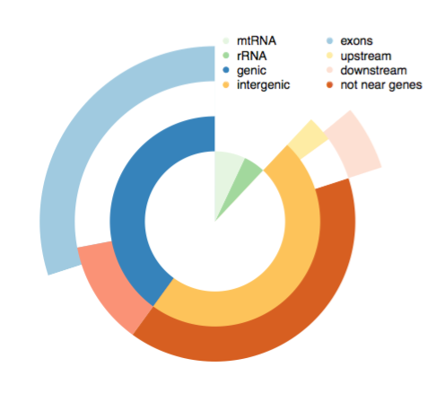

Reference: [http://onetipperday.sterding.com/2014/09/vennpier-combination-of-venn-diagram.html](http://onetipperday.sterding.com/2014/09/vennpier-combination-of-venn-diagram.html)


## Learn more {#plot-more}
------

1. Guide to Great Beautiful Graphics in R

   [http://www.sthda.com/english/wiki/ggplot2-essentials](http://www.sthda.com/english/wiki/ggplot2-essentials)

2. Top 50 ggplot2 Visualizations - The Master List \(With Full R Code\)

   b[http://r-statistics.co/Top50-Ggplot2-Visualizations-MasterList-R-Code.html](http://r-statistics.co/Top50-Ggplot2-Visualizations-MasterList-R-Code.html)


## Shared Scripts {#share-script}

------

### scripts

* Lu Lab: https://github.com/lulab/shared_scripts
* Zhi J. Lu: https://github.com/urluzhi/scripts

### Plots


* Lu Lab: https://github.com/lulab/shared_scripts/tree/master/plots
* Zhi J. Lu: https://github.com/urluzhi/scripts/tree/master/Rscript/R_plot


