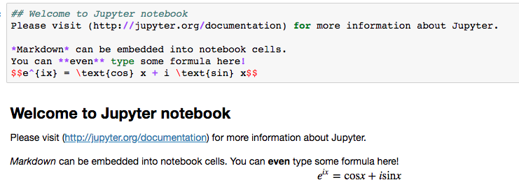

# Python Basics


- 本教程默认使用**python3**

## 1. Basic Practice Guide

### python语法规范
python非常注意规范的书写语法，以缩进为例，python强制要求使用tabs/spaces来缩进。推荐使用tab或四个空格来缩进。
```python
# use a tab
for i in range(3):
    print(i)
# use 2 spaces
for i in range(3):
  print(i)
# use 4 spaces
for i in range(3):
    print(i)
```

### 在终端运行python脚本
创建一个python脚本`welcome.py`，在文件中写入如下内容：
```python
print('welcome to python!')
```

在相同目录下运行:
```bash
chmod +x welcome.py  #set the python script as executable
python welcome.py    #use python to run welcome.py
```

用shebang符号可以不需要指明python解释器，即在python脚本的第一行添加`#! /usr/bin/env python`
```python
#! /usr/bin/env python
# -*- coding: UTF-8 -*-
print('welcome to python!')
```

现在就可以不需要指明python解释器，直接运行python脚本了。

```bash
chmod +x welcome.py  #set the python script as executable
./welcome.py
```

### Hello World!


```python
# This is a one line comment
print('Hello World!')
```


```python
print("The \n makes a new line")
print("The \t is a tab")
print('I\'m going to the movies')
```


```python
firstVariable = 'Hello World!'
print(firstVariable)
```


```python
# go over ? mark after if you are not sure what method does. 
print(firstVariable.lower())
print(firstVariable.upper())
print(firstVariable.title())
```


```python
# To look up what each method does in jupyter notebook
firstVariable.lower?
```


```python
# Can also use help
help(firstVariable.lower)
```

    


### Simple Math


```python
print (1+1)
print (130-2.0)
print (126/3)
print (2*3)
print (2**3)
print (10%3)
```


### if statement
Comparison Operator | Function
--- | --- 
< | less than
<= | less than or equal to
> | greater than
>= | greater than or equal to
== | equal
!= | not equal


```python
num = 3
if num % 3 == 0:
    print("if statement satisfied")
```


Logical Operator | Description
--- | ---
and | If both the operands are True then condition becomes True.
or | If any of the two operands are True then condition becomes True. 
not | Used to reverse the logical (not False becomes True, not True becomes False)


```python
# both the conditions are true, so the num will be printed out
num = 3
if num > 0 and num  < 15:
    print(num)
```

   
### else and elif


```python
my_num = 5
if my_num % 2 == 0:
    print("Your number is even")
elif my_num % 2 == 0:
    print("Your number is odd")
else: 
    print("Are you sure your number is an integer?")
```


### Swap values


```python
a = 1
b = 2
b, a = a, b
print(a, b)
```


### List
请务必注意，python的索引都是**从0开始的**，而不是1！

 |  |  |  |
--- | --- | --- | --- | ---
z =| [3, | 7, | 4, | 2]
index | 0 | 1 | 2 | 3

#### Accessing Values in List


```python
# Defining a list
z = [3, 7, 4, 2]
```


```python
# The first element of a list is at index 0
z[0]
```


```python
# Access Last Element of List 
z[-1]
```


#### Slicing Lists


```python
# first index is inclusive (before the :) and last (after the :) is not. 
# not including index 2
z[0:2]
```


```python
# everything up to index 3
z[:3]
```


```python
# index 1 to end of list
z[1:]
```


#### Minimum, Maximum, Length, and Sum of a list


```python
print(min(z), max(z), len(z), sum(z))
```

#### Add to the End of List


```python
x = [3, 7, 2, 11, 8, 10, 4]
y = ['Steve', 'Rachel', 'Michael', 'Adam', 'Monica', 'Jessica', 'Lester']
x.append(3)
y.append('James')
print(x)
print(y)
```

 

#### list comprehension


```python
#Use for loops
a = []
for i in range(10):
    a.append(i + 10)
print(a)
```


```python
#Use list comprehension
a = [i + 10 for i in range(10)]
print(a)
```


### Dictionary

字典是另一种可变容器模型，可存储任意类型对象。

字典的每个键值 `key->value` 对用冒号 `:` 分割，每个键值对之间用逗号 `,` 分割，整个字典包括在花括号 `{}` 中

键一般是唯一的，如果重复最后的一个键值对会替换前面的，值不需要唯一

#### 定义和获取字典中的值


```python
dict = {'a': 1, 'b': 2, 'b': '3'};
dict['b']
```


#### 修改字典


```python
dict = {'Name': 'Zara', 'Age': 7, 'Class': 'First'};
 
dict['Age'] = 8; # update existing entry
dict['School'] = "DPS School"; # Add new entry
 
 
print ("dict['Age']: ", dict['Age'])
print ("dict['School']: ", dict['School'])
```


#### Dict comprehension


```python
#Use for-loops:
a = {}
for i in range(10):
    a[i] = chr(ord('A') + i) 
print(a)
```

  

```python
#Use dict comprehension:
a = {i:chr(ord('A') + i) for i in range(10)}
print(a)
```


## 2. Homework
- 在电脑上安装Anaconda，在jupyter notebook中运行本教程中的相关代码，观察输出.


<link rel="stylesheet" type="text/css" href="auto-number-title.css" />


## 3. More Reading 

- [Advanced Tutorial - Python](https://lulab.gitbook.io/training/part-i-basic-skills/5.python_basics) - by Binbin Shi
- [Python Tutorials](https://github.com/mGalarnyk/Python_Tutorials)
- [Scipy Lectures](http://www.scipy-lectures.org/)
- [廖雪峰python教程](https://www.liaoxuefeng.com/wiki/0014316089557264a6b348958f449949df42a6d3a2e542c000)


---


## 附录：安装Anaconda和Jupyter Notebook

我们**建议**安装Anaconda，并使用Jupyter Notebook运行代码。读者可以下载本教程的[相关文件](https://cloud.tsinghua.edu.cn/f/37763eead90c4504bf07/)，并运行其中的`python_tutorial.ipynb`文件，但是推荐初学者自己输入代码，体会python的代码风格和规范。


### Anaconda

* Anaconda是一个管理和安装python包的管理软件，它也包含一些非常有用的工具如jupyter notebook
> * [官网下载地址](https://www.anaconda.com/download/)，也可以在TUNA镜像站[免流量下载Anaconda](https://mirrors.tuna.tsinghua.edu.cn/anaconda/archive/)

Operating System | Download Link | Notes
--- | --- | ---
Mac | [Anaconda3-5.2.0-MacOSX-x86_64.pkg](https://mirrors.tuna.tsinghua.edu.cn/anaconda/archive/Anaconda3-5.2.0-MacOSX-x86_64.pkg) | | 
Linux | [Anaconda3-5.2.0-Linux-x86_64.sh](https://mirrors.tuna.tsinghua.edu.cn/anaconda/archive/Anaconda3-5.2.0-Linux-x86_64.sh) | 注意需要添加环境变量 
Windows | [Anaconda3-5.2.0-Windows-x86_64.exe](https://mirrors.tuna.tsinghua.edu.cn/anaconda/archive/Anaconda3-5.2.0-Windows-x86_64.exe) | |


用`conda`安装python package，以`h5py`为例:
```bash
conda install h5py
```

用`conda`更新`h5py`至最新版本:
```bash
conda update h5py
```

安装conda时也自动安装了pip，pip也是一个用来安装和管理python包的工具，用`pip`安装python package，以`h5py`为例:
```bash
pip install h5py
```

用`pip`更新`h5py`至最新版本:
```bash
pip install --upgrade h5py
```

### jupyter notebook


[jupyter notebook](http://jupyter.org/) 是一款基于浏览器的交互性极强的python开发环境，在科研和工业界都广泛使用，可以帮助使用者方便的可视化结果，快速书写和调整代码，**非常推荐使用。**

**安装 jupyter notebook**

```
pip install jupyter_contrib_nbextensions
jupyter contrib nbextension install --user
```

**打开 jupyter notebook**

```bash
jupyter notebook --no-browser
```

或者使用软件版的Anaconda中集成的jupyter软件打开。


**使用 jupyter notebook**

- 保存，增加，删除，复制，粘贴代码框，上下移动代码框，运行，终止代码框，重启kernel（将会**清空内存**），切换代码框版式；
- 使用shift+enter运行代码框，使用enter换行；
- 可以搭配插件nbextenstion使用，提供更多功能。


#### 示例：


**展示图片：**


**展示dataframe（与pandas配合）：**


**方便的可视化（与matplotlib，seaborn等配合）：**


**支持markdown：**




