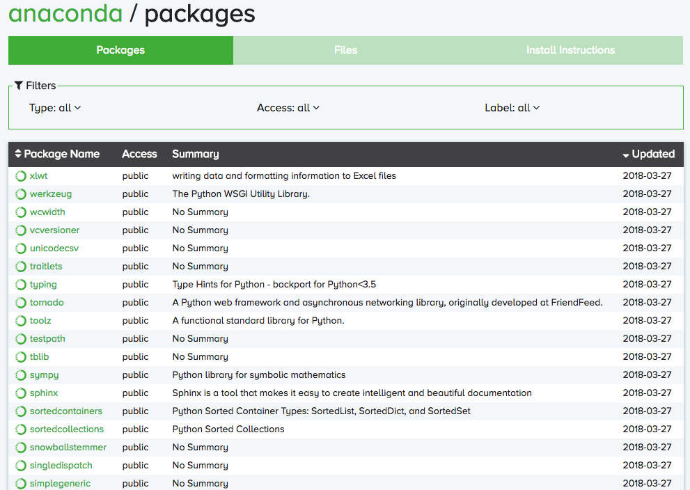
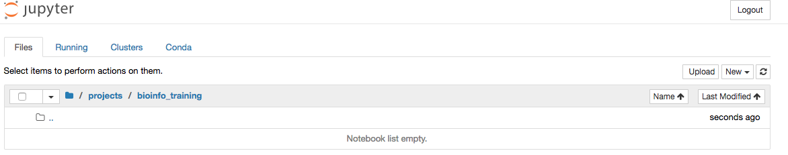
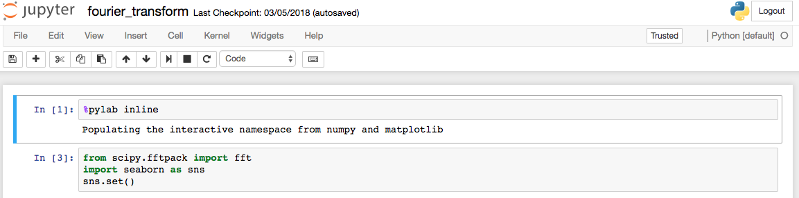
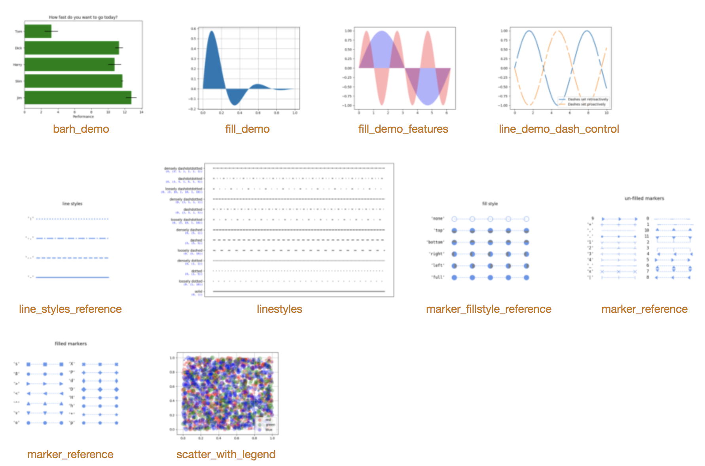

# Python Tutorial {#python_tutorial}


- 本教程默认使用**python3**
- **强烈建议** 安装好Anaconda，下载本教程的[相关文件](https://cloud.tsinghua.edu.cn/f/37763eead90c4504bf07/)，使用Jupyter notebook打开并运行其中的`python_tutorial.ipynb`文件。

## Anaconda 和 jupyter

### Anaconda

* 可以轻松的使用Anaconda管理和安装python的包（with `conda`），且包含一些非常有用的工具如jupyter notebook
* [官网下载地址](https://www.anaconda.com/download/)，也可以在TUNA镜像站[免流量下载Anaconda](https://mirrors.tuna.tsinghua.edu.cn/anaconda/archive/)

Operating System | Download Link | Notes
--- | --- | ---
Mac | [Anaconda3-5.2.0-MacOSX-x86_64.pkg](https://mirrors.tuna.tsinghua.edu.cn/anaconda/archive/Anaconda3-5.2.0-MacOSX-x86_64.pkg) | 
Linux | [Anaconda3-5.2.0-Linux-x86_64.sh](https://mirrors.tuna.tsinghua.edu.cn/anaconda/archive/Anaconda3-5.2.0-Linux-x86_64.sh) | 注意需要添加环境变量
Windows | [Anaconda3-5.2.0-Windows-x86_64.exe](https://mirrors.tuna.tsinghua.edu.cn/anaconda/archive/Anaconda3-5.2.0-Windows-x86_64.exe) | 



用`conda`安装python package，以`h5py`为例:
```bash
conda install h5py
```

用`conda`更新`h5py`至最新版本:
```bash
conda update h5py
```

安装conda时也自动安装了pip，pip也是一个用来安装和管理python包的工具，用`pip`安装python package，以`h5py`为例:
```bash
pip install h5py
```

用`pip`更新`h5py`至最新版本:
```bash
pip install --upgrade h5py
```

### jupyter notebook
URL: (http://jupyter.org/)

是一款基于浏览器的交互性极强的python开发环境，在科研和工业界都广泛使用，可以帮助使用者方便的可视化结果，快速书写和调整代码，**非常推荐使用**

**打开 jupyter notebook**

```bash
jupyter notebook --no-browser
```

或者使用软件版的Anaconda中集成的jupyter软件打开。

**Jupyter notebooks manager**




**Jupyter notebook**



**方便的可视化（与matplotlib，seaborn等配合）**


**展示图片**


**展示dataframe（与pandas配合）**


**支持markdown**


#### jupyter基本用法：
- 保存，增加，删除，复制，粘贴代码框，上下移动代码框，运行，终止代码框，重启kernel（将会**清空内存**），切换代码框版式
- 使用shift+enter运行代码框，使用enter换行
- 可以搭配插件nbextenstion使用，提供更多功能，用法：

```
pip install jupyter_contrib_nbextensions
jupyter contrib nbextension install --user
```

## Basic 

### python语法规范
python非常注意规范的书写语法，以缩进为例，python强制要求使用tabs/spaces来缩进。推荐使用tab或四个空格来缩进。
```python
# use a tab
for i in range(3):
    print(i)
# use 2 spaces
for i in range(3):
  print(i)
# use 4 spaces
for i in range(3):
    print(i)
```

### 在终端运行python脚本
创建一个python脚本`welcome.py`，在文件中写入如下内容：
```python
print('welcome to python!')
```

在相同目录下运行:
```bash
chmod +x welcome.py  #set the python script as executable
python welcome.py    #use python to run welcome.py
```

用shebang符号可以不需要指明python解释器，即在python脚本的第一行添加`#! /usr/bin/env python`
```python
#! /usr/bin/env python
# -*- coding: UTF-8 -*-
print('welcome to python!')
```

现在就可以不需要指明python解释器，直接运行python脚本了。

```bash
chmod +x welcome.py  #set the python script as executable
./welcome.py
```

### Hello World!


```python
# This is a one line comment
print('Hello World!')
```


```python
print("The \n makes a new line")
print("The \t is a tab")
print('I\'m going to the movies')
```


```python
firstVariable = 'Hello World!'
print(firstVariable)
```


```python
# go over ? mark after if you are not sure what method does. 
print(firstVariable.lower())
print(firstVariable.upper())
print(firstVariable.title())
```


```python
# To look up what each method does in jupyter notebook
firstVariable.lower?
```


```python
# Can also use help
help(firstVariable.lower)
```

    


### Simple Math


```python
print (1+1)
print (130-2.0)
print (126/3)
print (2*3)
print (2**3)
print (10%3)
```


### if statement
Comparison Operator | Function
--- | --- 
< | less than
<= | less than or equal to
> | greater than
>= | greater than or equal to
== | equal
!= | not equal


```python
num = 3
if num % 3 == 0:
    print("if statement satisfied")
```


Logical Operator | Description
--- | ---
and | If both the operands are True then condition becomes True.
or | If any of the two operands are True then condition becomes True. 
not | Used to reverse the logical (not False becomes True, not True becomes False)


```python
# both the conditions are true, so the num will be printed out
num = 3
if num > 0 and num  < 15:
    print(num)
```

   
### else and elif


```python
my_num = 5
if my_num % 2 == 0:
    print("Your number is even")
elif my_num % 2 == 0:
    print("Your number is odd")
else: 
    print("Are you sure your number is an integer?")
```


### Swap values


```python
a = 1
b = 2
b, a = a, b
print(a, b)
```


### List
请务必注意，python的索引都是**从0开始的**，而不是1！

 |  |  |  |
--- | --- | --- | --- | ---
z =| [3, | 7, | 4, | 2]
index | 0 | 1 | 2 | 3

#### Accessing Values in List


```python
# Defining a list
z = [3, 7, 4, 2]
```


```python
# The first element of a list is at index 0
z[0]
```


```python
# Access Last Element of List 
z[-1]
```


#### Slicing Lists


```python
# first index is inclusive (before the :) and last (after the :) is not. 
# not including index 2
z[0:2]
```


```python
# everything up to index 3
z[:3]
```


```python
# index 1 to end of list
z[1:]
```


#### Minimum, Maximum, Length, and Sum of a list


```python
print(min(z), max(z), len(z), sum(z))
```

#### Add to the End of List


```python
x = [3, 7, 2, 11, 8, 10, 4]
y = ['Steve', 'Rachel', 'Michael', 'Adam', 'Monica', 'Jessica', 'Lester']
x.append(3)
y.append('James')
print(x)
print(y)
```

 

#### list comprehension


```python
#Use for loops
a = []
for i in range(10):
    a.append(i + 10)
print(a)
```


```python
#Use list comprehension
a = [i + 10 for i in range(10)]
print(a)
```


### Dictionary

字典是另一种可变容器模型，可存储任意类型对象。

字典的每个键值 `key->value` 对用冒号 `:` 分割，每个键值对之间用逗号 `,` 分割，整个字典包括在花括号 `{}` 中

键一般是唯一的，如果重复最后的一个键值对会替换前面的，值不需要唯一

#### 定义和获取字典中的值


```python
dict = {'a': 1, 'b': 2, 'b': '3'};
dict['b']
```


#### 修改字典


```python
dict = {'Name': 'Zara', 'Age': 7, 'Class': 'First'};
 
dict['Age'] = 8; # update existing entry
dict['School'] = "DPS School"; # Add new entry
 
 
print ("dict['Age']: ", dict['Age'])
print ("dict['School']: ", dict['School'])
```


#### Dict comprehension


```python
#Use for-loops:
a = {}
for i in range(10):
    a[i] = chr(ord('A') + i) 
print(a)
```

  

```python
#Use dict comprehension:
a = {i:chr(ord('A') + i) for i in range(10)}
print(a)
```


## Scientific computation

### Scientific computing相关的python工具包


### 使用python工具包
python的开发者提供了数以万计的python工具包，以原生工具包`os`和矩阵计算工具包`numpy`为例，导入方法如下：


```python
import os
import numpy as np 
```

对于初学者，我们推荐优先掌握如下python工具包：
- Numpy
- Scipy
- Pandas
- Matplotlib

它们提供了非常强大有用的科学计算功能，在矩阵运算、统计建模、机器学习、数据可视化等领域都应用广泛。

如果读者对机器学习和深度学习感兴趣，可以进一步了解以下工具包：
- scikit-learn
- Keras/Tensorflow/Pytorh

#### 矩阵计算工具: Numpy
URL: (http://www.numpy.org/)


```python
import numpy as np
```


```python
# create an empty matrix of shape (5, 4)
X = np.zeros((5, 4), dtype=np.int32)
X
```


```python
# create an array of length 5: [0, 1, 2, 3, 4]
y = np.arange(0,5)
y
```


```python
# create an array of length 4: [0, 1, 2, 3]
z = np.arange(4)
z
```


```python
# set Row 1 to [0, 1, 2, 3]
X[0] = np.arange(4)
# set Row 2 to [1, 1, 1, 1]
X[1] = 1
X
```


```python
# add 1 to all elements
X += 1
X
```


```python
# add y to each row of X
X += y.reshape((-1, 1)) #reshape用于改变y的shape为5*1
X
```


```python
# add z to each column of X
X += z.reshape((1, -1))
X
```


```python
# get row sums => 
row_sums = X.sum(axis=1)
row_sums
```


```python
# get column sums
col_sums = X.sum(axis=0)
col_sums
```


```python
# matrix multiplication
A = X.dot(X.T) #X.T表示X的转置
A
```


#### 数值分析工具(概率分布，信号分析等.): Scipy
URL: (https://www.scipy.org/)

scipy.stats contains a large number probability distributions:


#### 操作data frames的工具包：pandas
URL: (http://pandas.pydata.org/pandas-docs/stable/)

请[下载gene.bed文件](https://github.com/lulab/teaching_book/tree/master/part-iii.-machine-learning-basics/data/)并将`data`文件夹放置在于本教程文件相同的目录下。


```python
import pandas as pd
```


```python
# read a bed file
genes = pd.read_table('data/gene.bed', header=None, sep='\t',
                     names=('chrom', 'start', 'end', 'gene_id', 'score', 'strand', 'biotype'))
genes.head(10)
```


<div>
<style scoped>
    .dataframe tbody tr th:only-of-type {
        vertical-align: middle;
    }

    .dataframe tbody tr th {
        vertical-align: top;
    }

    .dataframe thead th {
        text-align: right;
    }
</style>
<table border="1" class="dataframe">
  <thead>
    <tr style="text-align: right;">
      <th></th>
      <th>chrom</th>
      <th>start</th>
      <th>end</th>
      <th>gene_id</th>
      <th>score</th>
      <th>strand</th>
      <th>biotype</th>
    </tr>
  </thead>
  <tbody>
    <tr>
      <th>0</th>
      <td>chr10</td>
      <td>100237155</td>
      <td>100237302</td>
      <td>ENSG00000212464.1</td>
      <td>.</td>
      <td>-</td>
      <td>snoRNA</td>
    </tr>
    <tr>
      <th>1</th>
      <td>chr10</td>
      <td>100258570</td>
      <td>100258677</td>
      <td>ENSG00000207362.1</td>
      <td>.</td>
      <td>+</td>
      <td>snRNA</td>
    </tr>
    <tr>
      <th>2</th>
      <td>chr10</td>
      <td>100398351</td>
      <td>100398446</td>
      <td>ENSG00000212325.1</td>
      <td>.</td>
      <td>-</td>
      <td>misc_RNA</td>
    </tr>
    <tr>
      <th>3</th>
      <td>chr10</td>
      <td>100666694</td>
      <td>100667009</td>
      <td>ENSG00000274660.1</td>
      <td>.</td>
      <td>-</td>
      <td>misc_RNA</td>
    </tr>
    <tr>
      <th>4</th>
      <td>chr10</td>
      <td>100907173</td>
      <td>100907280</td>
      <td>ENSG00000222072.1</td>
      <td>.</td>
      <td>-</td>
      <td>misc_RNA</td>
    </tr>
    <tr>
      <th>5</th>
      <td>chr10</td>
      <td>100974984</td>
      <td>100975084</td>
      <td>ENSG00000207551.1</td>
      <td>.</td>
      <td>+</td>
      <td>miRNA</td>
    </tr>
    <tr>
      <th>6</th>
      <td>chr10</td>
      <td>101307528</td>
      <td>101307718</td>
      <td>ENSG00000222238.1</td>
      <td>.</td>
      <td>+</td>
      <td>snRNA</td>
    </tr>
    <tr>
      <th>7</th>
      <td>chr10</td>
      <td>101364844</td>
      <td>101365035</td>
      <td>ENSG00000222414.1</td>
      <td>.</td>
      <td>-</td>
      <td>snRNA</td>
    </tr>
    <tr>
      <th>8</th>
      <td>chr10</td>
      <td>101601416</td>
      <td>101601497</td>
      <td>ENSG00000263436.1</td>
      <td>.</td>
      <td>+</td>
      <td>miRNA</td>
    </tr>
    <tr>
      <th>9</th>
      <td>chr10</td>
      <td>101601416</td>
      <td>101601497</td>
      <td>ENSG00000283558.1</td>
      <td>.</td>
      <td>-</td>
      <td>miRNA</td>
    </tr>
  </tbody>
</table>
</div>


```python
# get all gene IDs
gene_ids = genes['gene_id']
```


```python
# set gene_id as index
genes.index = genes['gene_id']
genes.head()
```


<div>
<style scoped>
    .dataframe tbody tr th:only-of-type {
        vertical-align: middle;
    }

    .dataframe tbody tr th {
        vertical-align: top;
    }

    .dataframe thead th {
        text-align: right;
    }
</style>
<table border="1" class="dataframe">
  <thead>
    <tr style="text-align: right;">
      <th></th>
      <th>chrom</th>
      <th>start</th>
      <th>end</th>
      <th>gene_id</th>
      <th>score</th>
      <th>strand</th>
      <th>biotype</th>
    </tr>
    <tr>
      <th>gene_id</th>
      <th></th>
      <th></th>
      <th></th>
      <th></th>
      <th></th>
      <th></th>
      <th></th>
    </tr>
  </thead>
  <tbody>
    <tr>
      <th>ENSG00000212464.1</th>
      <td>chr10</td>
      <td>100237155</td>
      <td>100237302</td>
      <td>ENSG00000212464.1</td>
      <td>.</td>
      <td>-</td>
      <td>snoRNA</td>
    </tr>
    <tr>
      <th>ENSG00000207362.1</th>
      <td>chr10</td>
      <td>100258570</td>
      <td>100258677</td>
      <td>ENSG00000207362.1</td>
      <td>.</td>
      <td>+</td>
      <td>snRNA</td>
    </tr>
    <tr>
      <th>ENSG00000212325.1</th>
      <td>chr10</td>
      <td>100398351</td>
      <td>100398446</td>
      <td>ENSG00000212325.1</td>
      <td>.</td>
      <td>-</td>
      <td>misc_RNA</td>
    </tr>
    <tr>
      <th>ENSG00000274660.1</th>
      <td>chr10</td>
      <td>100666694</td>
      <td>100667009</td>
      <td>ENSG00000274660.1</td>
      <td>.</td>
      <td>-</td>
      <td>misc_RNA</td>
    </tr>
    <tr>
      <th>ENSG00000222072.1</th>
      <td>chr10</td>
      <td>100907173</td>
      <td>100907280</td>
      <td>ENSG00000222072.1</td>
      <td>.</td>
      <td>-</td>
      <td>misc_RNA</td>
    </tr>
  </tbody>
</table>
</div>


```python
# get row with given gene_id
gene = genes.loc['ENSG00000212325.1']
gene
```


    chrom                  chr10
    start              100398351
    end                100398446
    gene_id    ENSG00000212325.1
    score                      .
    strand                     -
    biotype             misc_RNA
    Name: ENSG00000212325.1, dtype: object


```python
# get rows with biotype = 'protein_coding'
genes_selected = genes[genes['biotype'] == 'protein_coding']
genes_selected.head()
```


<div>
<style scoped>
    .dataframe tbody tr th:only-of-type {
        vertical-align: middle;
    }

    .dataframe tbody tr th {
        vertical-align: top;
    }

    .dataframe thead th {
        text-align: right;
    }
</style>
<table border="1" class="dataframe">
  <thead>
    <tr style="text-align: right;">
      <th></th>
      <th>chrom</th>
      <th>start</th>
      <th>end</th>
      <th>gene_id</th>
      <th>score</th>
      <th>strand</th>
      <th>biotype</th>
    </tr>
    <tr>
      <th>gene_id</th>
      <th></th>
      <th></th>
      <th></th>
      <th></th>
      <th></th>
      <th></th>
      <th></th>
    </tr>
  </thead>
  <tbody>
    <tr>
      <th>ENSG00000120054.11</th>
      <td>chr10</td>
      <td>100042192</td>
      <td>100081877</td>
      <td>ENSG00000120054.11</td>
      <td>.</td>
      <td>-</td>
      <td>protein_coding</td>
    </tr>
    <tr>
      <th>ENSG00000107566.13</th>
      <td>chr10</td>
      <td>100150093</td>
      <td>100188334</td>
      <td>ENSG00000107566.13</td>
      <td>.</td>
      <td>-</td>
      <td>protein_coding</td>
    </tr>
    <tr>
      <th>ENSG00000213341.10</th>
      <td>chr10</td>
      <td>100188297</td>
      <td>100229619</td>
      <td>ENSG00000213341.10</td>
      <td>.</td>
      <td>-</td>
      <td>protein_coding</td>
    </tr>
    <tr>
      <th>ENSG00000095485.16</th>
      <td>chr10</td>
      <td>100232297</td>
      <td>100267680</td>
      <td>ENSG00000095485.16</td>
      <td>.</td>
      <td>-</td>
      <td>protein_coding</td>
    </tr>
    <tr>
      <th>ENSG00000196072.11</th>
      <td>chr10</td>
      <td>100273279</td>
      <td>100286712</td>
      <td>ENSG00000196072.11</td>
      <td>.</td>
      <td>-</td>
      <td>protein_coding</td>
    </tr>
  </tbody>
</table>
</div>


```python
# get protein coding genes in chr1
genes_selected = genes.query('(biotype == "protein_coding") and (chrom == "chr1")')
genes_selected.head()
```


<div>
<style scoped>
    .dataframe tbody tr th:only-of-type {
        vertical-align: middle;
    }

    .dataframe tbody tr th {
        vertical-align: top;
    }

    .dataframe thead th {
        text-align: right;
    }
</style>
<table border="1" class="dataframe">
  <thead>
    <tr style="text-align: right;">
      <th></th>
      <th>chrom</th>
      <th>start</th>
      <th>end</th>
      <th>gene_id</th>
      <th>score</th>
      <th>strand</th>
      <th>biotype</th>
    </tr>
  </thead>
  <tbody>
    <tr>
      <th>23888</th>
      <td>chr1</td>
      <td>153772370</td>
      <td>153774079</td>
      <td>ENSG00000279767.1</td>
      <td>.</td>
      <td>-</td>
      <td>protein_coding</td>
    </tr>
    <tr>
      <th>23944</th>
      <td>chr1</td>
      <td>16539065</td>
      <td>16539575</td>
      <td>ENSG00000268991.2</td>
      <td>.</td>
      <td>+</td>
      <td>protein_coding</td>
    </tr>
    <tr>
      <th>23950</th>
      <td>chr1</td>
      <td>16673002</td>
      <td>16673512</td>
      <td>ENSG00000237847.2</td>
      <td>.</td>
      <td>+</td>
      <td>protein_coding</td>
    </tr>
    <tr>
      <th>23952</th>
      <td>chr1</td>
      <td>16733951</td>
      <td>16734461</td>
      <td>ENSG00000279132.2</td>
      <td>.</td>
      <td>-</td>
      <td>protein_coding</td>
    </tr>
    <tr>
      <th>24470</th>
      <td>chr1</td>
      <td>100038096</td>
      <td>100083377</td>
      <td>ENSG00000156875.13</td>
      <td>.</td>
      <td>+</td>
      <td>protein_coding</td>
    </tr>
  </tbody>
</table>
</div>


```python
# count genes for each biotype
biotype_counts = genes.groupby('biotype')['gene_id'].count()
biotype_counts
```


    biotype
    3prime_overlapping_ncRNA                 31
    IG_C_gene                                14
    IG_C_pseudogene                           9
    IG_D_gene                                37
    IG_J_gene                                18
    IG_J_pseudogene                           3
    IG_V_gene                               144
    IG_V_pseudogene                         188
    IG_pseudogene                             1
    Mt_rRNA                                   2
    Mt_tRNA                                  22
    TEC                                    1068
    TR_C_gene                                 6
    TR_D_gene                                 4
    TR_J_gene                                79
    TR_J_pseudogene                           4
    TR_V_gene                               108
    TR_V_pseudogene                          30
    antisense                              5529
    bidirectional_promoter_lncRNA             8
    lincRNA                                7520
    macro_lncRNA                              1
    miRNA                                  1881
    misc_RNA                               2213
    non_coding                                3
    polymorphic_pseudogene                   54
    processed_pseudogene                  10248
    processed_transcript                    533
    protein_coding                        19817
    pseudogene                               18
    rRNA                                    543
    ribozyme                                  8
    sRNA                                      5
    scRNA                                     1
    scaRNA                                   49
    sense_intronic                          904
    sense_overlapping                       190
    snRNA                                  1900
    snoRNA                                  943
    transcribed_processed_pseudogene        452
    transcribed_unitary_pseudogene           95
    transcribed_unprocessed_pseudogene      749
    unitary_pseudogene                      116
    unprocessed_pseudogene                 2670
    vaultRNA                                  1
    Name: gene_id, dtype: int64


```python
# add a column for gene length
genes['length'] = genes['end'] - genes['start']
genes.head()
```


<div>
<style scoped>
    .dataframe tbody tr th:only-of-type {
        vertical-align: middle;
    }

    .dataframe tbody tr th {
        vertical-align: top;
    }

    .dataframe thead th {
        text-align: right;
    }
</style>
<table border="1" class="dataframe">
  <thead>
    <tr style="text-align: right;">
      <th></th>
      <th>chrom</th>
      <th>start</th>
      <th>end</th>
      <th>gene_id</th>
      <th>score</th>
      <th>strand</th>
      <th>biotype</th>
      <th>length</th>
    </tr>
  </thead>
  <tbody>
    <tr>
      <th>0</th>
      <td>chr10</td>
      <td>100237155</td>
      <td>100237302</td>
      <td>ENSG00000212464.1</td>
      <td>.</td>
      <td>-</td>
      <td>snoRNA</td>
      <td>147</td>
    </tr>
    <tr>
      <th>1</th>
      <td>chr10</td>
      <td>100258570</td>
      <td>100258677</td>
      <td>ENSG00000207362.1</td>
      <td>.</td>
      <td>+</td>
      <td>snRNA</td>
      <td>107</td>
    </tr>
    <tr>
      <th>2</th>
      <td>chr10</td>
      <td>100398351</td>
      <td>100398446</td>
      <td>ENSG00000212325.1</td>
      <td>.</td>
      <td>-</td>
      <td>misc_RNA</td>
      <td>95</td>
    </tr>
    <tr>
      <th>3</th>
      <td>chr10</td>
      <td>100666694</td>
      <td>100667009</td>
      <td>ENSG00000274660.1</td>
      <td>.</td>
      <td>-</td>
      <td>misc_RNA</td>
      <td>315</td>
    </tr>
    <tr>
      <th>4</th>
      <td>chr10</td>
      <td>100907173</td>
      <td>100907280</td>
      <td>ENSG00000222072.1</td>
      <td>.</td>
      <td>-</td>
      <td>misc_RNA</td>
      <td>107</td>
    </tr>
  </tbody>
</table>
</div>


```python
# save DataFrame to Excel file
length_table.to_excel('data/length_table.xlsx')
```

#### Basic graphics and plotting: matplotlib
URL: (https://matplotlib.org/contents.html)



#### Statistical data visualization: seaborn
URL: (https://seaborn.pydata.org/)


#### Progress bar: tqdm
URL: (https://pypi.python.org/pypi/tqdm)

一个有用的计时工具，可以使用`pip`或者`conda`安装：

```
pip install tqdm
```


```python
from tqdm import tqdm_notebook as tqdm
from time import sleep
```


```python
for i in tqdm(range(20)):
    sleep(0.2)
```


## 课外阅读
- [Recommendation: Python tutorial by Shibinbin](https://shibinbin.gitbooks.io/bioinfomatics-training-program/content/python_basics.html#install_python)
- [Python Tutorials](https://github.com/mGalarnyk/Python_Tutorials)
- [Scipy Lectures](http://www.scipy-lectures.org/)
- [廖雪峰python教程](https://www.liaoxuefeng.com/wiki/0014316089557264a6b348958f449949df42a6d3a2e542c000)

## Homework
- 在电脑上安装Anaconda，在jupyter notebook中运行本教程中的相关代码，观察输出.


<link rel="stylesheet" type="text/css" href="auto-number-title.css" />


