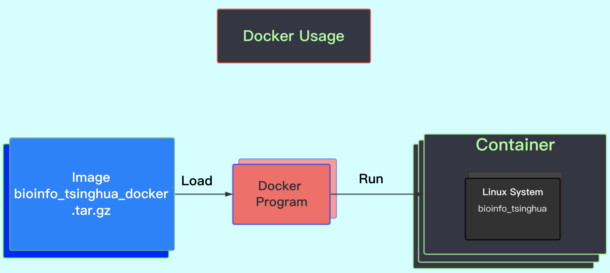

# Getting Started

## 1) 预修课程准备

1. 基本生物课程： 如《遗传学》和/或《分子生物学》
2. 基本统计课程： 如《概率论》和/或《生物统计》
3. 基本数学课程： 如《微积分》和《线性代数》
4. 基本计算机课程：如《C语言》

## 2) Learning Materials

* Tutorial
* **Basic Tutorial** (this one)
* **[Advanced Tutorial](https://lulab.gitbook.io/training)**

> see more learning materials in [Appendix I. Keep Learning](appendix/appendix1.more.md)

## 3) GitHub - Document your work

[GitHub](https://github.com) 是一个源代码托管平台。 
* 我们鼓励学生在 GitHub 上建立自己的仓库（repo）来托管项目，并添加好 `README.md` ，使用下文介绍的 Markdown 语言来解释你的工作。
* 我们也推荐有经验的读者用Git管理自己的代码，可以看这个[简易Git教程](https://www.liaoxuefeng.com/wiki/0013739516305929606dd18361248578c67b8067c8c017b000)。
* 在这里还可以找到海量的优秀开源项目代码，共同碰撞出思维的火花，实现 Social Coding。


[Markdown](https://github.com/adam-p/markdown-here/wiki/Markdown-Cheatsheet) 是一种通用标记语言，其[语法](https://github.com/adam-p/markdown-here/wiki/Markdown-Cheatsheet)远比 LaTeX 简洁，易于上手，使得用户能专心于写作，而不会被排版分心。
* 我们建议在Linux里**每个重要工作目录**都用这个语言来编辑一个README.md文件。
* md可以生成 HTML 文件发布在网站上。
* md也可以生成 PDF，具有很高的兼容性。

实例有：

* github (例如：[README.md](https://github.com/lulab/Ribowave/blob/master/README.md) 及其 [wiki](https://github.com/lulab/Ribowave/wiki) )
* 清华云（例如： [README.md](https://cloud.tsinghua.edu.cn/f/0018b4eb647a487d8b27/) )
* github page （例如：https://lulab.github.io 的 [source code](https://github.com/lulab/lulab.github.io/blob/master/README.md)）
* gitbook (例如：本文档） 


> 我们鼓励利用github，github自带的wiki，gitbook,清华云等云服务；对习惯离线编辑同学有如下软件推荐：
> Mac: [Bear](https://bear.app/), [MWeb](https://zh.mweb.im/); 
> Windows: [typora](https://typora.io/), [Madoko](https://www.madoko.net/)


## 4) 本教程使用说明

* 除非特殊说明，本章中的命令均是在自己电脑的 **Terminal** （终端）程序中进行。

> **特别注意:** 在Linux中空格有着专门的意义，所以要特别关注教程中列出的命令行中的空格符，**不可以省略空格**，否则Terminal里的命令会无法正确执行。


* 后面每一章的操作都在 Docker 中的一个独立的目录（位于用户家目录（`/home/test`）下）下进行，我们称其为**章节目录**。

> 例如， GSEA 这一章中提到 “以下操作均在 `gsea/` 目录下进行。”，指的就是在 `/home/test/gsea` 下进行该章所有操作，所有相对目录均是相对于该目录。


* 本教程全部作业均要求提供源代码和输出内容。提交作业格式可以是.doc/.txt/.md/.sh等，标有 "optional" 的题目选做，做对可获得额外加分。


## 5) Docker

Docker 因为其灵活性和资源占用少等优势开始取代过去传统的虚拟机（如VMWARE, Virtual Box等）。Docker在容器的基础上，进行了进一步的封装，从文件系统、网络互联到进程隔离等等，极大的简化了容器的创建和维护。使得 Docker技术比传统虚拟机技术更为轻便、快捷（[为什么使用Docker](https://yeasy.gitbooks.io/docker_practice/introduction/why.html)）。

### 5a.1) Docker程序(software）下载

读者可以去 [官方下载页面](https://www.docker.com/get-docker) 获取对应不同操作系统的docker软件的安装程序。（需要注册账号）

> windows 10 非pro版本的读者请注意：只有pro版本才能安装docker程序，所以如果不是pro版本，请下载并安装虚拟机 [VirtualBox](https://cloud.tsinghua.edu.cn/f/89c75b51b5bd423aa92b/) 。

### 5a.2) Docker镜像(image）下载

我们为读者提供了我们为本课程制作的用于Docker的一个**image（镜像）**，如下表所示。

| 操作系统 | 系统版本 | 软件程序（software） | 镜像（image） | 备注 |
|---------|-------------------------|-------------------------------------------------------------------------------------------------------------------------------------------------------------|----------------------------------|---|
| Windows | Windows 10 pro及以上 (64位) | [Docker](https://cloud.tsinghua.edu.cn/d/d6b2d37d9dc942eb9a6e/) | [bioinfo_tsinghua.docker.tar.gz](https://cloud.tsinghua.edu.cn/f/b8dcdfa425ba4880b4f3/) | 安装Docker程序并下载image文件到桌面（`~/Desktop`）|
| Windows | Windows 其它版本 (64位) | 虚拟机[VirtualBox](https://cloud.tsinghua.edu.cn/f/89c75b51b5bd423aa92b/) |  [bioinfo_tsinghua.virtualbox.ova](https://cloud.tsinghua.edu.cn/f/c91ec26fc5774303a5df/) | 安装VirtualBox程序并下载虚拟机image文件到桌面（`~/Desktop`）|
| Mac | 2010 or newer model | [Docker](https://cloud.tsinghua.edu.cn/d/d6b2d37d9dc942eb9a6e/) |  [bioinfo_tsinghua.docker.tar.gz](https://cloud.tsinghua.edu.cn/f/b8dcdfa425ba4880b4f3/) | 安装Docker程序并下载image文件到桌面（`~/Desktop`） |
| Linux | kernel 3.10 or higher. | [Docker](https://cloud.tsinghua.edu.cn/d/d6b2d37d9dc942eb9a6e/) | [bioinfo_tsinghua.docker.tar.gz](https://cloud.tsinghua.edu.cn/f/b8dcdfa425ba4880b4f3/) | 安装Docker程序并下载image文件到桌面（`~/Desktop`） |


### 5b) 各操作系统下的安装docker程序和加载docker镜像指南




#### 5b.1) Mac用户
按照5a)相应要求下载并安装Docker，下载image并将image放置到桌面（`~/Desktop`），安装完成后从本章的[5d) 载入镜像](#load-image)开始进行操作。

#### 5b.2) Windows 10 非Pro
使用 64 位其他版本的 Windows （以及用表中的方法安装 Docker 失败）的用户，请使用我们提供的虚拟机: [bioinfo_tsinghua.virtualbox.ova](https://cloud.tsinghua.edu.cn/f/c91ec26fc5774303a5df/) （用户名和密码均为 `test`）。

使用方法参见 [Appendix III. Docker 1a)](appendix/appendix3.docker.md#win-vb-use-docker) , 安装和配置虚拟机完成后从本章的 [5d) 载入镜像](#load-image)开始进行操作。

#### 5b.3) Windows 10 Pro

使用 Windows Pro 64 位的用户，请参见 [Appendix III. Docker 1b)](appendix/appendix3.docker.md#win-pro-use-docker) , 即可完成整个docker安装和容器创建工作。

完成后可继续阅读本章的[5h) 彻底删除容器](../getting-started.md#recover-container)及后续内容。


> **检查Docker是否安装成功**
> 以上三种用户安装完成后，均可打开 Terminal (Windows 下使用 PowerShell), > 运行以下命令，检查 Docker 是否正常安装：
> ```
> docker info
> ```


### 5c) 观看视频教程：如何使用docker（基于Mac）

可以选择观看视频教程，也可以跳过视频按照文字教程安装和配置docker。

[youtube](https://youtu.be/c1ldhV7dAhg)

[bilibili](https://www.bilibili.com/video/av30426956/)


### 5d) 载入镜像 {#load-image}

```bash
docker load -i ~/Desktop/bioinfo_tsinghua.docker.tar.gz # only if Mac or Windows 10 Pro

docker load -i ~/Desktop/bioinfo_tsinghua.tar.gz # Otherwise

```


### 5e) 创建并运行容器 {#create-container}

```bash
mkdir ~/Desktop/bioinfo_tsinghua_share

docker run --name=bioinfo_tsinghua -dt --restart unless-stopped -v ~/Desktop/bioinfo_tsinghua_share:/home/test/share bioinfo_tsinghua
```
<!--（`\`符号表示第二行与第三行是同一行，如果是手动输入命令，请不要输入`\`符号）-->

这里我们新建了一个名为 `bioinfo_tsinghua` 的容器（除非有特殊说明，接下来的章节中所有操作均在该容器中进行）。
> 参数说明：
> * 设置该容器能一直在后台保持运行状态（`-dt --restart unless-stopped`）
> * 主机(HOST, 例如Mac或者Windows）和docker容器（例如Linux）设置了一个文件夹同步，可以互传文件：
>   * HOST: `~/Desktop/bioinfo_tsinghua_share` == LINUX: `/home/test/share`


### 5f) 退出容器

用以下命令退出容器：

```bash
exit
```

### 5g) 重复使用容器 {#use-container}

到此为止，我们已经成功地安装了Docker，成功地载入一个镜像并且创建了容器（container）。以后我们再使用Docker并进入该容器练习，只需要反复执行3个步骤:

#### 5g.1) 双击运行docker程序

#### 5g.2) 运行该教程创建的容器（container）

在终端/Powershell中输入以下命令，即可进入容器：

```bash
docker exec -it bioinfo_tsinghua bash
```

正确输入该命令后会进入容器内部，可以看到我们准备的本教程相关的文件和软件。如下图所示


#### 5g.3) 在容器进行Linux操作


#### 5g.4) 退出容器

用以下命令退出容器：

```bash
exit
```


### 5h) 彻底删除容器 {#recover-container}

如果你不小心执行了错误操作，以至于无法正常执行本教程中的某一章节，可以删除该容器，然后新建一个干净的容器。

首先，

```bash
docker rm -f bioinfo_tsinghua
```

> **Tips**：之前提到过 `bioinfo_tsinghua` 一直保持运行状态，所以我们这里用 `-f` 来强制（force）删除。

然后，重复  [5e)创建容器](#create-container) 命令


## 6) Homework

1. 注册一个GitHub账户，创建一个仓库，写好`README.md`。尝试使用Git管理自己的代码并同步至GitHub。
2. 尝试使用Markdown语言，熟悉其语法。
3. 熟练掌握如何使用 Docker。
