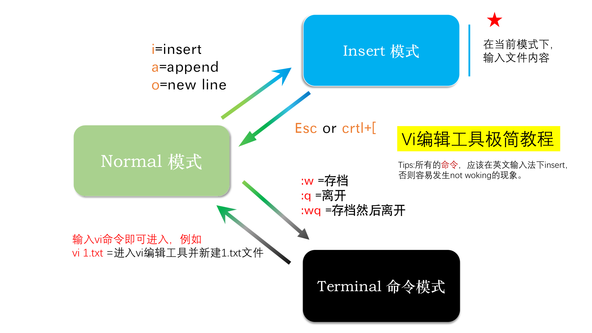

# 1.1 Basic Command

本节我们学习一些 Linux 的基本操作

| 命令 | 描述 |
| :--- | :--- |
| `man` | 查询某一命令的具体参数，例如：`man wget` |
| `mkdir` | 创建文件夹 |
| `cd` | 目录切换（注意区别相对路径与绝对路径） |
| `ls` | 显示文件夹中文件列表 |
| `cat` | 直接查看文件 |
| `wc` | 查看文件行数、字数 |
| `cut` | 取出文件中的特定列或字符 |
| `sort` | 排序 |
| `uniq` | 去重复 |
| `grep` | 文件中关键词搜索，返回行 |
| `chmod` | 修改文件的访问权限 |

首先进入到容器（在自己电脑的 Terminal 中运行，详情请参见 [这里](https://lulab.gitbooks.io/teaching/getting-started.html#use-container)）：

```bash
docker exec -it bioinfo_tsinghua bash
```

## 1\) 基本知识

1. linux 路径
   * 相对路径（从当前目录开始）
     * `file_name`   ：当前目录下的文件    
     * `folder_name` ：当前目录下的文件夹  
     * `..`          ：上一级目录  
     * `../file_name2`：指上一级目录下的文件   
   * 绝对路径（从根目录 `/` 开始） `/home/test` ：用户家目录
2. Linux命令行格式

   参见 [这里](https://www.ctolib.com/docs/sfile/vbird-linux-basic-4e/34.html#421-开始下达指令)

## 2\) 基本操作

对接下来介绍的所有命令不理解时，均可使用 `--help` 来查询，如 `ls --help`

`pwd` 显示当前目录

```bash
pwd
```

`ls` 显示文件夹中文件（夹）列表

```bash
ls        #显示当前目录下文件（夹）

ls -la    #显示全部详细格式

ls linux  #显示linux文件夹下的文件（夹）
```

`tree` 以树形结构显示文件夹

```bash
tree linux  #显示 linux 文件夹下文件（夹）
```

接下来的每步操作后，同学们都可以跑一遍 `pwd`, `ls` 和 `tree`，加深对路径和命令的理解

`cd` 目录切换

```bash
cd             # cd后面为空时，进入默认家目录（这里为 `/home/test`）    

cd /usr/local  # 进入根目录(目录名输入一部分即可按TAB键自动补全，非常好用)
```

以下步骤均在 `/home/test/linux/` 下进行:

```bash
cd /home/test/linux/
```

## 3\) 创建、删除与复制文件（夹）

`touch` 创建文件

```bash
touch old_file
```

`mkdir` 创建文件夹

```bash
mkdir old_folder
```

`cp` 复制文件\(夹\)，用法：`cp SOURCE DEST`

```bash
cp old_file old_file2 # 复制文件

cp -r old_folder old_folder2  # 复制文件夹，需要加上 -r
```

**注意**：当 `DEST` 为文件夹且已存在时，会把 `SOURCE` 整个（包括其自身）复制到 `DEST` 中

```bash
mkdir cp_folder

cp old_file cp_folder
cp -r old_folder cp_folder
```

`mv` 重命名或移动文件（夹）

```bash
mv old_file new_file        #文件重命名

mv old_folder new_folder    #文件夹重命名

mv new_file new_folder     #将文件移动到新目录
```

`rmdir` 删除文件夹

```bash
rmdir old_folder2   # 只能是空文件夹
```

`rm` 删除文件（夹）

```bash
rm old_file2                 # 删除文件

rm -r new_folder             # 删除文件夹（可以非空）
```

## 4\) 查看文件

`cat` 直接查看文件

```text
cat file
```

`wc` 查看文件行数、字数

```bash
wc -l file     #查看文件行

wc -c file     #查看文件字数
```

`head` 查看文件前几行

```bash
head file          #查看文件前 10 行（思考：为什么只显示 8 行）

head -n 6 file     #查看文件前 6 行
```

`tail` 查看文件后几行

```bash
tail file            #查看文件后 10 行

tail -n 4 file    #查看文件后 4 行
```

`more/less` 翻页查看文件

```bash
more file  # 按 d 向下翻页，翻完后（或按 q）退出 (由于文件过小，需要把终端调窄才有效果)

less file  # 按 d 向下翻页，u 向上翻页，q 退出
```

## 5\) 文件信息提取和操作

`cut` 取出文件中的特定列或字符

```bash
cut -f 4 file            #取出第 4 列

cut -d ";" -f 2 file     # 以分号作为输入字段的分隔符（默认为制表符），取出第 2 列
```

`sed` 编辑文件

```bash
sed 's/a/A/g' file     #将文件中所有的 a 替换为 A

sed -n '3,6 p' file    #打印第3到6行

sed '2 q' file         #打印前2行
```

`grep` 文件中关键词搜索，返回行

```bash
grep 'CDS' file       #显示匹配上 'CDS' 的所有行

grep -v 'CDS' file    #显示没有匹配上'CDS'的所有行

grep -w 'gene' file    # 必须与整个字匹配 (思考第 8 行中的 gene_id 包含 gene，为什么没有显示这一行)
```

`sort` 排序

```bash
sort -k 4 file           # 按照第 4 列排序

sort -k 5 file           # 按照第 5 列排序 (ASCII码顺序)
sort -k 5 -n file        # 按照第 5 列排序 (ASCII数值顺序)
```

`uniq` 去重复

```bash
uniq -c file    # 去重复并且计算重复频率（仅能处理串联重复）
```

> **Tips** `file` 中没有重复的行，该命令的效果要在下一节的最后一条命令中才能直观地看到。

## 6\) 压缩和数据流重定向

`gzip` 压缩文件

```bash
gzip file
```

`gunzip` 解压缩文件（`.gz` 文件）

```bash
gunzip file.gz
```

`tar` 打包压缩、解压缩文件（夹）

```bash
tar -zcv -f cp_folder.tar.gz cp_folder    #打包压缩文件夹（gzip格式）

tar -ztv -f cp_folder.tar.gz                 #查看压缩文件夹中的文件名（gzip格式）

tar -zxv -f cp_folder.tar.gz                 #打开包并解压缩（gzip格式）
```

* `-c` 打包压缩
* `-x` 解压
* `-t` 查看压缩包里的文件名
* `-z` `.gzip` 格式
* `-f` 指定压缩文件名

`>` 将终端结果输出给文件，会创建新文件或者覆盖原文件

```bash
cat file > file2  # 将 file 的内容输出到 file2
cat file2
```

`>>` 将终端结果输出给文件，内容会加在原文件内容尾部

```bash
sed -n '8 p' file >> file2 # 将 file 的第 8 行附加到 file2 的尾部
cat file2
```

`|` 管道，将左边命令的标准输出（standard output）作为右边命令接受的标准输入（standard input）

```bash
head -n 6 file | tail -n 3
# 输出file的前 6 行，通过管道转发给 tail 取出后 3 行，也就是原始文件的 4-6 行。

cut -f 4 file | sort | uniq -c
# 输出file的第 4 列，通过管道转发 sort 进行排序，通过管道转发到 uniq  去重复并且计算重复频率。
```

> **Tips**  
> 1. 管道命令只处理前一个命令正确输出，不处理错误输出（standard error）。  
> 1. 管道命令右边命令，必须能够接收标准输入流命令才行。

## 7\) 查看、修改文件权限

本节的操作前后要注意使用 `ls -hl`，对比操作前后文件权限的变化

用户及用户组：文件所有者 u\(user\)，用户组 g\(group\)，其他人 o\(other\)，所有人 a\(all\)

`chmod` 修改文件的访问权限，分为数字模式和符号模式。

_数字模式：_

```bash
chmod 755 file

chmod -R 755 cp_folder     # -R  修改该目录中所有文件的权限
```

三位数分别表示文件所有者，用户组，其他人

`r` 表示可读，`w` 表示可写，`x` 表示可执行

用数字表示：可读 `r`=1，可写 `w`=2，可执行 `x`=4

例如：`777` 表示所有用户对文件具有读、写、执行权限；`755` 表示文件所有者对文件具有可读、可写、可执行权限，其他用户只具有可读、可执行权限。

_符号模式：_

```bash
chmod u+x,go=rx file   #使file文件的所有者加上可执行权限，将用户组和其他人权限设置为可读和可执行

chmod o-x file         #使其他人对file文件除去可执行权限

chmod a+x cp_folder    #使所有人对folder文件夹加上可执行权限
```

* `+` 加入
* `-` 除去
* `=` 设置

## 8\) 其他命令

`top` 监视计算机使用情况（按 q 退出）

`date` 显示系统的时间和日期，可用于为程序运行时长进行计时

`which` 寻找可执行文件，显示路径

ctrl-c 终止当前进程

ctrl-z 暂停当前进程

## 9\) 清理

```bash
rm file2
rm -r cp_folder
rm cp_folder.tar.gz
```

## 10\) Vim

> It is hard to learn, but incredible to use.  
> --- by [here](http://yannesposito.com/Scratch/en/blog/Learn-Vim-Progressively/)

Vim 文本编辑器使用，主要就是模式之间的切换，如下图所示。



> **Tips** 如果你是第一次使用 Vim，发现熟悉的 Terminal 不见了不要慌，按 `:q` 退回即可。

具体操作请参见 [这里](https://www.ctolib.com/docs/sfile/vbird-linux-basic-4e/80.html#922-按键说明)

## 11\) 推荐阅读

更多Linux命令可参考其他在线教程或者书本，如：

* 《“笨办法”学python》附录“命令行快速入门” \(Optional Reading\)
* 《鸟哥的Linux私房菜－基础学习篇》5-10章中对应内容 \(Recommended Reading\)

> 推荐章节： 第5章
>
> 5.3.1 man page
>
> 第6章
>
> 6.1用户与用户组
>
> 6.2 LINUX文件权限概念
>
> 6.3 LINUX目录配置
>
> 第7章Linux文件与目录管理
>
> 7.1目录与路径
>
> 7.2文件与目录管理
>
> 7.3文件内容查阅
>
> 7.5命令与文件的查询
>
> 7.6权限与命令间的关系
>
> 第8章
>
> 8.2文件系统的简单操作
>
> 第9章
>
> 9.1压缩文件的用途与技术
>
> 9.2 Linux系统常见的压缩命令
>
> 9.3打包命令：tar
>
> 第10章vim程序编辑器

