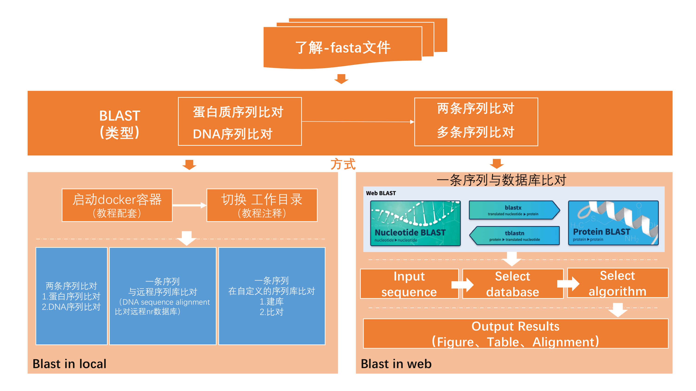
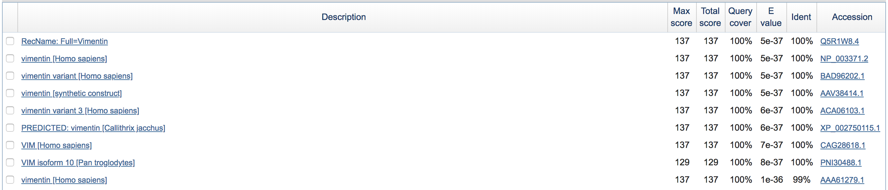
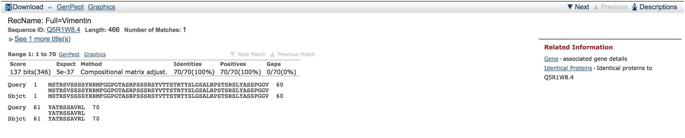

# 2.Blast

## 1\) Pipeline



## 2\) Data Structure

了解存储 sequence 的常用文件格式——**FASTA格式** （`.fasta` or `.fa` \)

```text
>gi|47115317|emb|CAG28618.1| VIM [Homo sapiens]
MSTRSVSSSSYRRMFGGPGTASRPSSSRSYVTTSTRTYSLGSALRPSTSRSLYASSPGGVYATRSSAVRL
```

> The word following the `>` symbol is the identifier of the sequence, and the rest of the line is the description \(optional\). Normally, identifiers are simply protein accession, name or Entrez gi's \(e.g., Q5I7T1, AG10B\_HUMAN, 129295\), but a bar-separated NCBI sequence identifier \(e.g., gi\|129295\) will also be accepted. Any arbitrary user-specified sequence identifier can also be used \(e.g., CLONE00073452\).

#### 2a\) Inputs

| Format | Description | Notes |
| :--- | :--- | :--- |
| fasta | contains gene name and sequence | gene name start with `>` |

#### 2b\) Outputs

| Format | Description | Notes |
| :--- | :--- | :--- |
| blastp | query aligned to database | - |

## 3\) Blast in local

### \(1\) 准备

进入到容器（在自己电脑的 Terminal 中运行，详情请参见 [这里](https://lulab.gitbooks.io/teaching/getting-started.html#use-container)）：

```bash
docker exec -it bioinfo_tsinghua bash
```

以下步骤均在 `/home/test/blast/` 下进行:

```bash
cd /home/test/blast/
```

准备输出目录

```bash
mkdir output
```

### \(2\) 两条序列比对

#### Protein sequence alignment

利用 `blastp` 进行蛋白质比对

```bash
blastp  -query protein/VIM.fasta  -subject   protein/NMD.fasta   -out output/blastp
```

`VIM.fasta` 与 `NMD.fasta` 分别是金属beta酶家族的两个亚种酶的序列

#### DNA sequence alignment

利用 `blastn` 进行DNA序列比对

```bash
blastn  -query dna/H1N1-HA.fasta  -subject   dna/H7N9-HA.fasta   -out output/blastn
```

`H1N1-HA.fasta` 与 `H7N9-HA.fasta` 是流感病毒序列文件

### \(3\) 一条序列与远程序列库比对

#### Protein sequence alignment 比对远程pdb数据库

运行时需要联网，无法上网请跳过。

```bash
blastp  -query protein/VIM.fasta  -db pdb -remote   -out output/blastp_remote
```

#### DNA sequence alignment 比对远程nr数据库

运行时需要联网，无法上网请跳过。

```bash
blastn  -query dna/H1N1-HA.fasta  -db nr  -remote   -out output/blastn_remote
```

### \(4\) 一条序列在自定义的序列库里比对

例如：在yeast基因组序列中搜索Yeast.fasta序列

#### Step 1: 建库

```bash
makeblastdb -dbtype nucl -in dna/YeastGenome.fa -out database/YeastGenome
```

* `-dbtype`: 待建库的类型（`nucl`, `prot`\)
* `-in`: 待建库的序列文件
* `-out`: 序列库名前缀

#### Step 2: 比对

```bash
blastn -query dna/Yeast.fasta -db database/YeastGenome -out output/Yeast.blastn
```

## 4\) Blast online

首先，进入NCBI官网在线[BLAST](https://blast.ncbi.nlm.nih.gov/Blast.cgi)，显示如下图所示界面，选择一种序列比对类型，然后根据提示进行序列比对。


### \(1\) Input sequence

```text
MSTRSVSSSSYRRMFGGPGTASRPSSSRSYVTTSTRTYSLGSALRPSTSRSLYASSPGGVYATRSSAVRL
```


### \(2\) Select database


### \(3\) Select algorithm


### \(4\) Output results


### \(5\) Output table



### \(6\) Alignment details



## 5\) Tips/Utilities

### \(1\) 查看序列比对结果文件的方式（blast in local）

1. 方式1: 利用docker挂载电脑主机目录，同步文件（该方法详见Appendix iii. docker章节tips/utilities部分）。  
2. 方式2: 利用vi文本编辑工具查看（该方法详见[HUXI Notes\_Linux ](https://huxi.gitbook.io/bioinformatic-notes/linux)章节tips/utilities-7.vi文件编辑器使用部分 ）。

### \(2\) A better view of fasta file

```bash
less -S dna/H1N1-HA.fasta  # chop long lines rather than wrap them (记得按 q 退出）
```

### \(3\) 安装blast及其子程序blastn, blastp，blastx, ...

> **Note: Docker 中已经装好**

#### 安装方式1-自动安装（推荐方式）

Ubuntu 自动安装软件方法： `sudo apt-get install 软件名称`

这里 blast 由 `ncbi-blast+` 提供

#### 安装方式2-手动安装

[Download link](ftp://ftp.ncbi.nlm.nih.gov/blast/executables/blast+/LATEST/)

寻找类似如下文件：

* 32位计算机（老机器）安装文件：如 `ncbi-blast-2.2.28+-ia32-linux.tar.gz`
* 64位机器安装文件： 如 `ncbi-blast-2.2.28+-x64-linux.tar.gz`

（可以通过 `uname -a` 查看机器类型是64还是32位）

## 6\) Homework and more

### \(1\) Blast sequence with mouse genome

请使用网页版的 blastp, 将上面的蛋白序列只与 mouse protein database 进行比对， 设置输出结果最多保留10个， E 值最大为 0.5。将操作过程和结果截图。

## 休息一会

**Jim Kent**


Jim Kent 1960年生于夏威夷，在旧金山长大。

Kent的编程生涯始于23岁，1983年Kent开始在Island Graphic Inc工作。当时Kent为Amiga家用电脑编写了一个能够结合3D渐变效果与2D简单动画的软件。

1985年他干脆自己开了一家软件公司 Dancing Flame, 将之前自己写的动画程序创建成为一个汇集各种动画和绘画功能的程序Cyber Paint，为CAD-3D开发提供便利。这是是第一个允许用户跨时间制作压缩视频的软件。之后他还开发了软件Autodesk Animator用于个人电脑中，可以为各种视频游戏创作艺术作品。  
2000年Kent在攻读加州大学圣克鲁兹生物学博士学位，此时人类基因组计划进行到后期，他写出了GigAssembler, 帮助人类基因组项目能够拼装和发布人类基因组序列。

在GigAssembler之后，Kent继续编写BLAT（BLAST-like alignment tool）和参与维护UCSC Genome Browser 来帮助分析重要的基因组数据。目前，Kent仍然在UCSC工作，主要是在网络工具上帮助理解人类基因组。他帮助维护和升级浏览器，并致力于比较基因组学， Parasol，UCSC kilocluster的运营和ENCODE项目。

