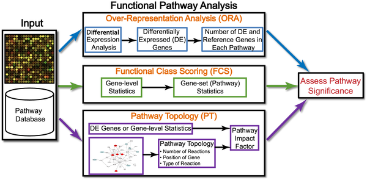

# 4.Function Analysis

* [**GO**](https://lulab.gitbooks.io/teaching/part-i.-basic-tools/4.gokegg/4.1.go.html)  
* [**KEGG**](https://lulab.gitbooks.io/teaching/part-i.-basic-tools/4.gokegg/4.2.kegg.html)  
* [**GSEA**](https://lulab.gitbooks.io/teaching/part-i.-basic-tools/4.gokegg/4.3.gsea.html)  

当我们找到一些感兴趣的基因后（比如在某种处理条件下，与对照相比，表达量有明显差异的基因），我们希望能从这些基因中提炼出生物学意义。

我们将会介绍基于差异表达基因的 over representation 分析，包括 GO 富集、KEGG 富集。

另外，我们还将以 GSEA 为代表介绍功能集打分（Functional Class Scroing）方法，其直接分析原始的基因表达矩阵。

更多内容请参考 [Ten Years of Pathway Analysis: Current Approaches and Outstanding Challenges](https://doi.org/10.1371/journal.pcbi.1002375)

