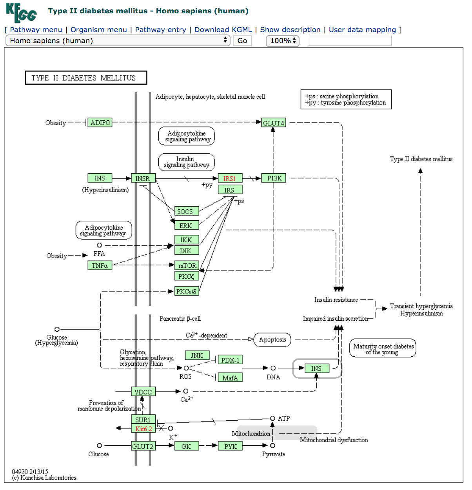
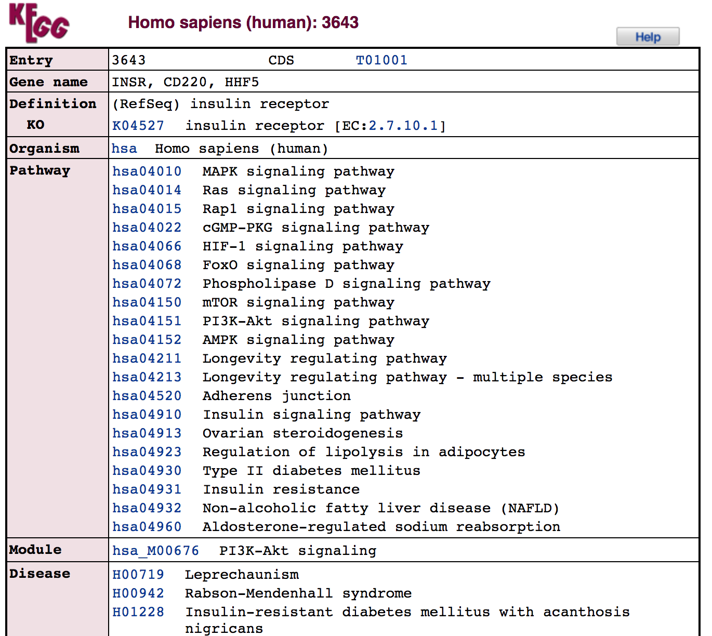
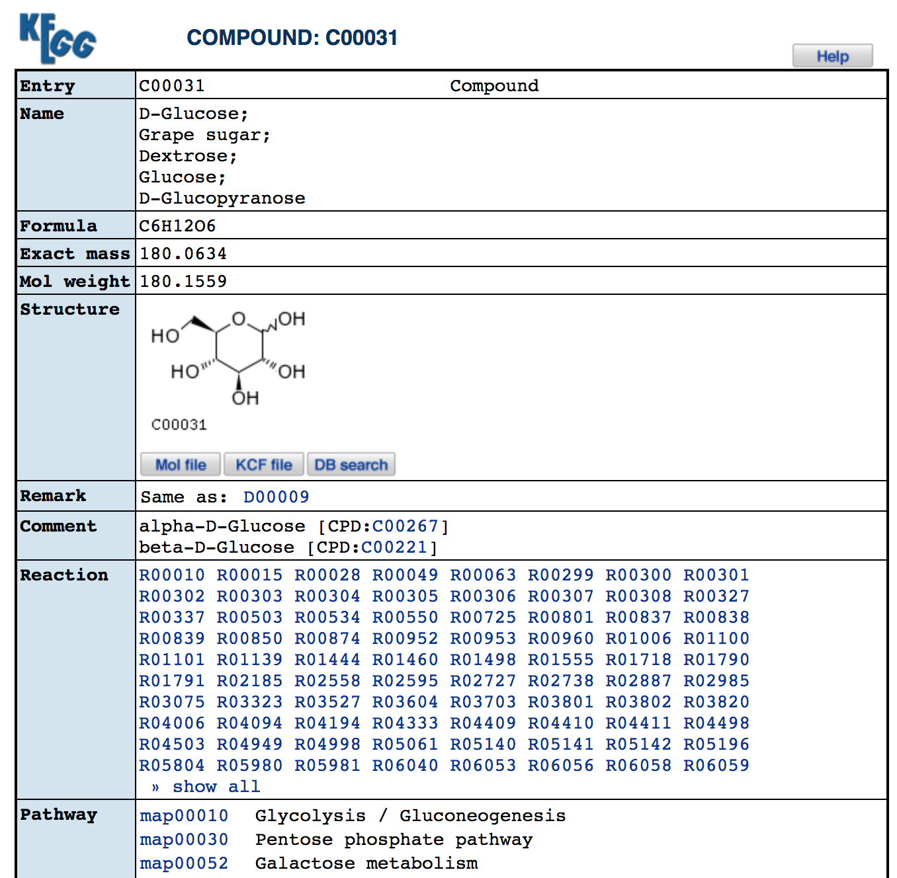
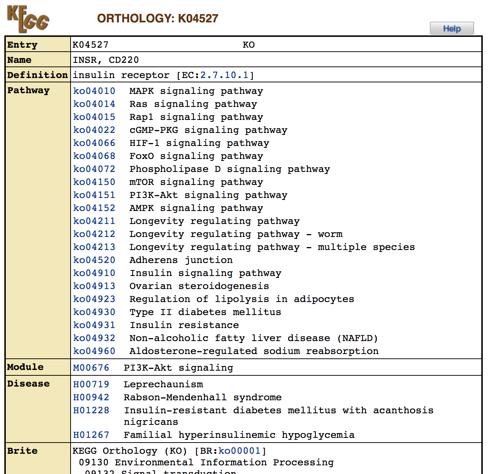
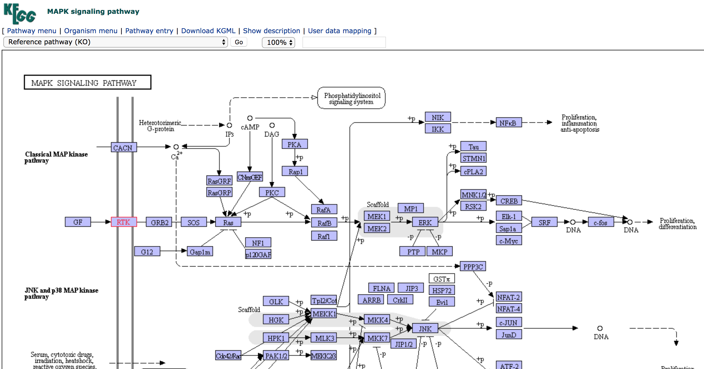
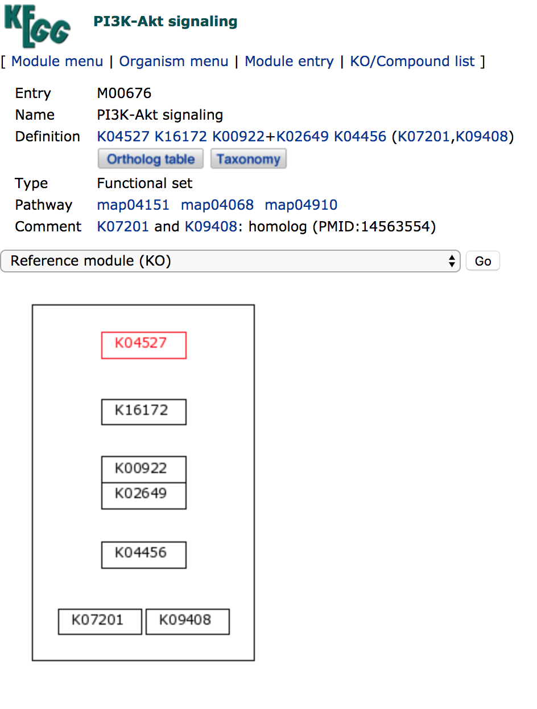
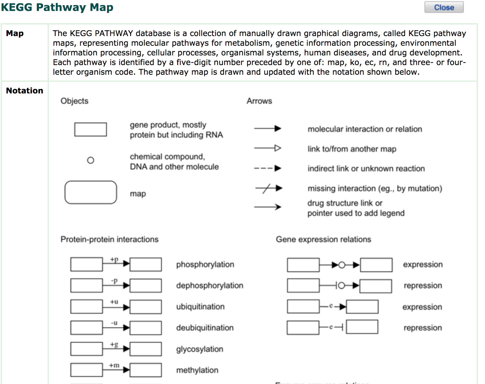
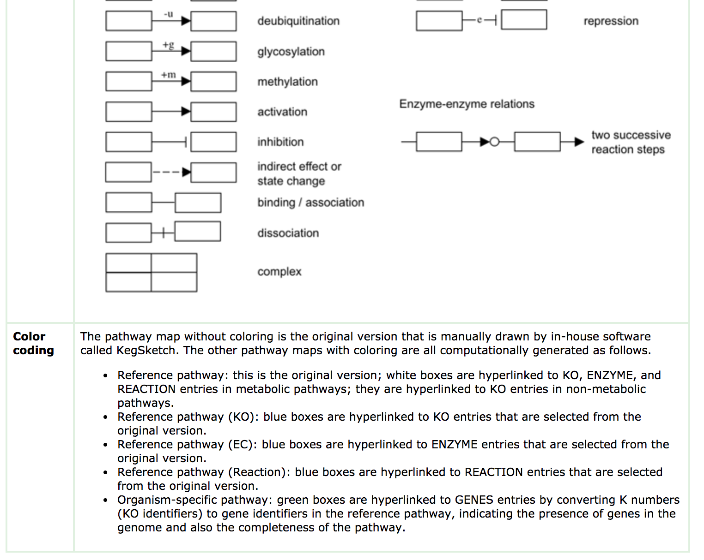

# 4.2. KEGG

## Pipeline

-------

## Data Structure

### getting software & data {#kegg-install}

1. go to [KOBAS](http://kobas.cbi.pku.edu.cn/anno_iden.php)
1. generate your list of interest genes

<pre style='height: 18em; scroll: auto;'>
ENSG00000001036
ENSG00000003756
ENSG00000008018
ENSG00000012048
ENSG00000043355
ENSG00000074755
ENSG00000079616
ENSG00000089280
ENSG00000100591
ENSG00000100941
ENSG00000101109
ENSG00000101974
ENSG00000104611
ENSG00000104738
ENSG00000105738
ENSG00000113318
ENSG00000114867
ENSG00000116221
ENSG00000116857
ENSG00000117724
ENSG00000119285
ENSG00000121774
ENSG00000127663
ENSG00000127884
ENSG00000128159
ENSG00000129187
ENSG00000130640
ENSG00000131473
ENSG00000134287
ENSG00000134644
ENSG00000136628
ENSG00000137273
ENSG00000146263
ENSG00000153187
ENSG00000160285
ENSG00000164818
ENSG00000164944
ENSG00000167325
ENSG00000167548
ENSG00000170448
ENSG00000179632
ENSG00000183207
ENSG00000187954
ENSG00000196700
ENSG00000196924
ENSG00000198604
ENSG00000198886
ENSG00000198899
ENSG00000206503
ENSG00000223609
ENSG00000272822
</pre>

### **Inputs**

| **File format** | **Information contained in file** | **File description** | **Notes** |
| :--- | :--- | :--- | :--- |
| txt | Ensembl Gene id | Ensembl gene id (i.e. Homo sapiens ENSG00000001036) |  |

### **Outputs**

| **File format** | **Information contained in file** | **File description** | **Notes** |
| :--- | :--- | :--- | :--- |
| txt | Output information | The KEGG ontology & enrichment results of each gene |  |

-----

## Running Scripts

1. `Input` -> `Type` 勾选 "Ensembl Gene ID"
1. 将[上文](#kegg-install)中的基因粘贴到文本框中
1. `Database` 勾选 "KEGG Pathway"
1. 单击 `Run`

图1 运行KOBAS

结果如下图所示

图1 KOBAS KEGG 富集结果

## Tips/Utilities

KOBAS 也可以进行 GO 富集，只需要在 `Database` 勾选 "GO" 即可

### Access the [KEGG](http://www.genome.jp/kegg/) top page:

+ Enter keywords or any KEGG object identifier in the search box.
+ Try, for example, hsa04930 to retrieve the KEGG pathway map for type 2 diabetes.

### KEGG Pathway Maps

+ Molecular network representation of experimental knowledge  

### Gene detail information

+ Example: Click INSR green box. Insulin receptor  

+ Chemical compound  

### KEGG Orthology (KO)

### Pathway map

### Module map

### Pathway help document

## Homework and more

1. 使用 KOBAS对以下基因进行 KEGG 富集分析 （Ensembl Gene ID）

<pre style='height: 18em; scroll: auto;'>
ENSG00000196136
ENSG00000183044
ENSG00000077522
ENSG00000174233
ENSG00000155897
ENSG00000102699
ENSG00000163631
ENSG00000109107
ENSG00000085662
ENSG00000179477
ENSG00000189058
ENSG00000130203
ENSG00000142192
ENSG00000240583
ENSG00000156219
ENSG00000104763
ENSG00000105409
ENSG00000110955
ENSG00000147416
ENSG00000131100
ENSG00000110092
ENSG00000171552
ENSG00000176697
ENSG00000119138
ENSG00000123843
ENSG00000104267
ENSG00000157388
ENSG00000108878
ENSG00000172137
ENSG00000110680
ENSG00000143933
ENSG00000070808
ENSG00000126247
ENSG00000077549
ENSG00000164305
ENSG00000187094
ENSG00000124762
ENSG00000106069
ENSG00000101204
ENSG00000175344
ENSG00000166165
ENSG00000109572
ENSG00000104853
ENSG00000175416
ENSG00000163823
ENSG00000173786
ENSG00000118432
ENSG00000164692
ENSG00000164919
ENSG00000112695
ENSG00000109472
ENSG00000181885
ENSG00000166426
ENSG00000143320
ENSG00000118260
ENSG00000095794
ENSG00000160202
ENSG00000109846
ENSG00000103316
ENSG00000118523
ENSG00000168036
ENSG00000169862
ENSG00000255974
ENSG00000123454
ENSG00000144355
ENSG00000149295
ENSG00000151577
ENSG00000069696
ENSG00000198121
ENSG00000120738
ENSG00000122877
ENSG00000074800
ENSG00000111674
ENSG00000108515
ENSG00000065361
ENSG00000244405
ENSG00000117480
ENSG00000164434
ENSG00000138685
ENSG00000096060
ENSG00000115414
ENSG00000170345
ENSG00000125740
ENSG00000187474
ENSG00000171298
ENSG00000204681
ENSG00000163288
ENSG00000163285
ENSG00000113327
ENSG00000128683
ENSG00000111640
ENSG00000106105
ENSG00000130283
ENSG00000168621
ENSG00000131095
ENSG00000001084
ENSG00000148672
ENSG00000088256
ENSG00000127955
ENSG00000087258
ENSG00000156052
ENSG00000078369
ENSG00000046653
ENSG00000177885
ENSG00000120251
ENSG00000171189
ENSG00000105737
ENSG00000176884
ENSG00000161509
ENSG00000178719
ENSG00000113580
ENSG00000168959
ENSG00000167004
ENSG00000084207
ENSG00000100644
ENSG00000204525
ENSG00000204287
ENSG00000198502
ENSG00000113161
ENSG00000100292
ENSG00000123358
ENSG00000204389
ENSG00000204388
ENSG00000044574
ENSG00000109971
ENSG00000106211
ENSG00000132002
ENSG00000135312
ENSG00000102468
ENSG00000140443
ENSG00000167244
ENSG00000115457
ENSG00000091181
ENSG00000110324
ENSG00000049249
ENSG00000143772
ENSG00000177606
ENSG00000171223
ENSG00000184408
ENSG00000177807
ENSG00000156113
ENSG00000185896
ENSG00000168028
ENSG00000169756
ENSG00000012223
ENSG00000090382
ENSG00000184292
ENSG00000105695
ENSG00000172005
ENSG00000069535
ENSG00000131711
ENSG00000186868
ENSG00000197971
ENSG00000146701
ENSG00000081189
ENSG00000172493
ENSG00000168314
ENSG00000204655
ENSG00000005381
ENSG00000158887
ENSG00000173531
ENSG00000187193
ENSG00000023228
ENSG00000178127
ENSG00000104722
ENSG00000100285
ENSG00000277586
ENSG00000184613
ENSG00000196712
ENSG00000162599
ENSG00000147862
ENSG00000100906
ENSG00000125820
ENSG00000122585
ENSG00000171246
ENSG00000154146
ENSG00000073969
ENSG00000148053
ENSG00000082556
ENSG00000112038
ENSG00000145730
ENSG00000173599
ENSG00000183036
ENSG00000125851
ENSG00000004799
ENSG00000136960
ENSG00000101327
ENSG00000181195
ENSG00000179094
ENSG00000067225
ENSG00000170890
ENSG00000123560
ENSG00000109099
ENSG00000108387
ENSG00000138032
ENSG00000184203
ENSG00000104695
ENSG00000078304
ENSG00000108946
ENSG00000188191
ENSG00000154229
ENSG00000171132
ENSG00000126583
ENSG00000067606
ENSG00000100030
ENSG00000102882
ENSG00000050748
ENSG00000109339
ENSG00000166033
ENSG00000159377
ENSG00000169398
ENSG00000151552
ENSG00000175582
ENSG00000119318
ENSG00000132341
ENSG00000139687
ENSG00000133884
ENSG00000117152
ENSG00000100316
ENSG00000156482
ENSG00000175634
ENSG00000139970
ENSG00000124788
ENSG00000149575
ENSG00000006210
ENSG00000169439
ENSG00000107562
ENSG00000116560
ENSG00000124193
ENSG00000115875
ENSG00000118515
ENSG00000117394
ENSG00000168003
ENSG00000157103
ENSG00000103546
ENSG00000142319
ENSG00000108576
ENSG00000066117
ENSG00000172062
ENSG00000135587
ENSG00000074317
ENSG00000145335
ENSG00000075618
ENSG00000112096
ENSG00000181449
ENSG00000125398
ENSG00000100146
ENSG00000113140
ENSG00000173898
ENSG00000106089
ENSG00000076944
ENSG00000008056
ENSG00000157152
ENSG00000006128
ENSG00000115353
ENSG00000167815
ENSG00000091513
ENSG00000008196
ENSG00000175745
ENSG00000072274
ENSG00000180176
ENSG00000151090
ENSG00000155090
ENSG00000102265
ENSG00000136352
ENSG00000163931
ENSG00000184113
ENSG00000232810
ENSG00000111669
ENSG00000127824
ENSG00000112041
ENSG00000154277
ENSG00000010256
ENSG00000140740
ENSG00000213585
ENSG00000163032
ENSG00000082898
ENSG00000166913
ENSG00000170027
ENSG00000128245
ENSG00000109906
ENSG00000167552
ENSG00000121966
ENSG00000171951
ENSG00000119508
ENSG00000032742
ENSG00000121053
ENSG00000188763
ENSG00000035681
ENSG00000105402
ENSG00000107186
ENSG00000108370
ENSG00000099250
ENSG00000132326
ENSG00000160145
ENSG00000130725
ENSG00000185359
ENSG00000185236
ENSG00000183691
ENSG00000100784
ENSG00000125733
ENSG00000049245
ENSG00000078596
ENSG00000103942
ENSG00000108587
ENSG00000136928
ENSG00000134852
ENSG00000117592
ENSG00000164326
ENSG00000119125
ENSG00000154174
ENSG00000060656
ENSG00000173848
ENSG00000213928
ENSG00000204628
ENSG00000130558
ENSG00000112186
ENSG00000265972
ENSG00000069966
ENSG00000188529
ENSG00000130640
ENSG00000130222
ENSG00000172594
ENSG00000154640
ENSG00000170348
ENSG00000168461
ENSG00000104435
ENSG00000173598
ENSG00000168309
ENSG00000084764
ENSG00000132718
ENSG00000182621
ENSG00000198576
ENSG00000182253
ENSG00000115524
ENSG00000221890
ENSG00000104205
ENSG00000169504
ENSG00000161642
ENSG00000106537
ENSG00000114861
ENSG00000080546
ENSG00000071575
ENSG00000163884
ENSG00000144834
ENSG00000095585
ENSG00000128872
ENSG00000164548
ENSG00000151967
ENSG00000116285
ENSG00000168209
ENSG00000164951
ENSG00000166272
ENSG00000101695
ENSG00000198498
ENSG00000048540
ENSG00000109943
ENSG00000078804
ENSG00000116574
ENSG00000197056
ENSG00000171621
ENSG00000164938
ENSG00000160877
ENSG00000100100
ENSG00000167615
ENSG00000141447
ENSG00000213186
ENSG00000137285
ENSG00000183688
ENSG00000205246
</pre>
