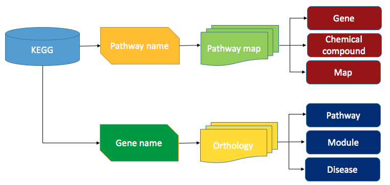
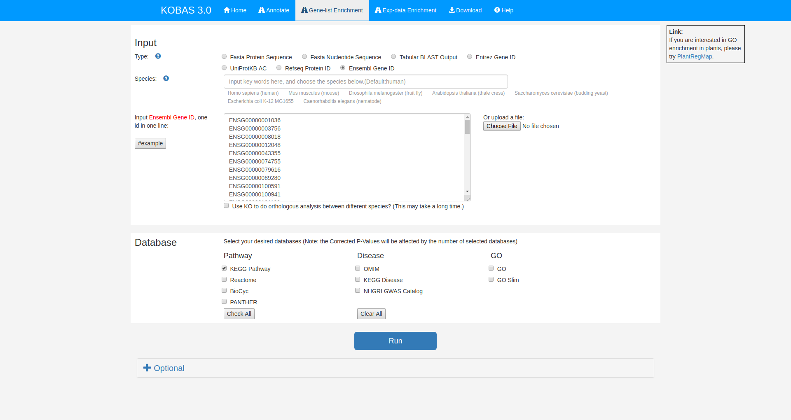
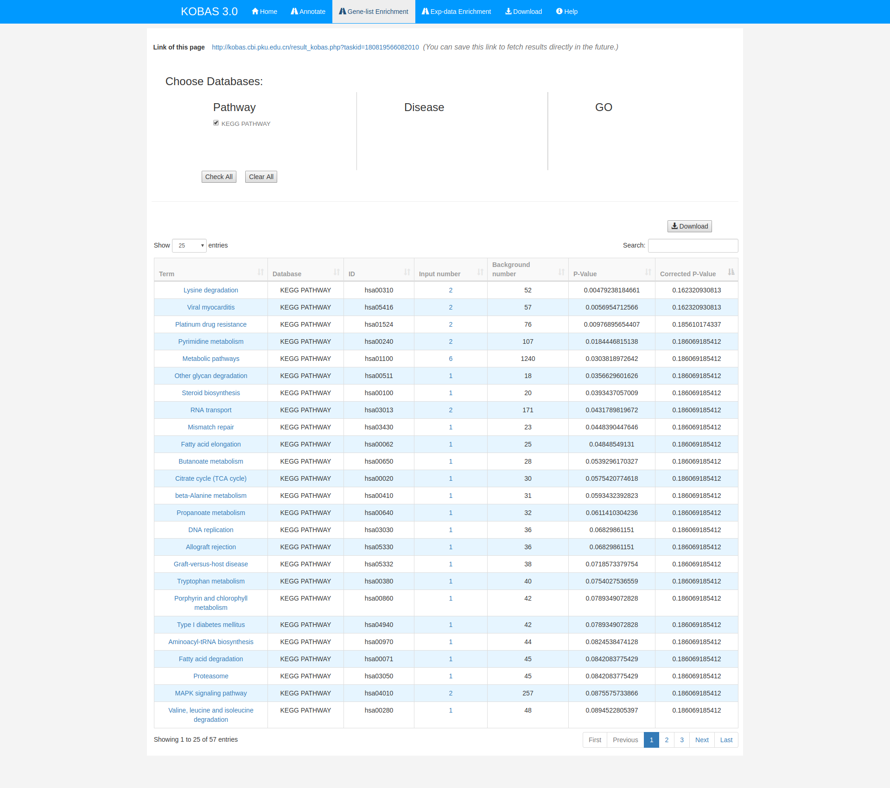

# 4.2. KEGG

## Pipeline

----

## Data Structure

### getting software & data {#kegg-install}

1. go to [KOBAS](http://kobas.cbi.pku.edu.cn/anno_iden.php)
1. generate your list of interest genes

<pre style='height: 18em; scroll: auto;'>
ENSG00000001036
ENSG00000003756
ENSG00000008018
ENSG00000012048
ENSG00000043355
ENSG00000074755
ENSG00000079616
ENSG00000089280
ENSG00000100591
ENSG00000100941
ENSG00000101109
ENSG00000101974
ENSG00000104611
ENSG00000104738
ENSG00000105738
ENSG00000113318
ENSG00000114867
ENSG00000116221
ENSG00000116857
ENSG00000117724
ENSG00000119285
ENSG00000121774
ENSG00000127663
ENSG00000127884
ENSG00000128159
ENSG00000129187
ENSG00000130640
ENSG00000131473
ENSG00000134287
ENSG00000134644
ENSG00000136628
ENSG00000137273
ENSG00000146263
ENSG00000153187
ENSG00000160285
ENSG00000164818
ENSG00000164944
ENSG00000167325
ENSG00000167548
ENSG00000170448
ENSG00000179632
ENSG00000183207
ENSG00000187954
ENSG00000196700
ENSG00000196924
ENSG00000198604
ENSG00000198886
ENSG00000198899
ENSG00000206503
ENSG00000223609
ENSG00000272822
</pre>

### **Inputs**

| **File format** | **Information contained in file** | **File description** | **Notes** |
| :--- | :--- | :--- | :--- |
| txt | Ensembl Gene id | Ensembl gene id (i.e. Homo sapiens ENSG00000001036) |  |

### **Outputs**

| **File format** | **Information contained in file** | **File description** | **Notes** |
| :--- | :--- | :--- | :--- |
| txt | Output information | The KEGG ontology & enrichment results of each gene |  |

-----

## Running Steps

1. `Input` -> `Type` 勾选 "Ensembl Gene ID"
1. 将[上文](#kegg-install)中的基因粘贴到文本框中
1. `Database` 勾选 "KEGG Pathway"
1. 单击 `Run`

图1 运行KOBAS

结果如下图所示

图1 KOBAS KEGG 富集结果

## Tips/Utilities

KOBAS 也可以进行 GO 富集，只需要在 `Database` 勾选 "GO" 即可

除了 KOBAS 之外，其它软件也能进行 KEGG 分析，如 [DAVID](https://david.ncifcrf.gov/)

## Homework and more

使用 KOBAS对以下基因进行 KEGG 富集分析 （Ensembl Gene ID）

1. 本章中用 KEGG 分析的基因与 上一章中用 GO 分析的基因是完全一样的，请比较两章的结果，总结两种方法得到的生物学意义有哪些异同。
1. 自己找差异表达文献，用其中的基因进行 KEGG 富集分析，并于文献中的结果作比较

