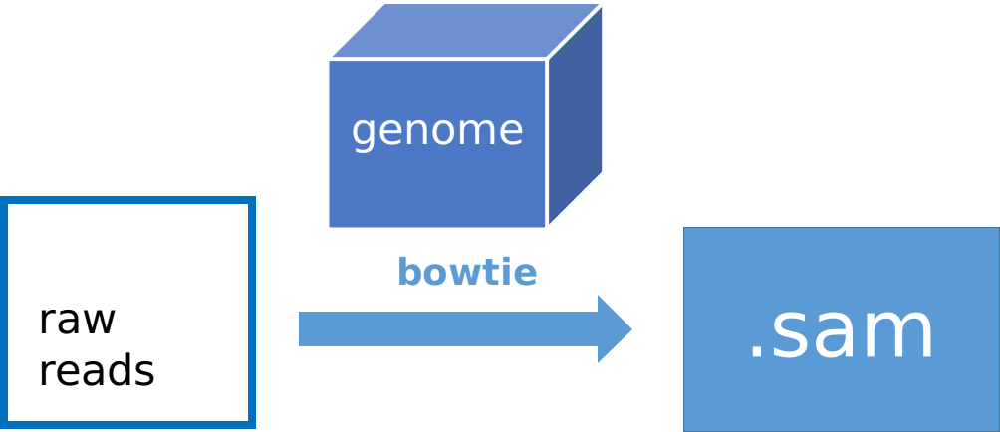

# 5. Mapping

Mapping reads to genome using Bowtie

## 1) Pipeline



## 2) Data Structure

### 2a) getting software & data

1. install software (already available in Docker)  
   [bowtie](http://sourceforge.net/projects/bowtie-bio/files/bowtie/1.0.0/)
1. data
   1. 我们使用酵母和e.coli 的数据，位于 Docker 中的 `/home/test/mapping`。
   1. 我们从 [这里](http://bowtie-bio.sourceforge.net/tutorial.shtml) 下载了 bowtie 提供的酵母和 e.coli 基因组 index，分别位于 Docker 中的 `/home/test/mapping/BowtieIndex` 和 `/home/test/mapping/bowtie-src/indexes`。


### 2b) input

| Format | Description          | Notes |
|--------|----------------------|-------|
| `.fq` | 存储 raw reads | FASTQ Format     |

例如：
```
@EAS54_6_R1_2_1_413_324
CCCTTCTTGTCTTCAGCGTTTCTCC
+
;;3;;;;;;;;;;;;7;;;;;;;88
```


> FASTQ format stores sequences and Phred qualities in a single file. It is concise and compact. FASTQ is first widely used in the Sanger Institute and therefore we usually take the Sanger specification and the standard FASTQ format, or simply FASTQ format. Although Solexa/Illumina read file looks pretty much like FASTQ, they are different in that the qualities are scaled differently. In the quality string, if you can see a character with its ASCII code higher than 90, probably your file is in the Solexa/Illumina format.

### 2c) output

| Format | Description          | Notes |
|--------|----------------------|-------|
| `.sam` | mapping 结果 | -     |
| `.bed` | Tab分隔， 便于其它软件(例如 IGB )处理 | -     |

bed文件格式：

1. chrom： The name of the chromosome (e.g. chr3, chrY, chr2_random) or scaffold (e.g. scaffold10671).
2. chromStart： The starting position of the feature in the chromosome or scaffold. The first base in a chromosome is numbered 0.
3. chromEnd： The ending position of the feature in the chromosome or scaffold. The chromEnd base is not included in the display of the feature. For example, the first 100 bases of a chromosome are defined as chromStart=0, chromEnd=100, and span the bases numbered 0-99.
4. name (optional): Defines the name of the BED line. This label is displayed to the left of the BED line in the Genome Browser window when the track is open to full display mode or directly to the left of the item in pack mode.
5. score (optional): A score between 0 and 1000. 


## 3) Running Steps

首先进入到容器（在自己电脑的 Terminal 中运行，详情请参见 [这里](https://lulab.gitbooks.io/teaching/getting-started.html#use-container)）：    

```bash
docker exec -it bioinfo_tsinghua bash
```

以下步骤均在 `/home/test/mapping/` 下进行:  

```bash
cd /home/test/mapping/
```

## 3a) mapping


```bash
bowtie -v 2 -m 10 --best --strata BowtieIndex/YeastGenome -f THA1.fa -S THA1.sam

bowtie -v 1 -m 10 --best --strata bowtie-src/indexes/e_coli \
    -q e_coli_1000_1.fq -S e_coli_1000_1.sam
```

- `-v`  report end-to-end hits with less than v mismatches; ignore qualities
- `-m`  suppress all alignments if more than m exist (def: no limit) 
- `-M`  like `-m`, but reports 1 random hit (MAPQ=0) (requires `--best`)
- `--best` hits guaranteed best stratum; ties broken by quality
- `--strata` hits in sub-optimal strata aren't reported (requires `--best`)
- `-f` raw reads文件 (FASTA) 
- `-q` raw reads 文件（FASTQ)    
- `-S` 输出文件名，格式为 `.sam` 格式 

## 3b) 格式转换

我们之后可以可视化比对出的结果。常用的软件和网站包括[IGV](https://software.broadinstitute.org/software/igv/download)和[UCSC](https://genome.ucsc.edu/cgi-bin/hgTracks)。将sam处理成Bed格式，方便后续可视化处理。

```bash
perl sam2bed.pl THA1.sam > THA1.bed
```

## 3c) 过滤文件 

上传 `.bed` 文件到 Genome Browser 浏览时，如果文件过大，或者MT染色体不识别，可以用如下方法：

```bash
grep -v chrmt THA1.bed > THA1_new.bed   #输出一个不含chromosome MT的文件

grep chrI THA1.bed > THA1_chrI.bed      #输出一个只有chromosome I的文件
```


## 4) Tips/Utilities


### 4a) 如何使用 UCSC genome browser

* 演示视频   
[@youtube](https://youtu.be/eTgEtfI65hA)

<iframe width="400" height="300" src="https://www.youtube.com/embed/eTgEtfI65hA" frameborder="0" allow="autoplay; encrypted-media" allowfullscreen></iframe>

* 演示视频  
[@bilibili](https://www.bilibili.com/video/av30448417/)

<iframe width="400" height="300" src="https://player.bilibili.com/player.html?aid=30448417&cid=53132461&page=1" allowfullscreen></iframe>

> **Tips**：  
>
> 1. 对于处理好的测序数据（bigWig，BAM,bigBed)，UCSC仅支持通过提供URL链接或直接输入。
>
> 1. 在比较不同样本的数据时，需要根据样本本身测序深度的不同来对纵坐标进行调整,从而保证该区域/位点测序数据能够显示完整并且可以相互比较。  
>
> 1. 有时，用 bedtools genomecov scale之后的 bigwig 文件纵坐标仍然会出现显示不完整等现象，此时需要手动调整下。  

### 4b) 如何使用 IGV genome browser

* 演示视频  

[@youtube](https://youtu.be/6_1ZcVw7ptU)

<iframe width="400" height="300" src="https://www.youtube.com/embed/6_1ZcVw7ptU" frameborder="0" allow="autoplay; encrypted-media" allowfullscreen></iframe>

* 演示视频  

[@bilibili](https://www.bilibili.com/video/av30448472/)

<iframe width="400" height="300" src="https://player.bilibili.com/player.html?aid=30448472&cid=53133093&page=1" allowfullscreen></iframe>

## 4c) 更多基因组文件格式

详见 [http://genome.ucsc.edu/FAQ/FAQformat.html](http://genome.ucsc.edu/FAQ/FAQformat.html)


## 5) Homework and more

1. 将 [`THA2.fa`](https://cloud.tsinghua.edu.cn/f/58b8cff4839d48fc86f3/?dl=1) map 到 `BowtieIndex/YeastGenome` 上，得到 `THA2.sam`。
1. 将 [`e_coli_500.fq`](https://cloud.tsinghua.edu.cn/f/fb442e88f79a4d1495d4/?dl=1) map 到 `bowtie-src/indexes/e_coli` 上，得到 `e_coli_500.sam`。
1. 将上面两个结果均转换为 `.bed` 文件。
1. 从上一步得到的 `THA2.bed` 中筛选出 
   - 一个不含chromosome V 的文件
   - 一个只有chromosome XII 的文件 


