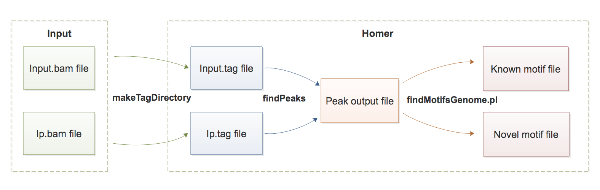

# 7.ChIP-seq

本章主要介绍 ChIP-seq 相关分析方法，包括 peak calling 和 motif analysis。

染色质免疫共沉淀测序（Chromatin immunoprecipitation sequencing，简称 ChIP-seq）被用于分析蛋白质与 DNA 的交互作用。常见的 ChIP-seq 实验主要研究转录因子和组蛋白修饰如何通过与DNA相互作用来调控基因表达，从而影响表型。ChIP-seq 对于充分了解许多生物过程和疾病状态至关重要。

## 1\) Pipeline



## 2\) Data Structure

### 2a\) getting software & data

1. install software \(already available in Docker\)

   [HOMER](http://homer.ucsd.edu/homer/)

2. data  
   我们使用 [GSE61210](https://www.ncbi.nlm.nih.gov/geo/query/acc.cgi?acc=GSE61210) 中的两个样本：

   * Input：[GSM1499619](https://www.ncbi.nlm.nih.gov/geo/query/acc.cgi?acc=gsm1499619)（`input.bam`）
   * IP：[GSM1499607](https://www.ncbi.nlm.nih.gov/geo/query/acc.cgi?acc=gsm1499607)（`ip.bam`）   

   如上表所示，我们已经准备好 `.bam` 文件（位于 Docker 中的 `/home/test/chip-seq/input`）。用户也可以参考 [这里](7.chip-seq.md#chip-seq-bam) 从 CHIP-seq 数据生成自己的 `.bam` 文件。

### 2b\) input

| Format | Description | Notes |
| :--- | :--- | :--- |
| `.bam` | 将CHIP-seq的 Reads 比对到参考基因组 | - |

### 2c\) output

#### 2c.1\) 核心输出文件如下所示：

|  | File format | File description |
| :--- | :--- | :--- |
| Peak calling | peak file | each row contatins information of a peak |
| Motif analysis | `homerResults.html` | de novo motif table in HTML format |

peak table in peak file

```text
# Column Headers:
#PeakID chr     start   end     strand  Normalized Tag Count    focus ratio   findPeaks Score  Total Tags      Control Tags (normalized to IP Experiment)    Fold Change vs Control   p-value vs Control      Fold Change vs Local    p-value vs Local       Clonal Fold Change
chrIII-1        chrIII  78346   78578   +       69987.1 0.862   5971.000000   5966.0   201.6   29.60   0.00e+00        26.54   0.00e+00        0.50
chrIII-2        chrIII  133     365     +       61226.9 0.775   5364.000000   5227.0   116.3   44.93   0.00e+00        59.92   0.00e+00        0.61
chrI-1  chrI    141663  141895  +       41225.6 0.854   3515.000000     3514.0169.1    20.78   0.00e+00        17.09   0.00e+00        0.50
chrII-1 chrII   165145  165377  +       35334.5 0.845   3015.000000     3018.0171.1    17.64   0.00e+00        14.47   0.00e+00        0.50
chrII-2 chrII   555827  556059  +       34817.1 0.790   2973.000000     2970.0159.6    18.61   0.00e+00        10.12   0.00e+00        0.50
```


图1. motif table in `homerResults.html`

#### 2c.2\) detailed description of Peak calling output

peak file contains the following columns

| column | information | description |
| :--- | :--- | :--- |
| 1 | PeakID | a _unique_ name for each peak |
| 2 | chr | chromosome where peak is located |
| 3 | starting position of peak |  |
| 4 | ending position of peak |  |
| 5 | Strand \(+/-\) |  |
| 6 | Normalized Tag Counts | number of tags found at the peak, normalized to 10 million total mapped tags \(or defined by the user\) |
| 7 | Focus Ratio | fraction of tags found appropriately upstream and downstream of the peak center |
| 8 | Peak score | position adjusted reads from initial peak region - reads per position may be limited |
| 9 | total Tags | number of tags found at the peak |
| 10 | Control Tags | normalized to IP Experiment |
| 11 | Fold Change vs Control | putative peaks have 4-fold more normalized tags in the target experiment than the control |
| 12 | p-value vs Control | HOMER uses the poisson distribution to determine the chance that the differences in tag counts are statistically significant \(sequencing-depth dependent\), requiring a cumulative poisson p-value of 0.0001 |
| 13 | Fold Change vs Local | HOMER requires the tag density at peaks to be 4-fold greater than in the surrounding 10 kb region |
| 14 | p-value vs Local | the comparison must also pass a poisson p-value threshold of 0.0001 |
| 15 | Clonal Fold Change | The fold threshold can be set with the `-C <#>` option \(default: `-C 2`\), if  this ratio gets too high, the peak may arise from expanded repeats, and should be discarded |

#### 2c.3\) detailed description of Motif analysis output

Detailed output files of Motif analysis will produce many files, we only explain the main output -- `homerResults.html` in above. Here we will briefly introduce other files.

| file name | description |
| :--- | :--- |
| `homerMotifs.all.motifs` | Simply the concatenated file composed of all the `homerMotifs.motifs<#>` files. |
| `motifFindingParameters.txt` | command used to execute `findMotifsGenome.pl`. |
| `knownResults.txt` | text file containing statistics about known motif enrichment \(open in EXCEL\). |
| `seq.autonorm.tsv` | autonormalization statistics for lower-order oligo normalization. |
| `homerResults.html` | HTML formatted output of de novo motif finding: |
| `knownResults.html` | HTML formatted output of known motif finding. |
| `knownResults/ directory` | contains files for the knownResults.html webpage, including `known<#>.motif` files for use in finding specific instance of each motif. |

## 3\) Running Steps

首先进入到容器（在自己电脑的 Terminal 中运行，详情请参见 [这里](https://lulab.gitbooks.io/teaching/getting-started.html#use-container)）：

```bash
docker exec -it bioinfo_tsinghua bash
```

以下步骤均在 `/home/test/chip-seq/` 下进行:

```bash
cd /home/test/chip-seq/
```

准备输出目录

```bash
mkdir output
```

### 3a\) Peak Calling

The common call peak software are HOMER and MACS, here we mainly introduce the usage of HOMER. You can get manual for MACS [here](7.chip-seq.md#chip-seq-macs).

HOMER contains a program called `findPeaks` that performs all of the peak calling analysis. Before we use `findPeaks` to call peak, we need to convert our `.bam` file into tag file by using `makeTagDirectory`:

```bash
makeTagDirectory input/ip    input/ip.part.bam
makeTagDirectory input/input input/input.part.bam
```

After this step, `input/ip` & `input/input` will contain several `.tags.tsv` files, as well as a file named `tagInfo.txt`. This file contains information about your sequencing run, including the total number of tags considered. This file is used by later peak-calling programs to quickly reference information about the experiment. Then we call peak by using these tag file:

```bash
findPeaks input/ip/ -style factor -o output/part.peak -i input/input/
```

Important parameters

| parameter | meaning |
| :--- | :--- |
| `-style` | Specialized options for specific analysis strategies, such as factor \(transcription factor ChIP-Seq\) and histone \(histone modification ChIP-Seq\). |
| `-o` | File name for to output peaks, default: stdout. |
| `-i` | Input tag directory, experiment to use as IgG/Input/Control. |

输出文件为 `/home/test/chip-seq/output/part.peak`, 示例如下

```text
#PeakID chr     start   end     strand  Normalized Tag Count    focus ratio     findPeaks Score Total TagControl Tags (normalized to IP Experiment)       Fold Change vs Control  p-value vs Control      Fold Change vs Local      p-value vs Local        Clonal Fold Change
chrIII-1        chrIII  78346   78578   +       69987.1 0.862   5971.000000     5966.0  201.6   29.60   0.00e+00  26.54   0.00e+00        0.50
chrIII-2        chrIII  133     365     +       61226.9 0.775   5364.000000     5227.0  116.3   44.93   0.00e+00  59.92   0.00e+00        0.61
chrI-1  chrI    141663  141895  +       41225.6 0.854   3515.000000     3514.0  169.1   20.78   0.00e+00 17.09    0.00e+00        0.50
chrII-1 chrII   165145  165377  +       35334.5 0.845   3015.000000     3018.0  171.1   17.64   0.00e+00 14.47    0.00e+00        0.50
chrII-2 chrII   555827  556059  +       34817.1 0.790   2973.000000     2970.0  159.6   18.61   0.00e+00 10.12    0.00e+00        0.50
chrIII-3        chrIII  163527  163759  +       31266.1 0.826   2662.000000     2670.0  186.0   14.35   0.00e+00  14.16   0.00e+00        0.51
```

### 3b\) Motif Analysis

HOMER contains a program called `findMotifsGenome.pl` that can find enriched motifs in ChIP-Seq peaks

```bash
findMotifsGenome.pl output/part.peak sacCer2 output/part.motif.output -len 8
```

Important parameters

* Region Size \(`-size <#>`, `-size <#>,<#>`, `-size given`, default: 200\) The size of the region used for motif finding is important. If analyzing ChIP-Seq peaks from a transcription factor, Chuck would recommend 50 bp for establishing the primary motif bound by a given transcription factor and 200 bp for finding both primary and "co-enriched" motifs for a transcription factor. When looking at histone marked regions, 500-1000 bp is probably a good idea。
* Motif length \(`-len <#>` or `-len <#>,<#>,...`, default 8,10,12\) In general, it's best to try out enrichment with shorter lengths \(i.e. less than 15\) before trying longer lengths.
* Number of motifs to find \(`-S <#>`, default 25\) Specifies the number of motifs of each length to find. 25 is already quite a bit.

最重要的输出文件为 `/home/test/chip-seq/output/part.motif.output/homerResults.html`, 示例输出参见 [这里](https://github.com/lulab/teaching_book/tree/f0875891a0784d5015587311c50bfbfa88e2a2d5/.gitbook/chip-seq-motif/homerResults.html)

## 4\) Tips/Utilities

### 4a\) Preparation `.bam` from ChIP-seq data   <a id="chip-seq-bam"></a>

If you want to get these two `.bam` files by yourself, you can follows these steps.

1. download data
   1. The fastq data for yeast ChIP-seq was downloaded from [GSE61210](https://www.ncbi.nlm.nih.gov/geo/query/acc.cgi?acc=GSE61210) .
   2. Input data was downloaded from [GSM1499619](https://www.ncbi.nlm.nih.gov/geo/query/acc.cgi?acc=gsm1499619);
   3. IP data was downloaded from [GSM1499607](https://www.ncbi.nlm.nih.gov/geo/query/acc.cgi?acc=gsm1499607).
2. build yeast bowtie index

   Yeast sacCer2 genome data was downloaded from UCSC [http://hgdownload.soe.ucsc.edu/goldenPath/sacCer2/bigZips/chromFa.tar.gz](http://hgdownload.soe.ucsc.edu/goldenPath/sacCer2/bigZips/chromFa.tar.gz).

   Index was build with commad:

   ```bash
   tar -xvf chromfa.tar.gz
   cat *.fa >yeast.allchrom.fa
   mkdir bowtie_index_yeast
   bowtie-build yeast.allchrom.fa bowtie_index_yeast/sacCer2
   ```

3. mapping

   ```bash
   bowtie -p 4  -m 1  -v 3  --best --strata bowtie_index_yeast/sacCer2 \
       -q input/ip.fastq -S input/ip.sam
   ```

4. sampling

   As the `.sam` file is too big for tutorial example, so we selected parts of them as example file.

   ```bash
   samtools sort input/ip.sam >input/ip.sorted.bam
   samtools index input/ip.sorted.bam
   samtools view input/ip.sorted.bam chrI chrII chrIII -b >input/ip.part.bam
   ```

### 4b\) peak file header

The top portion of the peak file will contain parameters and various analysis information


图2. peak file 元信息

Two fields need special notification:

* `genome size` represents the total effective number of mappable bases in the genome;
* `Approximate IP effeciency` describes the fraction of tags found in peaks versus genomic background. This provides an estimate of how well the ChIP worked. Certain antibodies like H3K4me3, ERa, or PU.1 will yield very high IP efficiencies \(&gt;20%\), while most rand in the 1-20% range. Once this number dips below 1% it's a good sign the ChIP didn't work very well and should probably be optimized.

### 4c\) peak calling using MACS   <a id="chip-seq-macs"></a>

[MACS](https://github.com/taoliu/MACS/) can also be used to call peaks \(the program is already installed in Docker\).

```bash
macs2 callpeak -t input/ip.part.bam -c input/input.part.bam --outdir output/macs_peak \
    --name=yeast_macs_p05 --format=BAM --gsize=1.2e7 --tsize=50 --pvalue=1e-5
```

The main output is `/home/test/chip-seq/output/macs_peak/yeast_macs_p05_peaks.xls`, which is a tabular file containing information about called peaks. You can open it in excel and sort/filter using excel functions. Information include:

* chromosome name
* start position of peak
* end position of peak
* length of peak region
* absolute peak summit position
* pileup height at peak summit, -log10\(pvalue\) for the peak summit \(e.g. pvalue =1e-10, then this value should be 10\)
* fold enrichment for this peak summit against random Poisson distribution with local lambda, -log10\(qvalue\) at peak summit

### 4d\) reference

HOMER call peak: [http://homer.ucsd.edu/homer/ngs/peaks.html](http://homer.ucsd.edu/homer/ngs/peaks.html)  
HOMER find motif: [http://homer.ucsd.edu/homer/ngs/peakMotifs.html](http://homer.ucsd.edu/homer/ngs/peakMotifs.html) MACS is introduced in "[Identifying ChIP-seq enrichment using MACS](https://www.nature.com/articles/nprot.2012.101)"

## 5\) Homework and more

1. 解释 `findPeaks` 和 `findMotifsGenome.pl` 主要参数的含义。
2. 提交文件: 提交Snf1蛋白在DNA上结合的 peak的位置, fold change, p-value等信息 和 motif 及p-value信息 \(peak 和 motif最好放到一个word/pdf文件中提交）。

   > * Snf1蛋白是染色体重塑复合体中的重要组成部分之一，为了探究Snf1蛋白会特异性识别哪些DNA序列，Workman小组在酵母中做了该蛋白的ChIP-seq实验。
   > * 其中Snf1蛋白IP实验数据为 ip.chrom\_part.bam，Input背景数据为input.chrom\_part.bam。请同学们根据本节课所学内容寻找Snf1蛋白在DNA上结合的 peak 和 motif。
   > * 作业的数据：bam 文件在 Docker 的 `/home/test/chip-seq/homework/` 文件夹中。
   > * 筛选标准 1. peak:`Fold Change (vs Control) >=8`，且 `p-value (vs Control)` &lt; $$10^{-8}$$ ; 2. motif: `p-value` &lt; $$10^{-10}$$ ;

