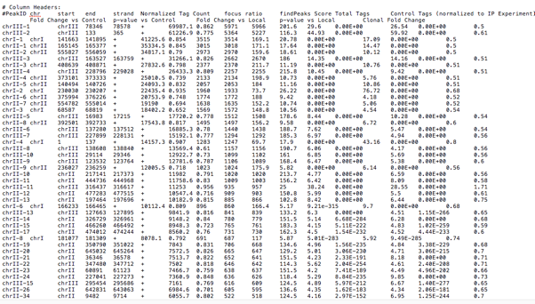
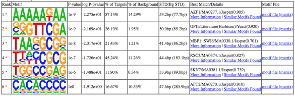
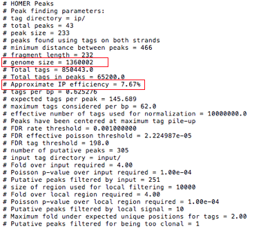

# 7. ChIP-seq: peak calling and motif analysis

本章主要介绍 ChIP-seq 相关分析方法，包括 peak calling 和 motif analysis。

染色质免疫共沉淀测序（Chromatin immunoprecipitation sequencing，简称 ChIP-seq）被用于分析蛋白质与 DNA 的交互作用。常见的 ChIP-seq 实验主要研究转录因子和组蛋白修饰如何通过与DNA相互作用来调控基因表达，从而影响表型。ChIP-seq 对于充分了解许多生物过程和疾病状态至关重要。

## Pipeline

---

## Data Structure

---

### getting software & data

1. install software
   1. [HOMER](http://homer.ucsd.edu/homer/)
   1. [MACS](http://liulab.dfci.harvard.edu/MACS/)
1. download example data from [here](https://github.com/dongzhuoer/docker-lulab-chipseq/tree/master/data/input)


### input

The input file for peak calling is `.bam` file generated from mapping step. ChIP-seq analysis usually needs two input `.bam` files, one is _IP_ `.bam` file and the other is _INPUT_ `.bam` file.

The example `.bam` files (in `/home/test/chip-seq`) listed above come from yeast ChIP-seq.


### output

| File format         | File description                               |
|---------------------|------------------------------------------------|
| peak file           | each row contatins information of a peak       |
| `homerResults.html` | HTML formatted output of de novo motif finding |



图1. peak table 



图2. motif table

<br>
<br>
<br>

detailed description of peak file

| column | information               | description                                                                                                                                                                                                 |
|--------|---------------------------|-------------------------------------------------------------------------------------------------------------------------------------------------------------------------------------------------------------|
| 1      | PeakID                    | a _unique_ name for each peak                                                                                                                                                                               |
| 2      | chr                       | chromosome where peak is located                                                                                                                                                                            |
| 3      | starting position of peak |                                                                                                                                                                                                             |
| 4      | ending position of peak   |                                                                                                                                                                                                             |
| 5      | Strand (+/-)              |                                                                                                                                                                                                             |
| 6      | Normalized Tag Counts     | number of tags found at the peak, normalized to 10 million total mapped tags (or defined by the user)                                                                                                       |
| 7      | Focus Ratio               | fraction of tags found appropriately upstream and downstream of the peak center                                                                                                                             |
| 8      | Peak score                | position adjusted reads from initial peak region - reads per position may be limited                                                                                                                        |
| 9      | total Tags                | number of tags found at the peak                                                                                                                                                                            |
| 10     | Control Tags              | normalized to IP Experiment                                                                                                                                                                                 |
| 11     | Fold Change vs Control    | putative peaks have 4-fold more normalized tags in the target experiment than the control                                                                                                                   |
| 12     | p-value vs Control        | HOMER uses the poisson distribution to determine the chance that the differences in tag counts are statistically significant (sequencing-depth dependent), requiring a cumulative poisson p-value of 0.0001 |
| 13     | Fold Change vs Local      | HOMER requires the tag density at peaks to be 4-fold greater than in the surrounding 10 kb region                                                                                                           |
| 14     | p-value vs Local          | the comparison must also pass a poisson p-value threshold of 0.0001                                                                                                                                         |
| 15     | Clonal Fold Change        | The fold threshold can be set with the `-C <#>` option (default: `-C 2`), if  this ratio gets too high, the peak may arise from expanded repeats, and should be discarded                                   |

<br>
output files of Motif analysis

| file name                    | description                                                                                                                            |
|------------------------------|----------------------------------------------------------------------------------------------------------------------------------------|
| `homerMotifs.all.motifs`     | Simply the concatenated file composed of all the `homerMotifs.motifs<#>` files.                                                        |
| `motifFindingParameters.txt` | command used to execute `findMotifsGenome.pl`.                                                                                         |
| `knownResults.txt`           | text file containing statistics about known motif enrichment (open in EXCEL).                                                          |
| `seq.autonorm.tsv`           | autonormalization statistics for lower-order oligo normalization.                                                                      |
| `homerResults.html`          | formatted output of de novo motif finding:                                                                                             |
| `knownResults.html`          | formatted output of known motif finding.                                                                                               |
| `knownResults/ directory`    | contains files for the knownResults.html webpage, including `known<#>.motif` files for use in finding specific instance of each motif. |


## Running Steps

---


### I. Peak Calling

```bash
docker rm -f chip-seq
docker run -dt --restart=unless-stopped -w /home/test/chip-seq --name chip-seq dongzhuoer/lulab-chipseq
docker exec -u root chip-seq ls /bin #/findPeaks.pl
docker exec chip-seq which makeTagDirectory

docker exec chip-seq /bin/makeTagDirectory input/ip input/ip.part.bam
```

The common call peak software are HOMER and MACS, here we mainly introduce the usage of HOMER. You can get manual for MACS from [here](#chip-seq-macs).

HOMER contains a program called `findPeaks` that performs all of the peak calling analysis. Before we use `findPeaks` to call peak, we need to convert our `.bam` file into `.tag` file by using `makeTagDirectory`:

```bash
makeTagDirectory input/ip input/ip.part.bam
```

In the end, your output directory will contain several `.tags.tsv` files, as well as a file named `tagInfo.txt`.  This file contains information about your sequencing run, including the total number of tags considered.  This file is used by later peak-calling programs to quickly reference information about the experiment. Then we call peak by using these tag file:

```bash
findPeaks ip/ -style factor -o part.peak -i input/
```

Important parameters

| parameter | meaning                                                                                                                                           |
|-----------|---------------------------------------------------------------------------------------------------------------------------------------------------|
| `-style`  | Specialized options for specific analysis strategies, such as factor (transcription factor ChIP-Seq) and histone (histone modification ChIP-Seq). |
| `-o`      | File name for to output peaks, default: stdout.                                                                                                   |
| `-i`      | Input tag directory, experiment to use as IgG/Input/Control.                                                                                      |


### II. Motif Analysis

HOMER contains a program called `findMotifsGenome.pl` that can find enriched motifs in ChIP-Seq peaks

```bash
findMotifsGenome.pl part.peak sacCer2 part.motif.output -len 8
```

Important parameters


- Region Size  
  (`-size <#>`, `-size <#>,<#>`, `-size given`, default: 200)  
  The size of the region used for motif finding is important.  If analyzing 
      ChIP-Seq peaks from a transcription factor, Chuck would recommend 50 bp 
      for establishing the primary motif bound by a given transcription factor 
      and 200 bp for finding both primary and "co-enriched" motifs for a 
      transcription factor.  When looking at histone marked regions, 500-1000 bp
      is probably a good idea。

- Motif length  
  (`-len <#>` or `-len <#>,<#>,...`, default 8,10,12)   
  In general, it's best to try out enrichment with shorter lengths 
      (i.e. less than 15) before trying longer lengths.

- Number of motifs to find  
  (`-S <#>`, default 25)  
  Specifies the number of motifs of each length to find. 25 is already quite a bit.

## Tips/Utilities

---

### Preparation `.bam` from ChIP-seq data

If you want to get these two `.bam` files by yourself, you can follows these steps.

1. download data

   1. The fastq data for yeast ChIP-seq was downloaded from [GSE61210](https://www.ncbi.nlm.nih.gov/geo/query/acc.cgi?acc=GSE61210) .
   1. Input data was downloaded from GSM1499619;
   1. IP data was downloaded from GSM1499607.

1. build yeast bowtie index
   
   Yeast sacCer2 genome data was downloaded from UCSC <http://hgdownload.soe.ucsc.edu/goldenPath/sacCer2/bigZips/chromFa.tar.gz>.
   
   Index was build with commad:
   
   ```bash
   tar -xvf chromfa.tar.gz
   cat *.fa >yeast.allchrom.fa
   mkdir bowtie_index_yeast
   bowtie-build yeast.allchrom.fa bowtie_index_yeast/sacCer2
   ```
   
2. mapping
   
   ```bash
   bowtie -p 4  -m 1  -v 3  --best --strata bowtie_index_yeast/sacCer2 -q input/ip.fastq -S input/ip.sam
   ```
   
3. sampling
   
   As the sam file is too big for tutorial example, so we selected parts of them as example file.
   
   ```bash
   samtools sort input/ip.sam >input/ip.sorted.bam
   samtools index input/ip.sorted.bam
   samtools view input/ip.sorted.bam chrI chrII chrIII -b >input/ip.part.bam
   ```

### peak file header

The top portion of the peak file will contain parameters and various analysis information



图1. peak file 元信息

Two fields need special notification:

- `genome size`   
  represents the total effective number of mappable bases in the genome;

- `Approximate IP effeciency`   
  describes the fraction of tags found in peaks versus
      genomic background.  This provides an estimate of how well the ChIP worked. 
      Certain antibodies like H3K4me3, ERa, or PU.1 will yield very high IP efficiencies (<20%), 
      while most rand in the 1-20% range.  Once this number dips below 1% it's a 
      good sign the ChIP didn't work very well and should probably be optimized.


### peak calling using MACS {#chip-seq-macs}

```bash
macs14 -t ip.bam -c input.bam --name=yeast_macs_p05  --format=BAM --gsize=1.2e7  --tsize=50 --pvalue=1e-5 --mfold=4
```

`NAME_peaks.xls` is a tabular file which contains information about called peaks. You can open it in excel and sort/filter using excel functions. Information include:

- chromosome name
- start position of peak
- end position of peak
- length of peak region
- absolute peak summit position
- pileup height at peak summit, -log10(pvalue) for the peak summit (e.g. pvalue =1e-10, then this value should be 10)
- fold enrichment for this peak summit against random Poisson distribution with local lambda, -log10(qvalue) at peak summit


## Homework and more

---


1. 理解 `findPeaks` 和 `findMotifsGenome.pl` 各参数含义。
1. 根据 [这里](https://github.com/dongzhuoer/docker-lulab-chipseq/tree/master/data/homework) 的 `input.chrom_part.bam` 和 `ip.chrom_part.bam`）寻找 peak 和 motif。
