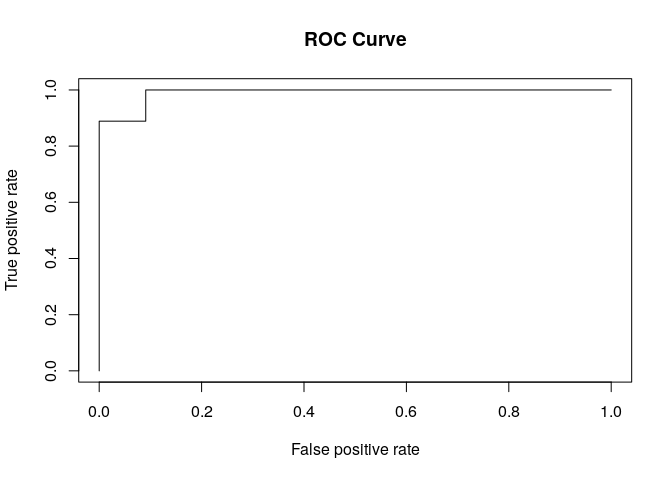

8.1 Machine Learning with R
===========================

1. Practice Guide
-----------------

Here we use random forest as an example.

### 1) preparation

install needed packages:

-   `magrittr` enable one style of writing R code, refer to
    [here](https://r4ds.had.co.nz/pipes.html#piping-alternatives) for
    why I use that style.
-   `randomForest`: build random forest model
-   `dplyr`: manipulate data frame
-   `ROCR`: ROC analysis
-   `GGally`: plot correlation between features

<!-- -->

    cran_pkg <- c('magrittr', 'dplyr', 'randomForest', 'ROCR', 'GGally')
    lapply(cran_pkg, function(x) {if (!(x %in% .packages(T))) install.packages(x)})

1.  The first line specify needed packages
2.  the second line install packages which *doesn’t exist* in your
    system (`.packages(T)` will list existing packages in the system.)

To avoid conflict of function name, in the following code, I will try me
best to use `pkg::fun()` instead of `library(pkg)`. However `magrittr`
is an exception, I have to `library()` it:

    library(magrittr)

### 2) generate data set

We use one of R’s built-in data set, `iris`, Edgar Anderson’s Iris Data
set.

The original data set contains observations for four features (sepal
length and width, and petal length and width — all in cm) of 150 flowers
of three species (each 50).

To make things simple, here we only choose two species, `versicolor` and
`virginica`.

    df <- iris %>% tibble::as_tibble() %>% 
        dplyr::filter(Species != 'setosa') %>%
        dplyr::mutate(Species = factor(Species))

-   The frist line turn `iris` into a
    [`tibble`](https://tibble.tidyverse.org/), a modern reimagining of
    the `data.frame`.
-   The second line select rows whose species is not `setosa`, so only
    `versicolor` and `virginica` are left.
-   The third line drops factor level of `Species` variable,
    `randomForest::randomForest()` would complain if you don’t do this.
    (This is a little technical, the orignial `Species` contains three
    levels, `setosa`, `versicolor` and `virginica`. Although we remove
    all `setosa` values, the `setosa` level still exists, and now this
    level contains no values, that would cause
    `randomForest::randomForest()` to fail . After we call `factor()`,
    `Species` contains only two levels, both do have values.)

Let’s have a look at our data (only part of it is shown, the whole data
contains 100 rows)

<table>
<colgroup>
<col style="width: 20%" />
<col style="width: 19%" />
<col style="width: 20%" />
<col style="width: 19%" />
<col style="width: 19%" />
</colgroup>
<thead>
<tr class="header">
<th style="text-align: center;">Sepal.Length</th>
<th style="text-align: center;">Sepal.Width</th>
<th style="text-align: center;">Petal.Length</th>
<th style="text-align: center;">Petal.Width</th>
<th style="text-align: center;">Species</th>
</tr>
</thead>
<tbody>
<tr class="odd">
<td style="text-align: center;">7</td>
<td style="text-align: center;">3.2</td>
<td style="text-align: center;">4.7</td>
<td style="text-align: center;">1.4</td>
<td style="text-align: center;">versicolor</td>
</tr>
<tr class="even">
<td style="text-align: center;">6.4</td>
<td style="text-align: center;">3.2</td>
<td style="text-align: center;">4.5</td>
<td style="text-align: center;">1.5</td>
<td style="text-align: center;">versicolor</td>
</tr>
<tr class="odd">
<td style="text-align: center;">6.9</td>
<td style="text-align: center;">3.1</td>
<td style="text-align: center;">4.9</td>
<td style="text-align: center;">1.5</td>
<td style="text-align: center;">versicolor</td>
</tr>
<tr class="even">
<td style="text-align: center;">6.5</td>
<td style="text-align: center;">3</td>
<td style="text-align: center;">5.2</td>
<td style="text-align: center;">2</td>
<td style="text-align: center;">virginica</td>
</tr>
<tr class="odd">
<td style="text-align: center;">6.2</td>
<td style="text-align: center;">3.4</td>
<td style="text-align: center;">5.4</td>
<td style="text-align: center;">2.3</td>
<td style="text-align: center;">virginica</td>
</tr>
<tr class="even">
<td style="text-align: center;">5.9</td>
<td style="text-align: center;">3</td>
<td style="text-align: center;">5.1</td>
<td style="text-align: center;">1.8</td>
<td style="text-align: center;">virginica</td>
</tr>
</tbody>
</table>

### 3) divide data set

Before we build the model, we need to divide the data set into training
set and testing set. So we can train our model using data in training
set, and evalute the model using data in testing set.

Here we randomly assigns 80 percent samples to the traing set, and the
left 20 percent to the testing set.

    set.seed(0)   # Set random seed to make results reproducible:

    nrow_training <- floor(nrow(df) * 0.8)  # Calculate the size of training sets
    indexes <- sample(1:nrow(df), nrow_training)  # these rows will be select for training

    # Assign the data to the correct sets
    training <- df[indexes, ] 
    testing <- df[-indexes, ]

### 4) Build the model

Then we can build a random forest model.

    rf_classifier = randomForest::randomForest(Species ~ ., training)

The code is fairly easy and straightforward:

-   `Species` is the reponse variable
-   `.` tells that all other variables are features
-   `training` is the data to train the model

Let’s have a look at our model

    ## 
    ## Call:
    ##  randomForest(formula = Species ~ ., data = training) 
    ##                Type of random forest: classification
    ##                      Number of trees: 500
    ## No. of variables tried at each split: 2
    ## 
    ##         OOB estimate of  error rate: 7.5%
    ## Confusion matrix:
    ##            versicolor virginica class.error
    ## versicolor         38         3  0.07317073
    ## virginica           3        36  0.07692308

### 5) Evaluate the model

After we build the model, we can make prediction on the testing set:

    predicted_value <- predict(rf_classifier, testing[, -ncol(testing)])
    real_value <- testing[[ncol(testing)]]

The result is as follows:

<table style="width:57%;">
<colgroup>
<col style="width: 25%" />
<col style="width: 18%" />
<col style="width: 13%" />
</colgroup>
<thead>
<tr class="header">
<th style="text-align: center;">predicted_value</th>
<th style="text-align: center;">real_value</th>
<th style="text-align: center;">correct</th>
</tr>
</thead>
<tbody>
<tr class="odd">
<td style="text-align: center;">versicolor</td>
<td style="text-align: center;">versicolor</td>
<td style="text-align: center;">TRUE</td>
</tr>
<tr class="even">
<td style="text-align: center;">versicolor</td>
<td style="text-align: center;">versicolor</td>
<td style="text-align: center;">TRUE</td>
</tr>
<tr class="odd">
<td style="text-align: center;">versicolor</td>
<td style="text-align: center;">versicolor</td>
<td style="text-align: center;">TRUE</td>
</tr>
<tr class="even">
<td style="text-align: center;">versicolor</td>
<td style="text-align: center;">versicolor</td>
<td style="text-align: center;">TRUE</td>
</tr>
<tr class="odd">
<td style="text-align: center;">versicolor</td>
<td style="text-align: center;">versicolor</td>
<td style="text-align: center;">TRUE</td>
</tr>
<tr class="even">
<td style="text-align: center;">versicolor</td>
<td style="text-align: center;">versicolor</td>
<td style="text-align: center;">TRUE</td>
</tr>
<tr class="odd">
<td style="text-align: center;">versicolor</td>
<td style="text-align: center;">versicolor</td>
<td style="text-align: center;">TRUE</td>
</tr>
<tr class="even">
<td style="text-align: center;">versicolor</td>
<td style="text-align: center;">versicolor</td>
<td style="text-align: center;">TRUE</td>
</tr>
<tr class="odd">
<td style="text-align: center;">versicolor</td>
<td style="text-align: center;">versicolor</td>
<td style="text-align: center;">TRUE</td>
</tr>
<tr class="even">
<td style="text-align: center;">virginica</td>
<td style="text-align: center;">virginica</td>
<td style="text-align: center;">TRUE</td>
</tr>
<tr class="odd">
<td style="text-align: center;">virginica</td>
<td style="text-align: center;">virginica</td>
<td style="text-align: center;">TRUE</td>
</tr>
<tr class="even">
<td style="text-align: center;">versicolor</td>
<td style="text-align: center;">virginica</td>
<td style="text-align: center;">FALSE</td>
</tr>
<tr class="odd">
<td style="text-align: center;">virginica</td>
<td style="text-align: center;">virginica</td>
<td style="text-align: center;">TRUE</td>
</tr>
<tr class="even">
<td style="text-align: center;">virginica</td>
<td style="text-align: center;">virginica</td>
<td style="text-align: center;">TRUE</td>
</tr>
<tr class="odd">
<td style="text-align: center;">virginica</td>
<td style="text-align: center;">virginica</td>
<td style="text-align: center;">TRUE</td>
</tr>
<tr class="even">
<td style="text-align: center;">virginica</td>
<td style="text-align: center;">virginica</td>
<td style="text-align: center;">TRUE</td>
</tr>
<tr class="odd">
<td style="text-align: center;">versicolor</td>
<td style="text-align: center;">virginica</td>
<td style="text-align: center;">FALSE</td>
</tr>
<tr class="even">
<td style="text-align: center;">virginica</td>
<td style="text-align: center;">virginica</td>
<td style="text-align: center;">TRUE</td>
</tr>
<tr class="odd">
<td style="text-align: center;">virginica</td>
<td style="text-align: center;">virginica</td>
<td style="text-align: center;">TRUE</td>
</tr>
<tr class="even">
<td style="text-align: center;">virginica</td>
<td style="text-align: center;">virginica</td>
<td style="text-align: center;">TRUE</td>
</tr>
</tbody>
</table>

We can summarise the result into a confusion matrix:

<table>
<thead>
<tr class="header">
<th> </th>
<th>True versicolor</th>
<th>True virginica</th>
</tr>
</thead>
<tbody>
<tr class="odd">
<td>Predicted versicolor</td>
<td>9</td>
<td>2</td>
</tr>
<tr class="even">
<td>Predicted virginica</td>
<td>0</td>
<td>9</td>
</tr>
</tbody>
</table>

Now we can calculate some statistics:

-   sensitivity: 9 / (9+0) = 100%
-   specificity: 9 / (9+2) = 82%
-   accuracy: (9 + 9)/20 = 90%
    <!--   - mcc (Matthews correlation coefficient): (9\*9 - 0\*2) / (9\*11\*11\*9) = 0.008   -->

### 6) ROC

Finally, let’s draw a ROC curve.

    probability <- predict(rf_classifier, testing[, -ncol(testing)], type = 'prob')
    label <- testing[[5]] %>% {ifelse(. ==  levels(.)[1], 1, 0)}

    prediction <- ROCR::prediction(probability[, 1], label)

    prediction %>% ROCR::performance('tpr', 'fpr') %>% ROCR::plot(main = 'ROC Curve') 

-   `probability`: for each row, we use the model to predict the
    probability of it belongs to each species
-   `levels`: we flag `versicolor` as `1`, `virginica` as `0`
-   `prediction`: we calculate the ROC
-   the last line plot the ROC using false positive rate (`'fpr'`) as x
    axis, true positive rate (`'tpr'`) as y axis

Cauculate the AUC

    ROCR::performance(prediction, 'auc')@y.values[[1]]

    ## [1] 0.989899

### 7) Tips and more

#### 7a) feature correlation

Before we build the model, we usually need to examine our data first. A
good start is to explore the correlation between features:

    GGally::ggpairs(df, columns = 1:4, ggplot2::aes(color = Species))

### 8) More reading

The code refer [this
post](https://www.blopig.com/blog/2017/04/a-very-basic-introduction-to-random-forests-using-r/)

For more machine learning models, you can refer to [these
scripts](https://github.com/urluzhi/scripts/tree/master/Rscript/machine_learning):

-   `logistic_regression.R`: Logistic Regression
-   `svm.R`: SVM
-   `plot_result.R`: Plot your training and testing performance

Last but not the least, you can also read *[The `caret`
package](http://topepo.github.io/caret)*, a tutorial written in GitBook

2. Homework
-----------

-   学习和使用教程中的代码，使用下面的数据，练习Random
    Forest，在training set上训练，在test set上预测，汇报模型的prediction
    performance: 包括 accuracy, sensitivity, specificity,
    roc\_auc等指标，绘制ROC曲线。

    > **作业要求** ：上交一个文档汇报prediction
    > performance，并解释如上指标所代表的意义，附ROC曲线并解释其意义。

We use another R’s built-in dataset, `mtcars`, you need to run the
following code to contruct the data:

    library(magrittr)

    df2 <- mtcars %>% tibble::as_tibble() %>%
        dplyr::mutate(Transmission = ifelse(am, 'manual', 'automatic') %>% factor) %>%
        dplyr::select(3:7, 'Transmission')

As you can see, `Transmission` is the reponse variable, all other
variables are features.

<table style="width:72%;">
<colgroup>
<col style="width: 11%" />
<col style="width: 8%" />
<col style="width: 9%" />
<col style="width: 11%" />
<col style="width: 11%" />
<col style="width: 20%" />
</colgroup>
<thead>
<tr class="header">
<th style="text-align: center;">disp</th>
<th style="text-align: center;">hp</th>
<th style="text-align: center;">drat</th>
<th style="text-align: center;">wt</th>
<th style="text-align: center;">qsec</th>
<th style="text-align: center;">Transmission</th>
</tr>
</thead>
<tbody>
<tr class="odd">
<td style="text-align: center;">160</td>
<td style="text-align: center;">110</td>
<td style="text-align: center;">3.9</td>
<td style="text-align: center;">2.62</td>
<td style="text-align: center;">16.46</td>
<td style="text-align: center;">manual</td>
</tr>
<tr class="even">
<td style="text-align: center;">160</td>
<td style="text-align: center;">110</td>
<td style="text-align: center;">3.9</td>
<td style="text-align: center;">2.875</td>
<td style="text-align: center;">17.02</td>
<td style="text-align: center;">manual</td>
</tr>
<tr class="odd">
<td style="text-align: center;">108</td>
<td style="text-align: center;">93</td>
<td style="text-align: center;">3.85</td>
<td style="text-align: center;">2.32</td>
<td style="text-align: center;">18.61</td>
<td style="text-align: center;">manual</td>
</tr>
<tr class="even">
<td style="text-align: center;">258</td>
<td style="text-align: center;">110</td>
<td style="text-align: center;">3.08</td>
<td style="text-align: center;">3.215</td>
<td style="text-align: center;">19.44</td>
<td style="text-align: center;">automatic</td>
</tr>
<tr class="odd">
<td style="text-align: center;">360</td>
<td style="text-align: center;">175</td>
<td style="text-align: center;">3.15</td>
<td style="text-align: center;">3.44</td>
<td style="text-align: center;">17.02</td>
<td style="text-align: center;">automatic</td>
</tr>
<tr class="even">
<td style="text-align: center;">225</td>
<td style="text-align: center;">105</td>
<td style="text-align: center;">2.76</td>
<td style="text-align: center;">3.46</td>
<td style="text-align: center;">20.22</td>
<td style="text-align: center;">automatic</td>
</tr>
<tr class="odd">
<td style="text-align: center;">360</td>
<td style="text-align: center;">245</td>
<td style="text-align: center;">3.21</td>
<td style="text-align: center;">3.57</td>
<td style="text-align: center;">15.84</td>
<td style="text-align: center;">automatic</td>
</tr>
<tr class="even">
<td style="text-align: center;">146.7</td>
<td style="text-align: center;">62</td>
<td style="text-align: center;">3.69</td>
<td style="text-align: center;">3.19</td>
<td style="text-align: center;">20</td>
<td style="text-align: center;">automatic</td>
</tr>
<tr class="odd">
<td style="text-align: center;">140.8</td>
<td style="text-align: center;">95</td>
<td style="text-align: center;">3.92</td>
<td style="text-align: center;">3.15</td>
<td style="text-align: center;">22.9</td>
<td style="text-align: center;">automatic</td>
</tr>
<tr class="even">
<td style="text-align: center;">167.6</td>
<td style="text-align: center;">123</td>
<td style="text-align: center;">3.92</td>
<td style="text-align: center;">3.44</td>
<td style="text-align: center;">18.3</td>
<td style="text-align: center;">automatic</td>
</tr>
<tr class="odd">
<td style="text-align: center;">167.6</td>
<td style="text-align: center;">123</td>
<td style="text-align: center;">3.92</td>
<td style="text-align: center;">3.44</td>
<td style="text-align: center;">18.9</td>
<td style="text-align: center;">automatic</td>
</tr>
<tr class="even">
<td style="text-align: center;">275.8</td>
<td style="text-align: center;">180</td>
<td style="text-align: center;">3.07</td>
<td style="text-align: center;">4.07</td>
<td style="text-align: center;">17.4</td>
<td style="text-align: center;">automatic</td>
</tr>
<tr class="odd">
<td style="text-align: center;">275.8</td>
<td style="text-align: center;">180</td>
<td style="text-align: center;">3.07</td>
<td style="text-align: center;">3.73</td>
<td style="text-align: center;">17.6</td>
<td style="text-align: center;">automatic</td>
</tr>
<tr class="even">
<td style="text-align: center;">275.8</td>
<td style="text-align: center;">180</td>
<td style="text-align: center;">3.07</td>
<td style="text-align: center;">3.78</td>
<td style="text-align: center;">18</td>
<td style="text-align: center;">automatic</td>
</tr>
<tr class="odd">
<td style="text-align: center;">472</td>
<td style="text-align: center;">205</td>
<td style="text-align: center;">2.93</td>
<td style="text-align: center;">5.25</td>
<td style="text-align: center;">17.98</td>
<td style="text-align: center;">automatic</td>
</tr>
<tr class="even">
<td style="text-align: center;">460</td>
<td style="text-align: center;">215</td>
<td style="text-align: center;">3</td>
<td style="text-align: center;">5.424</td>
<td style="text-align: center;">17.82</td>
<td style="text-align: center;">automatic</td>
</tr>
<tr class="odd">
<td style="text-align: center;">440</td>
<td style="text-align: center;">230</td>
<td style="text-align: center;">3.23</td>
<td style="text-align: center;">5.345</td>
<td style="text-align: center;">17.42</td>
<td style="text-align: center;">automatic</td>
</tr>
<tr class="even">
<td style="text-align: center;">78.7</td>
<td style="text-align: center;">66</td>
<td style="text-align: center;">4.08</td>
<td style="text-align: center;">2.2</td>
<td style="text-align: center;">19.47</td>
<td style="text-align: center;">manual</td>
</tr>
<tr class="odd">
<td style="text-align: center;">75.7</td>
<td style="text-align: center;">52</td>
<td style="text-align: center;">4.93</td>
<td style="text-align: center;">1.615</td>
<td style="text-align: center;">18.52</td>
<td style="text-align: center;">manual</td>
</tr>
<tr class="even">
<td style="text-align: center;">71.1</td>
<td style="text-align: center;">65</td>
<td style="text-align: center;">4.22</td>
<td style="text-align: center;">1.835</td>
<td style="text-align: center;">19.9</td>
<td style="text-align: center;">manual</td>
</tr>
<tr class="odd">
<td style="text-align: center;">120.1</td>
<td style="text-align: center;">97</td>
<td style="text-align: center;">3.7</td>
<td style="text-align: center;">2.465</td>
<td style="text-align: center;">20.01</td>
<td style="text-align: center;">automatic</td>
</tr>
<tr class="even">
<td style="text-align: center;">318</td>
<td style="text-align: center;">150</td>
<td style="text-align: center;">2.76</td>
<td style="text-align: center;">3.52</td>
<td style="text-align: center;">16.87</td>
<td style="text-align: center;">automatic</td>
</tr>
<tr class="odd">
<td style="text-align: center;">304</td>
<td style="text-align: center;">150</td>
<td style="text-align: center;">3.15</td>
<td style="text-align: center;">3.435</td>
<td style="text-align: center;">17.3</td>
<td style="text-align: center;">automatic</td>
</tr>
<tr class="even">
<td style="text-align: center;">350</td>
<td style="text-align: center;">245</td>
<td style="text-align: center;">3.73</td>
<td style="text-align: center;">3.84</td>
<td style="text-align: center;">15.41</td>
<td style="text-align: center;">automatic</td>
</tr>
<tr class="odd">
<td style="text-align: center;">400</td>
<td style="text-align: center;">175</td>
<td style="text-align: center;">3.08</td>
<td style="text-align: center;">3.845</td>
<td style="text-align: center;">17.05</td>
<td style="text-align: center;">automatic</td>
</tr>
<tr class="even">
<td style="text-align: center;">79</td>
<td style="text-align: center;">66</td>
<td style="text-align: center;">4.08</td>
<td style="text-align: center;">1.935</td>
<td style="text-align: center;">18.9</td>
<td style="text-align: center;">manual</td>
</tr>
<tr class="odd">
<td style="text-align: center;">120.3</td>
<td style="text-align: center;">91</td>
<td style="text-align: center;">4.43</td>
<td style="text-align: center;">2.14</td>
<td style="text-align: center;">16.7</td>
<td style="text-align: center;">manual</td>
</tr>
<tr class="even">
<td style="text-align: center;">95.1</td>
<td style="text-align: center;">113</td>
<td style="text-align: center;">3.77</td>
<td style="text-align: center;">1.513</td>
<td style="text-align: center;">16.9</td>
<td style="text-align: center;">manual</td>
</tr>
<tr class="odd">
<td style="text-align: center;">351</td>
<td style="text-align: center;">264</td>
<td style="text-align: center;">4.22</td>
<td style="text-align: center;">3.17</td>
<td style="text-align: center;">14.5</td>
<td style="text-align: center;">manual</td>
</tr>
<tr class="even">
<td style="text-align: center;">145</td>
<td style="text-align: center;">175</td>
<td style="text-align: center;">3.62</td>
<td style="text-align: center;">2.77</td>
<td style="text-align: center;">15.5</td>
<td style="text-align: center;">manual</td>
</tr>
<tr class="odd">
<td style="text-align: center;">301</td>
<td style="text-align: center;">335</td>
<td style="text-align: center;">3.54</td>
<td style="text-align: center;">3.57</td>
<td style="text-align: center;">14.6</td>
<td style="text-align: center;">manual</td>
</tr>
<tr class="even">
<td style="text-align: center;">121</td>
<td style="text-align: center;">109</td>
<td style="text-align: center;">4.11</td>
<td style="text-align: center;">2.78</td>
<td style="text-align: center;">18.6</td>
<td style="text-align: center;">manual</td>
</tr>
</tbody>
</table>
