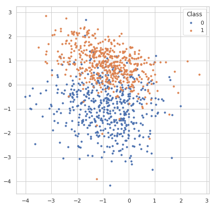
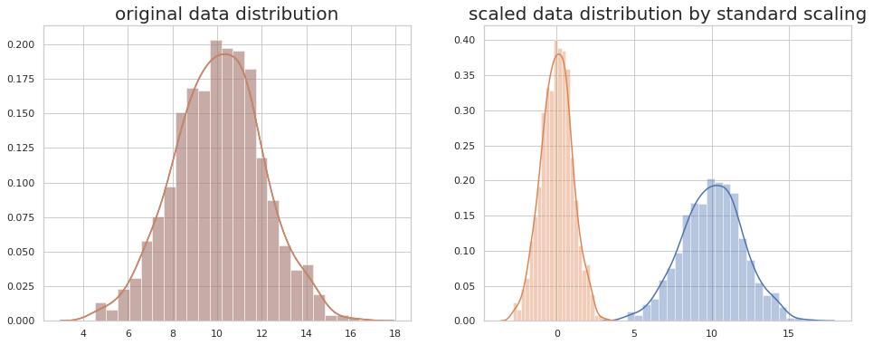
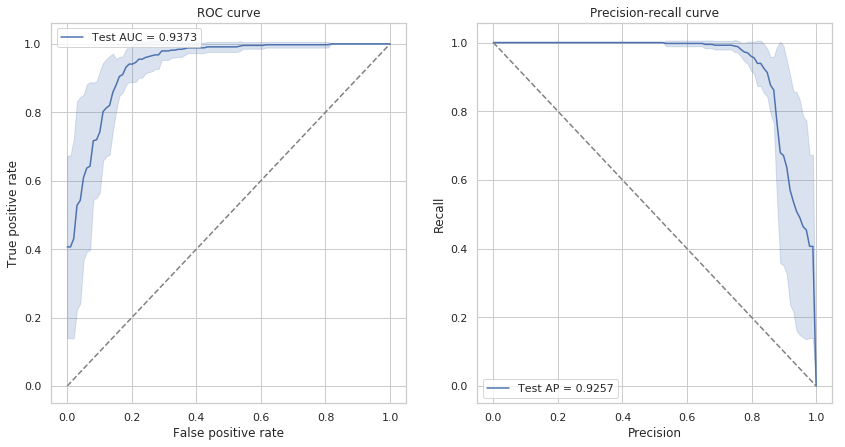

# 8.2 Machine Learning with Python

## 1. Practice Guide

### 0\) 本章教程使用指南

读者将会发现，机器学习的核心模型已经被**scikit-learn**等工具包非常好的模块化了，调用起来非常简单，仅需要几行代码，但是一个完整的、有效的机器学习工程项目却包括很多步骤，可以包括**数据导入，数据可视化理解，前处理，特征选择，模型训练，参数调整，模型预测，模型评估，后处理**等多个步骤，一个在真实世界中有效的模型可能需要工作者对数据的深入理解，以选择各个步骤合适的方法。

通过本章教程，读者可以对机器学习的基本概念方法和具体流程有所了解，而且可以通过实践更好地掌握python相关工具包的使用，为后续的应用做好准备。

读者初次阅读和进行代码实践时，可以将重点放在对方法和概念的理解上，对于一些稍微复杂的代码，不需要理解代码里的每个细节。

### 1\) 导入需要的Python工具包

这里我们会导入一些后续操作需要的python工具包，它们的相关文档如下，请有兴趣的读者重点学习和了解[scikit-learn](http://scikit-learn.org/)工具包。

* [numpy](https://docs.scipy.org/doc/numpy/): arrays
* [pandas](https://pandas.pydata.org/): data IO, DataFrame
* [scikit-learn](http://scikit-learn.org/): machine learning
* [statsmodels](https://www.statsmodels.org/): statistical functions
* [matplotlib](https://matplotlib.org/): plotting
* [seaborn](https://matplotlib.org/): high-level plotting based on _matplotlib_
* [jupyter](https://jupyter.org/): Python notebook

```python
%pylab inline
# For data importing
import pandas as pd
# For machine learning
from sklearn.datasets import make_classification
from sklearn.preprocessing import StandardScaler
from sklearn.linear_model import LogisticRegression
from sklearn.model_selection import KFold, train_test_split
from sklearn.metrics import accuracy_score, roc_auc_score, f1_score, recall_score, precision_score, \
    roc_curve, precision_recall_curve, average_precision_score, matthews_corrcoef, confusion_matrix
# For plotting
import seaborn as sns
sns.set()
sns.set_style('whitegrid')
random_state = np.random.RandomState(1289237)  #我们在本教程中固定numpy的随机种子，以使结果可重现
```

### 2\) 产生数据集

在处理真实世界的数据集之前，我们先产生一些模拟的数据集来学习机器学习的基本概念。 _scikit-learn_ 提供了很多方法\([sklearn.datasets](http://scikit-learn.org/stable/modules/classes.html#module-sklearn.datasets)\) 来方便地产生数据集。

#### 2.1\) 分类问题数据集

我们可以产生一个标签为离散值的用于分类问题的数据集

[sklearn.datasets.make\_classification](http://scikit-learn.org/stable/modules/generated/sklearn.datasets.make_classification.html#sklearn.datasets.make_classification) 可以从一个混合高斯分布中产生样本，并且可以控制样本数量，类别数量和特征数量。

我们会产生一个数据集，共有1000个样本，两种类别，四种特征。本章教程使用该数据作为演示。

* **产生数据:**

```python
X, y = make_classification(n_samples=1000, n_classes=2, n_features=4,
                           n_informative=2, n_redundant=0, n_clusters_per_class=1,
                           class_sep=0.9, random_state=random_state)
X.shape, y.shape #查看特征和标签的shape
```

* **用matplotlib可视化样本数据的分布:**

```python
fig, ax = plt.subplots(figsize=(7, 7))
for label in np.unique(y):
    ax.scatter(X[y == label, 0], X[y == label, 1], s=10, label=str(label))
ax.legend(title='Class')
```



### 3\) Data scaling

* **使用standard/z-score scaling 对数据做scaling:**

```
X = StandardScaler().fit_transform(X)
```

```python
#产生模拟数据，1000个数据点，均值为10，标准差为2
x = random_state.normal(10, 2, size=1000)
fig, ax = plt.subplots(1,2,figsize=(16, 6))
sns.distplot(x, ax=ax[0])
sns.distplot(x, ax=ax[1])
sns.distplot(np.ravel(x), ax=ax[0])
sns.distplot(np.ravel(StandardScaler().fit_transform(x.reshape((-1, 1)))), ax=ax[1])
ax[0].set_title('original data distribution',fontsize=20)
ax[1].set_title('scaled data distribution by standard scaling',fontsize=20)
```



### 4\) 划分数据得到训练集和测试集（training set & test set）

到这里，我们已经对数据进行了一些分析，并且做了一些基本的预处理，接下来我们需要对数据进行划分，得到训练集和测试集，通过训练集中的数据训练模型，再通过测试集的数据评估模型的表现。

因为模型总是会在某种程度上过拟合训练数据，因此在训练数据上评估模型是有偏的，模型在训练集上的表现总会比测试集上好一些。

因为模型总是可以学到数据中隐藏的模式和分布，如果样本间彼此的差异比较大，过拟合问题就会得到一定程度的减轻。而如果数据的量比较大，模型在训练集和测试集上的表现差异就会减小。

这里我们使用[train\_test\_split](http://scikit-learn.org/stable/modules/generated/sklearn.model_selection.train_test_split.html) 方法来随机的将80%的样本设置为训练样本， 将其余20%设置为测试样本。

另一个常见的概念是验证集（validation set），通过将训练集再随机划分为训练集和验证集，进行多折交叉验证（[cross validation](https://www.zhihu.com/question/39259296)），可以帮助我们评估不同的模型，调整模型的超参数等，此外交叉验证在数据集较小的时候也被用于直接评估模型的表现，我们在交叉验证部分还会详细讲解。

```python
X_train, X_test, y_train, y_test = train_test_split(X, y, test_size=0.2, random_state=random_state)
print('number of training samples: {}, test samples: {}'.format(X_train.shape[0], X_test.shape[0]))
```

```text
number of training samples: 800, test samples: 200
```

### 5\) 使用机器学习模型进行分类

* **示例：调用逻辑回归模型并且训练模型**

> 逻辑斯谛回归是一个简单但是非常有效的模型，与它的名字不同，逻辑斯谛回归用于解决分类问题，在二分类问题中被广泛使用。对于二分类问题，我们需要对每一个样本预测它属于哪一类（0或者1）。
>
> 逻辑斯谛回归是一个线性分类模型，它会对输入的feature进行线性组合，然后将线性组合组合得到的值通过一个非线性的sigmoid函数映射为一个概率值\(范围为0~1\)。
>
> 模型训练过程中，模型内部的参数（线性模型的权重）会调整使得模型的损失函数（真实label和预测label的交叉熵）最小。
>
> $$p(y_i | \mathbf{x}_i) = \frac{1}{1 + \text{exp} \left( \sum_{j=1}^M x_{ij} w_{j} + b \right)}$$

使用sklearn封装好的模型进行模型的训练非常简单，以逻辑斯谛回归模型为例，只需要两行即可完成模型的训练，我们使用默认参数构建模型。

```python
model = LogisticRegression()
model
```

```text
LogisticRegression(C=1.0, class_weight=None, dual=False, fit_intercept=True,
          intercept_scaling=1, max_iter=100, multi_class='ovr', n_jobs=1,
          penalty='l2', random_state=None, solver='liblinear', tol=0.0001,
          verbose=0, warm_start=False)
```

### 6）在训练集\(traning set\)上进行交叉验证

我们首先在**训练集**上做**K折（k-folds）交叉验证**

_scikit-learn_提供很多功能来[划分数据集](http://scikit-learn.org/stable/modules/classes.html#module-sklearn.model_selection).

这里我们使用[KFold](http://scikit-learn.org/stable/modules/generated/sklearn.model_selection.KFold.html) 来将数据集划分为10折，5和10是交叉验证中经常使用的折数。如果样本数量和计算资源允许，一般设置为10折。

下面的代码展示_KFold_是如何划分数据集的，图片中每一行为一个轮次，每一行中黑色的box为该轮次的测试集

```python
n_splits = 10

kfold = KFold(n_splits=n_splits, random_state=random_state)
is_train = np.zeros((n_splits, X_train.shape[0]), dtype=np.bool)
for i, (train_index, test_index) in enumerate(kfold.split(X_train, y_train)):
    is_train[i, train_index] = 1

fig, ax = plt.subplots(figsize=(15, 3))
ax.pcolormesh(is_train)
ax.set_yticks(np.arange(n_splits) + 0.5)
ax.set_yticklabels(np.arange(n_splits) + 1)
ax.set_ylabel('Round')
ax.set_xlabel('Sample')
```


接下来我们在训练集上训练模型，对验证集进行预测，这样我们可以分析模型在10折交叉验证中每一轮时在训练集和验证集分别的表现。

```python
predictions = np.zeros((n_splits, X_train.shape[0]), dtype=np.int32)
predicted_scores = np.zeros((n_splits, X_train.shape[0]))

for i in range(n_splits):
    model.fit(X_train[is_train[i]], y_train[is_train[i]])
    predictions[i] = model.predict(X_train)
    predicted_scores[i] = model.predict_proba(X_train)[:, 1]
```

#### 6.1） 收集评估指标

我们统计了模型10折交叉验证的指标

```python
scorers = {'accuracy': accuracy_score,
           'recall': recall_score,
           'precision': precision_score,
           'f1': f1_score,
           'mcc': matthews_corrcoef
}
cv_metrics = pd.DataFrame(np.zeros((n_splits*2, len(scorers) + 2)),
                          columns=list(scorers.keys()) + ['roc_auc', 'average_precision'])
cv_metrics.loc[:, 'dataset'] = np.empty(n_splits*2, dtype='U')
for i in range(n_splits):
    for metric in scorers.keys():
        cv_metrics.loc[i*2 + 0, metric] = scorers[metric](y_train[is_train[i]], predictions[i, is_train[i]])
        cv_metrics.loc[i*2 + 1, metric] = scorers[metric](y_train[~is_train[i]], predictions[i, ~is_train[i]])
    cv_metrics.loc[i*2 + 0, 'roc_auc'] = roc_auc_score(y_train[is_train[i]], predicted_scores[i, is_train[i]])
    cv_metrics.loc[i*2 + 1, 'roc_auc'] = roc_auc_score(y_train[~is_train[i]], predicted_scores[i, ~is_train[i]])
    cv_metrics.loc[i*2 + 0, 'average_precision'] = average_precision_score(y_train[is_train[i]], 
                                                                           predicted_scores[i, is_train[i]])
    cv_metrics.loc[i*2 + 1, 'average_precision'] = average_precision_score(y_train[~is_train[i]], 
                                                                           predicted_scores[i, ~is_train[i]])
    cv_metrics.loc[i*2 + 0, 'dataset'] = 'train'
    cv_metrics.loc[i*2 + 1, 'dataset'] = 'valid'

cv_metrics
```

|  | f1 | recall | mcc | precision | accuracy | roc\_auc | average\_precision | dataset |
| :--- | :--- | :--- | :--- | :--- | :--- | :--- | :--- | :--- |
| 0 | 0.878179 | 0.903581 | 0.748357 | 0.854167 | 0.873611 | 0.941207 | 0.923974 | train |
| 1 | 0.845070 | 0.833333 | 0.721750 | 0.857143 | 0.862500 | 0.933712 | 0.935387 | valid |
| 2 | 0.882834 | 0.902507 | 0.761891 | 0.864000 | 0.880556 | 0.943726 | 0.924183 | train |
| 3 | 0.813953 | 0.875000 | 0.606866 | 0.760870 | 0.800000 | 0.913125 | 0.905351 | valid |
| 4 | 0.876011 | 0.900277 | 0.745555 | 0.853018 | 0.872222 | 0.938294 | 0.919266 | train |
| 5 | 0.897436 | 0.921053 | 0.801002 | 0.875000 | 0.900000 | 0.959900 | 0.950735 | valid |
| 6 | 0.867769 | 0.884831 | 0.733970 | 0.851351 | 0.866667 | 0.939244 | 0.920460 | train |
| 7 | 0.921348 | 0.953488 | 0.825387 | 0.891304 | 0.912500 | 0.948460 | 0.930326 | valid |
| 8 | 0.875000 | 0.900000 | 0.751351 | 0.851351 | 0.875000 | 0.940865 | 0.919294 | train |
| 9 | 0.907216 | 0.897959 | 0.764660 | 0.916667 | 0.887500 | 0.940092 | 0.953203 | valid |
| 10 | 0.887118 | 0.910082 | 0.764626 | 0.865285 | 0.881944 | 0.944802 | 0.940066 | train |
| 11 | 0.812500 | 0.812500 | 0.687500 | 0.812500 | 0.850000 | 0.907552 | 0.805292 | valid |
| 12 | 0.879452 | 0.899160 | 0.756376 | 0.860590 | 0.877778 | 0.942403 | 0.921710 | train |
| 13 | 0.840909 | 0.880952 | 0.650666 | 0.804348 | 0.825000 | 0.919173 | 0.923660 | valid |
| 14 | 0.875339 | 0.899721 | 0.745633 | 0.852243 | 0.872222 | 0.936373 | 0.916857 | train |
| 15 | 0.925000 | 0.925000 | 0.850000 | 0.925000 | 0.925000 | 0.985625 | 0.985886 | valid |
| 16 | 0.871724 | 0.895184 | 0.742868 | 0.849462 | 0.870833 | 0.937808 | 0.913878 | train |
| 17 | 0.898876 | 0.869565 | 0.774672 | 0.930233 | 0.887500 | 0.966752 | 0.979593 | valid |
| 18 | 0.879357 | 0.896175 | 0.750337 | 0.863158 | 0.875000 | 0.943842 | 0.927530 | train |
| 19 | 0.846154 | 1.000000 | 0.738985 | 0.733333 | 0.850000 | 0.927789 | 0.878746 | valid |

#### 6.2）交叉验证ROC

```text
from scipy import interp
cv_metrics_mean = cv_metrics.groupby('dataset').mean()
fig, axes = plt.subplots(1, 2, figsize=(14, 7))
# ROC curve
ax = axes[0]
all_fprs = np.linspace(0, 1, 100)
roc_curves = np.zeros((n_splits, len(all_fprs), 2))
for i in range(n_splits):
    fpr, tpr, thresholds = roc_curve(y_train[~is_train[i]], predicted_scores[i, ~is_train[i]])
    roc_curves[i, :, 0] = all_fprs
    roc_curves[i, :, 1] = interp(all_fprs, fpr, tpr)
roc_curves = pd.DataFrame(roc_curves.reshape((-1, 2)), columns=['fpr', 'tpr'])
sns.lineplot(x='fpr', y='tpr', data=roc_curves, ci='sd', ax=ax,
             label='Test AUC = {:.4f}'.format(cv_metrics_mean.loc['valid', 'roc_auc']))
#ax.plot(fpr, tpr, label='ROAUC = {:.4f}'.format(roc_auc_score(y_test, y_score[:, 1])))
#ax.plot([0, 1], [0, 1], linestyle='dashed')
ax.set_xlabel('False positive rate')
ax.set_ylabel('True positive rate')
ax.plot([0, 1], [0, 1], linestyle='dashed', color='gray')
ax.set_title('ROC curve')
ax.legend()

# predision-recall curve
ax = axes[1]
all_precs = np.linspace(0, 1, 100)
pr_curves = np.zeros((n_splits, len(all_precs), 2))
for i in range(n_splits):
    fpr, tpr, thresholds = precision_recall_curve(y_train[~is_train[i]], predicted_scores[i, ~is_train[i]])
    pr_curves[i, :, 0] = all_precs
    pr_curves[i, :, 1] = interp(all_precs, fpr, tpr)
pr_curves = pd.DataFrame(pr_curves.reshape((-1, 2)), columns=['precision', 'recall'])
sns.lineplot(x='precision', y='recall', data=pr_curves, ci='sd', ax=ax,
             label='Test AP = {:.4f}'.format(cv_metrics_mean.loc['valid', 'average_precision']))

ax.set_xlabel('Precision')
ax.set_ylabel('Recall')
ax.plot([0, 1], [1, 0], linestyle='dashed', color='gray')
ax.set_title('Precision-recall curve')
ax.legend()
```

> tips: Anaconda并没有集成seaborn的最新版本，如果运行代码时报错，请使用pip更新seaborn：`pip install seaborn==0.9.0`



### 7\) 在整个训练集\(training set\)上进行模型训练

同样使用**Logistic Regression**模型。

```text
model.fit(X_train, y_train)
```

### 8\) 在测试集\(test set\)上预测和评估整个训练集\(traning set\)得到的模型

#### 8.1\) 在测试集上预测样本类别

为了评估模型表现，我们需要对测试集样本进行预测，我们使用_predict_方法来预测样本类别，它会返回一个整数型array来表示不同的样本类别。

```python
y_pred = model.predict(X_test)
y_pred
```

```text
array([0, 0, 1, 1, 0, 0, 1, 0, 0, 1, 1, 0, 1, 0, 1, 1, 0, 1, 1, 0, 1, 0,
       0, 1, 0, 1, 1, 0, 0, 1, 0, 0, 1, 0, 0, 0, 1, 1, 1, 1, 1, 1, 0, 0,
       1, 1, 1, 1, 0, 1, 1, 1, 1, 1, 1, 0, 0, 0, 0, 0, 0, 0, 1, 0, 1, 1,
       1, 0, 1, 1, 0, 1, 0, 1, 0, 1, 1, 1, 0, 0, 0, 0, 0, 0, 0, 0, 1, 0,
       1, 0, 0, 0, 0, 1, 0, 1, 0, 1, 0, 1, 1, 1, 1, 1, 1, 1, 1, 0, 1, 0,
       1, 0, 0, 0, 0, 1, 0, 0, 0, 0, 0, 1, 0, 1, 1, 1, 0, 1, 0, 1, 0, 1,
       0, 0, 0, 1, 1, 0, 0, 0, 0, 0, 0, 1, 0, 0, 1, 0, 0, 1, 0, 0, 0, 0,
       0, 0, 0, 1, 0, 1, 1, 0, 0, 0, 0, 1, 1, 0, 1, 1, 0, 1, 0, 1, 0, 1,
       1, 0, 1, 1, 0, 1, 0, 0, 1, 0, 0, 0, 1, 1, 0, 1, 1, 1, 0, 0, 0, 0,
       1, 0])
```

#### 8.2\) **构建预测结果的Confusion matrix：**

使用scikit-learn的confusion\_matrix方法即可得到模型预测结果的confusion matrix

```python
pd.DataFrame(confusion_matrix(y_test, y_pred), 
             columns=pd.Series(['Negative', 'Positive'], name='Predicted'),
             index=pd.Series(['Negative', 'Positive'], name='True'))
```

| Predicted | Negative | Positive |
| :--- | :--- | :--- |
| True |  |  |
| Negative | 81 | 8 |
| Positive | 27 | 84 |

```python
scorers = {'accuracy': accuracy_score,
           'recall': recall_score,
           'precision': precision_score,
           'f1': f1_score,
           'mcc': matthews_corrcoef
}
for metric in scorers.keys():
    print('{} = {}'.format(metric, scorers[metric](y_test, y_pred)))
```

```text
accuracy = 0.825
recall = 0.7567567567567568
precision = 0.9130434782608695
f1 = 0.8275862068965518
mcc = 0.6649535460625479
```

#### 8.3\) 绘制模型评估性能图

**绘制ROC曲线和Precision-Recall曲线**

我们使用sklearn自带的_roc\_curve_和_precision\_recall\_curve_方法来计算绘图需要的指标，这两个方法需要的输入为测试集每个样本的真实标签和模型预测的每个样本的概率。

```python
fig, axes = plt.subplots(1, 2, figsize=(14, 7))
# ROC curve
y_score = model.predict_proba(X_test)
fpr, tpr, thresholds = roc_curve(y_test, y_score[:, 1])
ax = axes[0]
ax.plot(fpr, tpr, label='AUROC = {:.4f}'.format(roc_auc_score(y_test, y_score[:, 1])))
ax.plot([0, 1], [0, 1], linestyle='dashed')
ax.set_xlabel('False positive rate')
ax.set_ylabel('True positive rate')
ax.set_title('ROC curve')
ax.legend()
# predision-recall curve
precision, recall, thresholds = precision_recall_curve(y_test, y_score[:, 1])
ax = axes[1]
ax.plot(precision, recall, label='AP = {:.4f}'.format(average_precision_score(y_test, y_score[:, 1])))
ax.plot([0, 1], [1, 0], linestyle='dashed')
ax.set_xlabel('Precision')
ax.set_ylabel('Recall')
ax.set_title('Precision-recall curve')
ax.legend()
```


可以看到AUROC和AP都接近于1，可以认为模型的分类效果很好。

## 2. Homework

* 学习和使用教程中的代码，

  * 首先利用教程中的方法产生数据集，按照training set : test set = 0.8 : 0.2的比例划分数据集；
  * 然后学习使用不同的分类器 \(SVC, random forest, logistic regression等\) ；
  * 在training set上训练，在test set上预测，汇报不同模型的prediction performance: accuracy, sensitivity, specificity, ppv, mcc, roc\_auc等指标，绘制ROC曲线。

  > **作业要求** ：上交一个文档汇报三种分类器的performance，并解释如上指标所代表的意义，附上ROC曲线并解释其意义。
  >
  > Hint:导入模型：

```text
from sklearn.ensemble import RandomForestClassifier
from sklearn.svm import SVC, LinearSVC
```

* （选做）学习和实践交叉验证，使用不同的K值，比较不同模型的表现。
* （选做）修改样本的类别比例，在类别不均衡数据上比较模型的表现。


