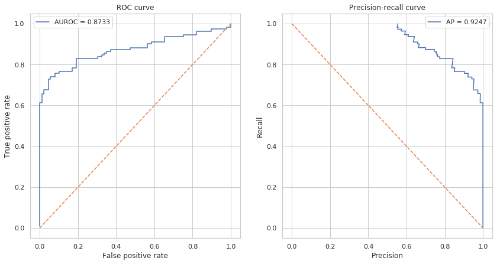

# 8.Machine Learning Basics

## 1. Introduction

### 1\) 机器学习的定义与分类

机器学习研究如何从数据中学习其隐藏的模式并预测未知数据的特征。

根据预测变量是否已知，机器学习通常分为两类：**监督学习**和**无监督学习**。

* 监督学习

模型通过特征和类别标签作为构建模型的输入。如果目标变量（要预测的变量）是类别信息（例如正/负），该问题称为分类问题。如果目标变量是连续的（例如身高）则为回归问题。

* 无监督学习

目标变量是未指定的。模型的目的是确定内部数据的结构（cluster）。在模型拟合之后，我们可以将新来的样本分给cluster或生成与原始数据具有相似分布的样本。无监督学习也可以用于监督学习之前的数据预处理步骤。

### 2\) Data Scaling  

对于大多数机器学习算法，建议将feature scale到一个比较小的范围，以减少极端值的影响。

feature的规模过大或者过小都会增加数值不稳定的风险并且还使损失函数更加难以优化。

* 基于线性模型权重的特征选择方法会假定输入的feature在同样的规模上。
* 基于梯度下降算法的模型（比如神经网络）的表现和收敛速度会被没有合理scale的数据显著影响。
* 决策树和随机森林类算法对数据规模不太敏感，因为它们使用rule-based标准。

常见的数据缩放方法包括：

> * standard/z-score scaling
>
> Standard/z-score scaling first shift features to their centers\(mean\) and then divide by their standard deviation. This method is suitable for most continous features of approximately Gaussian distribution.
>
> $$\text{zscore}(x_{ij}^{'}) = \frac{x_{ij} - \mu _{ij}}{\sigma _i}$$
>
> * min-max scaling
>
> Min-max scaling method scales data into range \[0, 1\]. This method is suitable for data concentrated within a range and preserves zero values for sparse data. Min-max scaling is also sensitive to outliers in the data. Try removing outliers or clip data into a range before scaling.
>
> $$\text{minmax}(x_{ij}^{'}) = \frac{x_{ij} - \text{min}_k \mathbf{x}_{ik}} {\text{max}_k x_{ik} - \text{min}_k x_{ik}}$$
>
> * abs-max scaling.
>
> Max-abs scaling method is similar to min-max scaling, but scales data into range \[-1, 1\]. It does not shift/center the data and thus preserves signs \(positive/negative\) of features. Like min-max, max-abs is sensitive to outliers.
>
> $$\text{maxabs}(x_{ij}^{'}) = \frac{x_{ij}}{\text{max}_k \vert x_{ik} \vert}$$
>
> * robust scaling
>
> Robust scaling method use robust statistics \(median, interquartile range\) instead of mean and standard deviation. Median and IQR are less sensitive to outliers. For features with large numbers of outliers or largely deviates from normal distribution, robust scaling is recommended.
>
> $$\text{robustscale}(x_{ij}^{'}) = \frac{x_{ij} - \text{median}_k x_{ik}} {Q_{0.75}(\mathbf{x}_i) - Q_{0.25}(\mathbf{x}_i)}$$

### 3\) 分类问题的评估指标

* **Confusion matrix：**

最常用的评估分类模型表现的方法是构建一个[confusion matrix](https://en.wikipedia.org/wiki/Confusion_matrix).

Confusion matrix会总结模型正确和错误分类的样本数量，并将预测的样本分成如下四类：

|  | Predicted | Negative | Positive |  |
| :--- | :--- | :--- | :--- | :--- |
| **True** |  |  |  |  |
| **Negative** |  | True Negative \(TN\) | False Negative \(FN\) | $$\textbf{NPV} =\frac{TN}{TN+FN}$$ |
| **Positive** |  | False Positive \(FP\) | True Positive \(TP\) | $$\textbf{PPV} =\frac{TP}{TP+FP}$$ |
|  |  | $$\textbf{Specificity} = \frac{TN}{TN+FP}$$ | $$\textbf{Sensiticity} = \frac{TP}{TP+FN}$$ |  |

* **Accuracy \(0 ~ 1\)** 

summarizes both positive and negative predictions, but is biased if the classes are imbalanced:

$$\text{Accuracy} = \frac{TP + TN}{TP + TN + FP + FN}$$

* **Recall/sensitivity \(0 ~ 1\)**

summarizes how well the model finds out positive samples:

$$\text{Recall/Sensitivity} = \frac{TP}{TP + FN}$$

* **Precision/positive predictive value \(0 ~ 1\)** 

summarizes how well the model finds out negative samples:

$$\text{Precision/Positive Predictive Value} = \frac{TP}{TP + FP}$$

* **F1 score \(0 ~ 1\)** 

balances between positive predictive value \(PPV\) and true positive rate \(TPR\) and is more suitable for imbalanced dataset:

$$\text{F1 score} = 2 \frac{PPV \cdot TPR}{PPV + TPR}$$

* **Matthews correlation coefficient \(MCC\) \(-1 ~ 1\)** 

another metric that balances between recall and precision:

$$\text{MCC} = \frac{TP \times TN - FP \times FN} {(TP + FN)(TP + FP)(TN + FP)(TN + FN)}$$

* **ROC曲线和Precision-Recall曲线：**

有时，一个固定的cutoff不足以评估模型性能。 Receiver Operating Characterisic（ROC）曲线和Precision-Recall曲线可以通过不同的cutoff评估模型的表现。 ROC曲线和Precision-Recall对于类别不平衡问题也有比较好的评估。与ROC曲线相比，recision-Recall曲线更适合类别极不平衡的数据集。

ROC曲线下面积（AUROC）或average precision \(AP\)是一个单值，它总结了不同截止值下的模型平均表现，常常用于报告模型的分类表现。

可以看到AUROC和AP都接近于1，可以认为模型的分类效果很好。

### 4\) 交叉验证

交叉验证可以被用于在训练集中再随机划分出一部分验证集用于挑选模型的参数，也可以用于直接评估模型的表现。

对于非常大的数据集，将数据集单独拆分为训练集和测试集就足够来评估模型性能。但是，对于小型数据集，测试样本仅代表一小部分未来预测中可能的样本，即对于小数据集，划分出的测试集可能因为样本数过少而不具有代表性。

**示例：K折（k-folds）交叉验证**

在**K折交叉验证**中，数据集被均匀地划分为$k$个部分（folds）。在每轮验证中，模型在一个fold上进行测试，并在剩余的$\frac{k-1}{k}$部分上进行训练。

K折交叉验证确保训练样本和测试样本之间没有重叠，K轮结束后，每个样本会被设置为测试样品一次。最后，模型平均表现是在 $k$轮次中计算的。

## 2. More Reading

* [Advanced Tutorial](https://lulab.gitbook.io/training/part-iii.-advanced-bioinfo-analyses/introduction-of-part-iii)
  * Machine Learning
  * Feature Selection
  * Deep Learning

