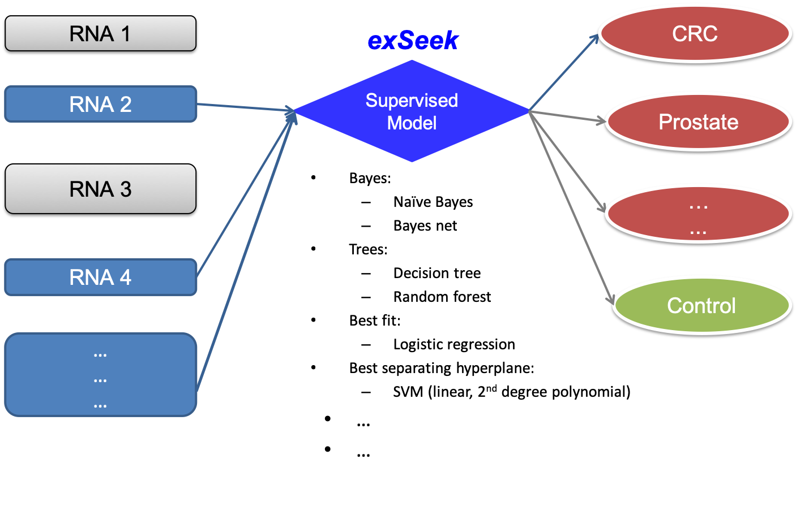

# 11. exRNA Biomarker


### **Precision Medicine: A novel exRNA panel for cancer diagnosis**


## 背景介绍

在多种体液中，如血清、唾液以及尿液等，可以检测到一类非侵入性细胞外 RNA \(extracellular RNA, exRNA\)。诸如环状RNA \(circular RNA\)等这类具有空间结构的 RNA 分子，能够在血浆中稳定存在。这些从细胞分泌出的 exRNA 通常由微囊泡 \(microvesicles\)、外泌体\(exosome\) 包裹，或者与 RBP 密切结合形成 RNP 复合体。因为这些分子由于具备类细胞膜结构和蛋白质的保护，加上某些 RNA 具有特定的结构，exRNA 在多种体液 \(血清、唾液、尿液等\) 中可以抵抗体液中 RNase 的降解，从而稳定存在。exRNA 包括的类型很多，例如 miRNA，Y RNA, circRNA，lncRNA 等，每种又有不同的加工、剪切和修饰产物，这种多样性为更 好的临床检验带来了新的期望。这些 exRNA 可以成为一类有效的生物标志物，服务于人体健康状况检测和疾病的诊断，如癌症的早期诊断、肿瘤生长状况监测、以及预后辅助诊断。

本Quiz依托于Lulab现有的一些研究结果，希望读者通过生物信息学方法，尝试使用一些机器学习方法，发现和研究与癌症发生发展相关的新型体液胞外RNA \(extracellular RNA，exRNA\)生物标志物，并应用于几种国内高致死癌症的早期诊断和预后辅助治疗。我们将在癌症病人体液 \(如血液\)中的游离、微囊泡、外泌体、RNP 等不同组分中发现和鉴定标志癌症发生发展的新型 exRNA，构建模型，最终建立一个具有更高精准度和重复性的无创检验癌症（尤其是早期癌症）的方法。

### 1\) 总体流程图

### 2\) 主要目标

利用构建出的expression matrix，分别对Colorectal Cancer vs Healthy Control和Prostate Cancer vs Healthy Control建立分类模型，找出稳健的可以区分癌症和正常样本的Feature，并进行相关分析。

##  休息一会

        随着科学技术的不断发展，尤其是 21 世纪初高通量测序技术（NGS） 的出现，使肿瘤诊断从传统的病理和影像学检测跨入精准诊断时代，“液体活检”的概念也应运而生。液体活检（Liquid Biospy）是一种利用 Sanger、qPCR、NGS 等基因测序技术从血液、脑脊液、唾液等非实性生物标本中检测循环肿瘤 DNA（ ctDNA） 、循环肿瘤细胞（ CTCs） 、外泌体（exosomes） 等生物标志物的肿瘤诊断方法。

      液体活检作为可用于癌症早筛的一种无创检测技术，一直以来备受科研和临床研究的关注。测序巨头Illumina首席执行官Jay Flatley此前在接受媒体采访时曾表示，“液态活检”的市场规模至少达400亿美元，甚至宣称这项技术可能是癌症诊断领域最激动人心的突破。

       GRAIL正是一家以“液体活检”为中心的公司，被外界称为全球癌症血液筛查公司中的领先者、癌症大数据领域的独角兽 。2016年1月由基因测序巨头Illumina联合比尔盖茨、Bezos Expeditions、和Sutter Hill Ventures等投入一亿美金，并且分出一部分公司骨干成立了Grail。据统计，GRAIL自2016年成立以来，短短两三年时间就已经获得了全球多家公司超过15亿美元的巨额投资，它成为历史上融资规模最大的三家生物技术公司之一，包括腾讯在内的一些中国公司也是其资方。

        Jennifer Cook是GRAIL的目前的首席执行官。此前，Jennifer曾在Roche Pharmaceuticals / Genentech担任过多个高级管理职位，负责产品开发和商业化的整个生命周期。2016年 ，因其对医疗保健行业的贡献和鼓舞人心的领导力而获得认可，她被医疗保健女企业家协会评为年度女性。Jennifer拥有斯坦福大学人类生物学和生物学硕士学位，以及加州大学伯克利分校哈斯商学院的MBA学位。

      最近，在2018年欧洲肿瘤内科学会（ESMO）年会上，GRAIL公司发布了CCGA（ Circulating Cell-free Genome Atlas ）研究项目的最新数据。当前研究结果显示，利用血液进行癌症早期筛查不仅可行，而且在不同类型癌症中还具有高度特异性。使用无创、简单、精准的液体活检方法进行癌症早期筛查，代表着人类征服癌症的最大希望。现在，这个梦想变得越来越可触可及了。

